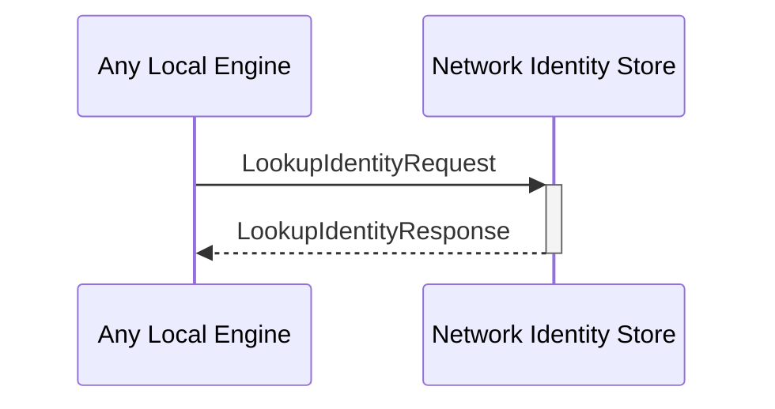

# LookupIdentityRequest
# LookupIdentityResponse

## Purpose

<!-- ANCHOR: purpose -->
Look up information about an  *external identity* in the local database.
<!-- ANCHOR_END: purpose -->

## Type

<!-- ANCHOR: type -->
**Reception:**

[[LookupIdentityRequestV1#lookupidentityrequestv1]]

{{#include ../types/lookup-identity-request-v1.md:type}}

**Triggers:**

[[LookupIdentityResponseV1#lookupidentityresponsev1]]

{{#include ../types/lookup-identity-response-v1.md:type}}
<!-- ANCHOR_END: type -->

## Behavior

<!-- ANCHOR: behavior -->
Return the information associated with the requested external identity.
<!-- ANCHOR_END: behavior -->

## Message flow

<!-- ANCHOR: messages -->

<!-- ANCHOR_END: messages -->

