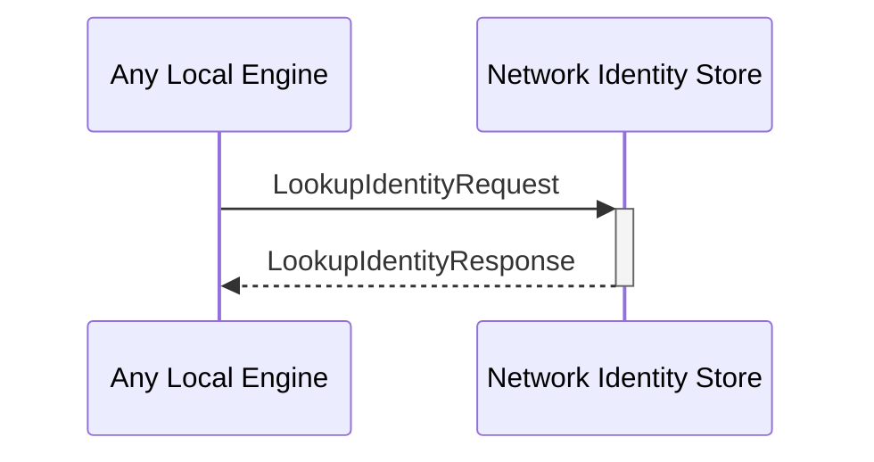

# LookupIdentityRequest

# LookupIdentityResponse

## Purpose

<!-- --8<-- [start:purpose] -->
Look up information about an  *external identity* in the local database.
<!-- --8<-- [end:purpose] -->

## Type

<!-- --8<-- [start:type] -->
**Reception:**

[[LookupIdentityRequestV1#lookupidentityrequestv1]]

--8<-- "../types/lookup-identity-request-v1.md:type"

**Triggers:**

[[LookupIdentityResponseV1#lookupidentityresponsev1]]

--8<-- "../types/lookup-identity-response-v1.md:type"
<!-- --8<-- [end:type] -->

## Behaviour

<!-- --8<-- [start:behaviour] -->
Return the information associated with the requested external identity.
<!-- --8<-- [end:behaviour] -->

## Message flow

<!-- --8<-- [start:messages] -->

<!-- --8<-- [end:messages] -->

