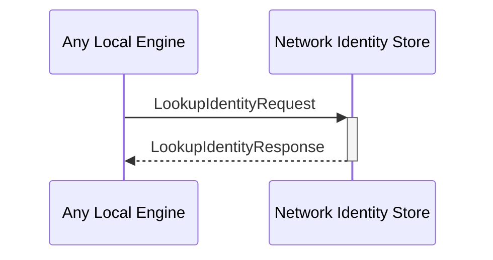

# LookupIdentityRequest
# LookupIdentityResponse

## Purpose

<!-- --8<-- [start:purpose] -->
Look up information about an  *external identity* in the local database.
<!-- --8<-- [end:purpose] -->

## Type

<!-- --8<-- [start:type] -->
**Reception:**

[[LookupIdentityRequestV1#lookupidentityrequestv1]]

{{#include ../types/lookup-identity-request-v1.md:type}}

**Triggers:**

[[LookupIdentityResponseV1#lookupidentityresponsev1]]

{{#include ../types/lookup-identity-response-v1.md:type}}
<!-- --8<-- [end:type] -->

## Behavior

<!-- --8<-- [start:behavior] -->
Return the information associated with the requested external identity.
<!-- --8<-- [end:behavior] -->

## Message flow

<!-- --8<-- [start:messages] -->

<!-- --8<-- [end:messages] -->

