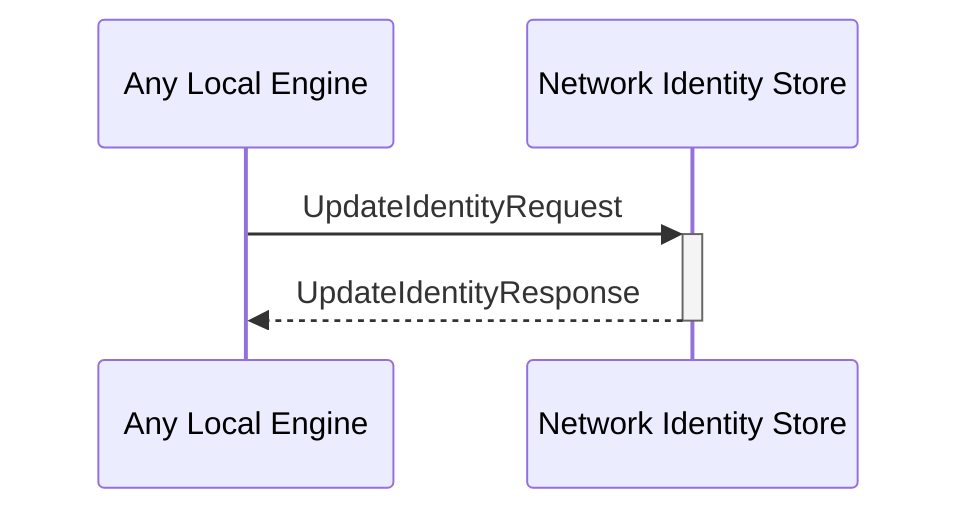

# UpdateIdentityRequest
# UpdateIdentityResponse

## Purpose

<!-- ANCHOR: purpose -->
Update information associated with a given external identity.
<!-- ANCHOR_END: purpose -->

## Type

<!-- ANCHOR: type -->
**Reception:**

[[UpdateIdentityRequestV1#updateidentityrequestv1]]

{{#include ../types/update-identity-request-v1.md:type}}

**Triggers:**

[[UpdateIdentityResponseV1#updateidentityresponsev1]]

{{#include ../types/update-identity-response-v1.md:type}}
<!-- ANCHOR_END: type -->

## Behavior

<!-- ANCHOR: behavior -->
Update the provided information in the local data store.
<!-- ANCHOR_END: behavior -->

## Message flow

<!-- ANCHOR: messages -->

<!-- ANCHOR_END: messages -->

