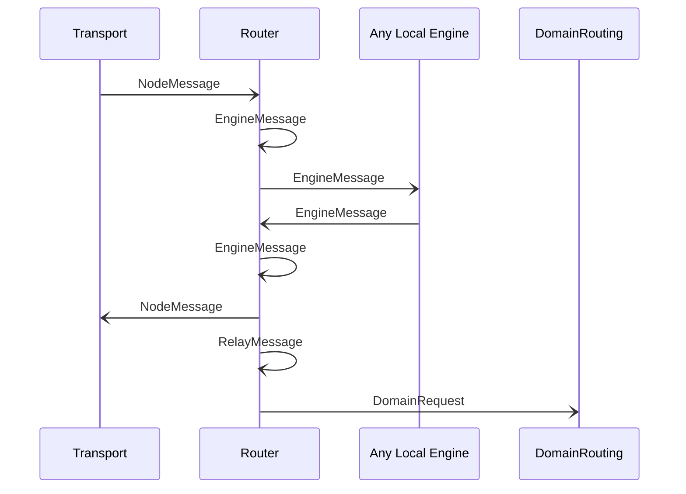

# EngineMessage

## Purpose

<!-- --8<-- [start:purpose] -->
A message sent between engine instances (both local & remote).
<!-- --8<-- [end:purpose] -->

## Type

<!-- --8<-- [start:type] -->
**Reception:**

[[EngineMessageV1#enginemessagev1]]

--8<-- "../types/engine-message-v1.md:type"

**Triggers:**

[[EngineMessage#enginemessage]]

[[NodeMessage#nodemessage]]

[[RelayMessage#relaymessage]]

[[DomainRequest#domainrequest]]
<!-- --8<-- [end:type] -->

## Behavior

<!-- --8<-- [start:behavior] -->
When the router receives an *EngineMessage* from a local engine instance,
it processes it the following way:

1. It looks up `dst`, the [[DestinationIdentity#destinationidentity]] in the routing table:

   - If not found, it sends a [[LookupIdentityRequest#lookupidentityrequest]]
     with the destination address to the [[Network Identity Store#network-identity-store]] engine.
     - If the [[LookupIdentityResponse#lookupidentityresponse]] returns a result, it is added to the routing table,
       and the process continues with the next step.

2. If a route is found, the *EngineMessage* is processed the following way,
   depending on the type of [[DestinationIdentity#destinationidentity]]:

   - Engine ([[EngineIdentity#engineidentity]]): unicast message to a local engine

     - The *Router* forwards the *EngineMessage* directly to the destination engine

   - Node ([[NodeIdentity#nodeidentity]]): unicast message to a remote node

     - The *Router* wraps the *EngineMessage* in a [[NodeMessage#nodemessage]]
       with the *destination* set to the remote node's identity,
       and the *source* set to the local node's identity
       (which equals to the engine instance identity of the *Router*),
       then signs the message with its identity key,
       and forwards it to the [[Transport#transport]] engine for delivery over the network.

   - Topic ([[TopicIdentity#topicidentity]]): multicast message to a local pub/sub topic

     - The Router forwards the [[Message#message]] to all local engines subscribed to the multicast group,
       which might include the [[PubSub#pubsub]] engine
       that is responsible for remote delivery over a P2P publish-subscribe protocol.

2. (cont.)

   - Relay ([[NodeIdentity#nodeidentity]]): relayed message via another node

     - The *Router* wraps the *EngineMessage* in a [[RelayMessage#relaymessage]]
       with the *destination* set to the external identity from the routing table,
       the *source* set to the local node identity,
       and signs it with its identity key.
     - The *Router* then wraps the [[RelayMessage#relaymessage]] in a [[NodeMessage#nodemessage]]
       and sends it to [[Transport#transport]] for delivery over the network.

   - Domain ([[DomainIdentity#domainidentity]]): anycast message to a domain

     - The *Router* wraps the *EngineMessage* in a [[DomainRequest#domainrequest]]
       with the destination set to the domain's identity and the *source* set to the local node identity.
     - The *Router* then sends the [[DomainRequest#domainrequest]] to the [[Domain Routing#domain-routing]] engine.

3. If no route is found, the message is dropped.

When processing the *EngineMessage*, the given [[RoutingPrefs#routingprefs]] and [[RoutingScope#routingscope]] is respected.

!!! note

    The router subscribes to *[[IdentityUpdated#identityupdated]]* notifications of the [[Network Identity Store#network-identity-store]] engine, in order to keep addresses in the routing table up to date.
<!-- --8<-- [end:behavior] -->

## Message flow

<!-- --8<-- [start:messages] -->

<!-- --8<-- [end:messages] -->

