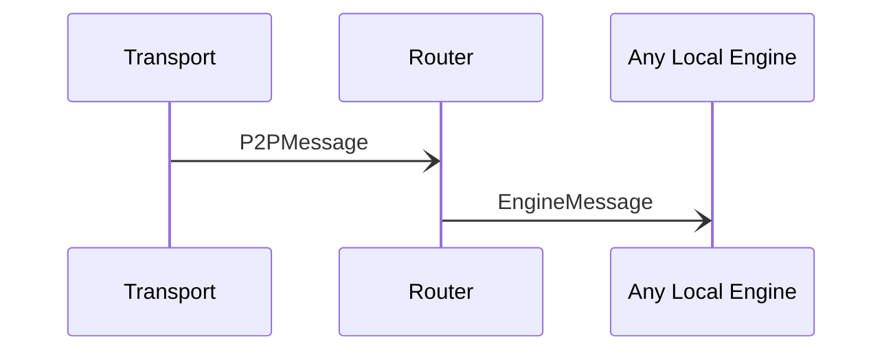

# P2PMessage

## Purpose

<!-- ANCHOR: purpose -->
A signed message sent between peers.
<!-- ANCHOR_END: purpose -->

## Type

<!-- ANCHOR: type -->
**Reception:**

[[P2PMessageV1#p2pmessagev1]]

{{#include ../types/p2p-message-v1.md:type}}

**Triggers:**

[[EngineMessage#enginemessage]]
<!-- ANCHOR_END: type -->

## Behavior

<!-- ANCHOR: behavior -->
The *Router* verifies the signature, and if valid, it processes the contained *[[EngineMessage#enginemessage]]* or *[[RelayMessage#relaymessage]]*.
Otherwise discards the message, and disconnects from the peer by sending a *[[DisconnectRequest#disconnectrequest]]* message to *[[Transport#transport]]*.
<!-- ANCHOR_END: behavior -->

## Message flow

<!-- ANCHOR: messages -->

<!-- ANCHOR_END: messages -->

