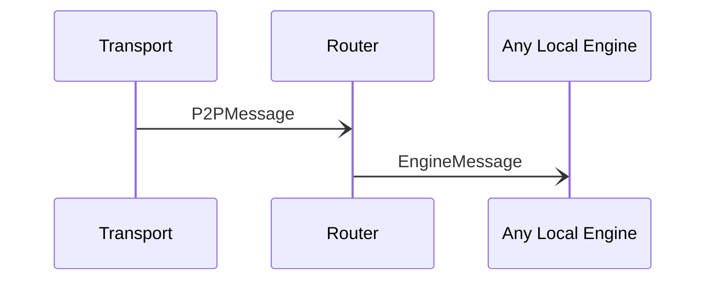

# P2PMessage

## Purpose

<!-- --8<-- [start:purpose] -->
A signed message sent between peers.
<!-- --8<-- [end:purpose] -->

## Type

<!-- --8<-- [start:type] -->
**Reception:**

[[P2PMessageV1#p2pmessagev1]]

--8<-- "../types/p2p-message-v1.md:type"

**Triggers:**

[[EngineMessage#enginemessage]]
<!-- --8<-- [end:type] -->

## Behavior

<!-- --8<-- [start:behavior] -->
The *Router* verifies the signature, and if valid, it processes the contained *[[EngineMessage#enginemessage]]* or *[[RelayMessage#relaymessage]]*.
Otherwise discards the message, and disconnects from the peer by sending a *[[DisconnectRequest#disconnectrequest]]* message to *[[Transport#transport]]*.
<!-- --8<-- [end:behavior] -->

## Message flow

<!-- --8<-- [start:messages] -->

<!-- --8<-- [end:messages] -->

