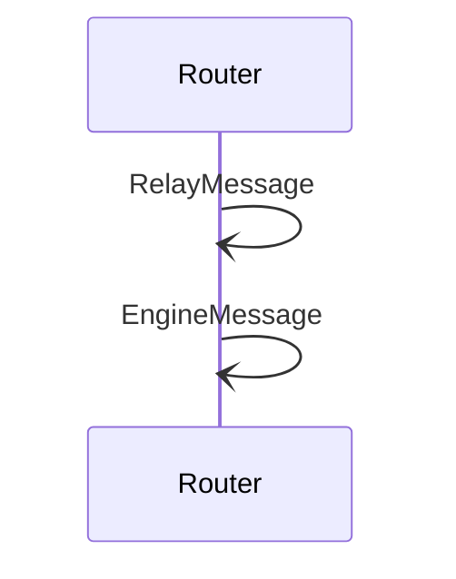

# RelayMessage

## Purpose

<!-- --8<-- [start:purpose] -->
A *RelayMessage* is used to relay an encrypted [[EngineMessage#enginemessage]] via multiple routing hops.
It is sent between two nodes and encapsulates either an *[[EngineMessage#enginemessage]]* or another *RelayMessage*.
<!-- --8<-- [end:purpose] -->

## Type

<!-- --8<-- [start:type] -->
**Reception:**

[[RelayMessageV1#relaymessagev1]]

--8<-- "../types/relay-message-v1.md:type"

**Triggers:**

[[EngineMessage#enginemessage]]
<!-- --8<-- [end:type] -->

## Behaviour

<!-- --8<-- [start:behaviour] -->
When the router receives a [[RelayMessage#relaymessage]]
from a remote node via the [[Transport#transport]] engine,
it processes it the following way:

1. It checks whether it is configured to allow relaying
   either from the *source* node or to the *destination* node.
   - If not, it drop the message
2. It decrypts the contained [[EngineMessage#enginemessage]] or [[RelayMessage#relaymessage]], and processes it.
<!-- --8<-- [end:behaviour] -->

## Message flow

<!-- --8<-- [start:messages] -->

<!-- --8<-- [end:messages] -->

