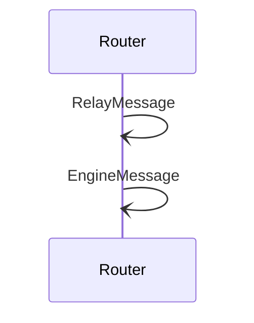

# RelayMessage

## Purpose

<!-- ANCHOR: purpose -->
A *RelayMessage* is used to relay an encrypted [[EngineMessage#enginemessage]] via multiple routing hops.
It is sent between two nodes and encapsulates either an *[[EngineMessage#enginemessage]]* or another *RelayMessage*.
<!-- ANCHOR_END: purpose -->

## Type

<!-- ANCHOR: type -->
**Reception:**

[[RelayMessageV1#relaymessagev1]]

{{#include ../types/relay-message-v1.md:type}}

**Triggers:**

[[EngineMessage#enginemessage]]
<!-- ANCHOR_END: type -->

## Behavior

<!-- ANCHOR: behavior -->
When the router receives a [[RelayMessage#relaymessage]]
from a remote node via the [[Transport#transport]] engine,
it processes it the following way:

1. It checks whether it is configured to allow relaying
   either from the *source* node or to the *destination* node.
   - If not, it drop the message
2. It decrypts the contained [[EngineMessage#enginemessage]] or [[RelayMessage#relaymessage]], and processes it.
<!-- ANCHOR_END: behavior -->

## Message flow

<!-- ANCHOR: messages -->

<!-- ANCHOR_END: messages -->

