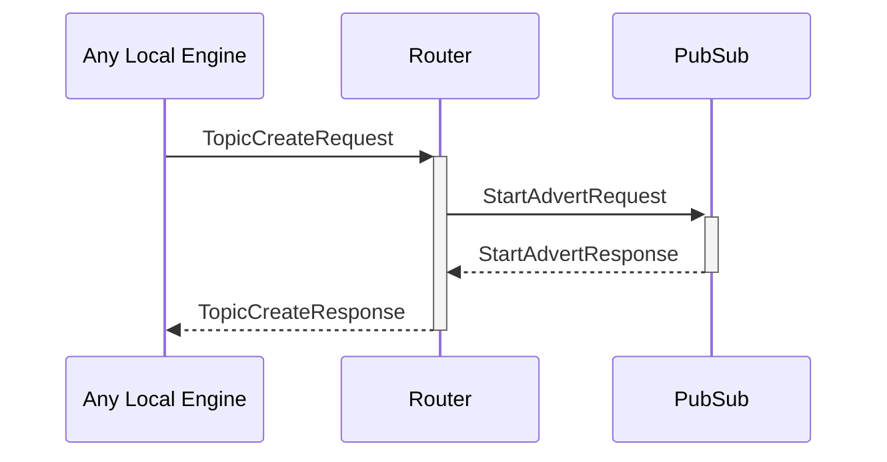

# TopicCreateRequest

## Purpose

<!-- ANCHOR: purpose -->
Create a pub/sub topic and start accepting subscriptions to it.
<!-- ANCHOR_END: purpose -->

## Type

<!-- ANCHOR: type -->
**Reception:**

[[TopicCreateRequestV1#topiccreaterequestv1]]

{{#include ../types/topic-create-request-v1.md:type}}

**Triggers:**

[[TopicCreateResponseV1#topiccreateresponsev1]]

{{#include ../types/topic-create-response-v1.md:type}}
<!-- ANCHOR_END: type -->

## Behavior

<!-- ANCHOR: behavior -->
The topic is added to the [[RoutingTable#routingtable]] with an initially empty subscriber list.
<!-- ANCHOR_END: behavior -->

## Message flow

<!-- ANCHOR: messages -->

<!-- ANCHOR_END: messages -->

