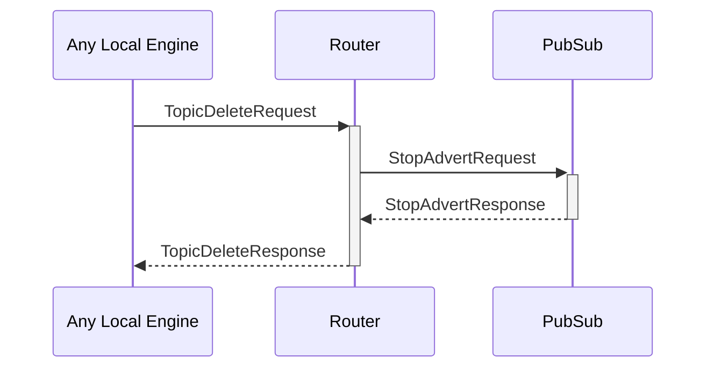

# TopicDeleteRequest

## Purpose

<!-- ANCHOR: purpose -->
Delete a pub/sub topic and remove all subscribers.

The request must come from the same engine that created the topic.
<!-- ANCHOR_END: purpose -->

## Type

<!-- ANCHOR: type -->
**Reception:**

[[TopicDeleteRequestV1#topicdeleterequestv1]]

{{#include ../types/topic-delete-request-v1.md:type}}

**Triggers:**

[[TopicDeleteResponseV1#topicdeleteresponsev1]]

{{#include ../types/topic-delete-response-v1.md:type}}
<!-- ANCHOR_END: type -->

## Behavior

<!-- ANCHOR: behavior -->
The topic is removed from the [[RoutingTable#routingtable]] along with all subscribers.
<!-- ANCHOR_END: behavior -->

## Message flow

<!-- ANCHOR: messages -->

<!-- ANCHOR_END: messages -->

