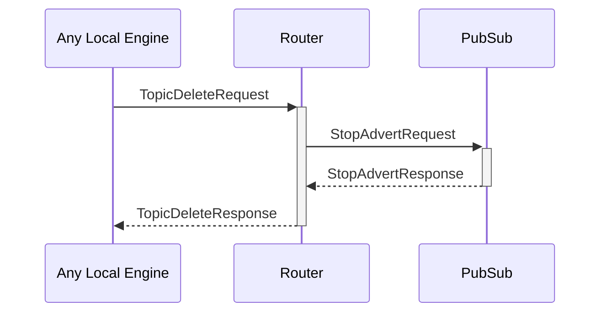

# TopicDeleteRequest

## Purpose

<!-- --8<-- [start:purpose] -->
Delete a pub/sub topic and remove all subscribers.

The request must come from the same engine that created the topic.
<!-- --8<-- [end:purpose] -->

## Type

<!-- --8<-- [start:type] -->
**Reception:**

[[TopicDeleteRequestV1#topicdeleterequestv1]]

{{#include ../types/topic-delete-request-v1.md:type}}

**Triggers:**

[[TopicDeleteResponseV1#topicdeleteresponsev1]]

{{#include ../types/topic-delete-response-v1.md:type}}
<!-- --8<-- [end:type] -->

## Behavior

<!-- --8<-- [start:behavior] -->
The topic is removed from the [[RoutingTable#routingtable]] along with all subscribers.
<!-- --8<-- [end:behavior] -->

## Message flow

<!-- --8<-- [start:messages] -->

<!-- --8<-- [end:messages] -->

