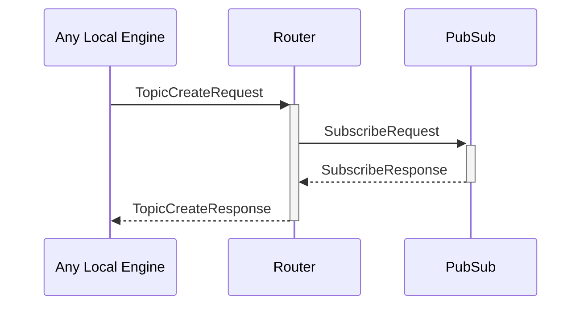

# TopicSubRequest

## Purpose

<!-- --8<-- [start:purpose] -->
Subscription request for a pub/sub topic.
<!-- --8<-- [end:purpose] -->

## Type

<!-- --8<-- [start:type] -->
**Reception:**

[[TopicSubRequestV1#topicsubrequestv1]]

--8<-- "../types/topic-sub-request-v1.md:type"

**Triggers:**

[[TopicSubResponseV1#topicsubresponsev1]]

--8<-- "../types/topic-sub-response-v1.md:type"
<!-- --8<-- [end:type] -->

## Behavior

<!-- --8<-- [start:behavior] -->
If the topic already exists in the [[RoutingTable#routingtable]],
the [[EngineIdentity#engineidentity]] of the requesting engine is added to the [[RoutingTable#routingtable]],
and  a *[[TopicSubResponse#topicsubresponse]]* is returned with a success result.

Otherwise, if the topic does not exist yet:
- when the `scope` is *LocalOnly*, an error is returned
- when the `scope` is *Any*, the [[Router#router]] sends a [[SubscribeRequest#subscriberequest]] to [[PubSub#pubsub]]
<!-- --8<-- [end:behavior] -->

## Message flow

<!-- --8<-- [start:messages] -->

<!-- --8<-- [end:messages] -->

