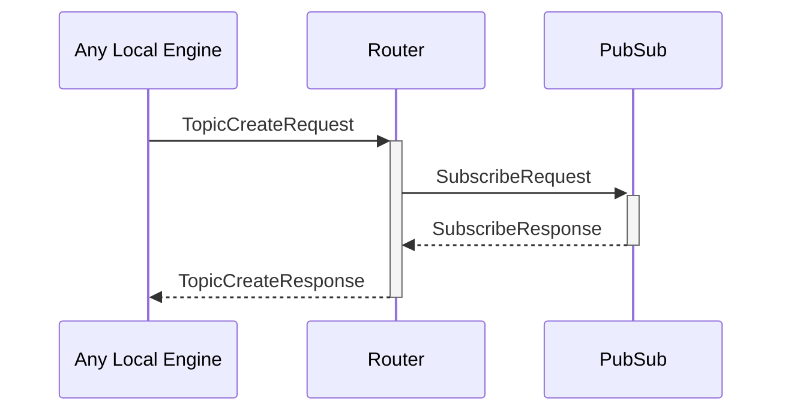

# TopicSubRequest

## Purpose

<!-- ANCHOR: purpose -->
Subscription request for a pub/sub topic.
<!-- ANCHOR_END: purpose -->

## Type

<!-- ANCHOR: type -->
**Reception:**

[[TopicSubRequestV1#topicsubrequestv1]]

{{#include ../types/topic-sub-request-v1.md:type}}

**Triggers:**

[[TopicSubResponseV1#topicsubresponsev1]]

{{#include ../types/topic-sub-response-v1.md:type}}
<!-- ANCHOR_END: type -->

## Behavior

<!-- ANCHOR: behavior -->
If the topic already exists in the [[RoutingTable#routingtable]],
the [[EngineIdentity#engineidentity]] of the requesting engine is added to the [[RoutingTable#routingtable]],
and  a *[[TopicSubResponse#topicsubresponse]]* is returned with a success result.

Otherwise, if the topic does not exist yet:
- when the `scope` is *LocalOnly*, an error is returned
- when the `scope` is *Any*, the [[Router#router]] sends a [[SubscribeRequest#subscriberequest]] to [[PubSub#pubsub]]
<!-- ANCHOR_END: behavior -->

## Message flow

<!-- ANCHOR: messages -->

<!-- ANCHOR_END: messages -->

