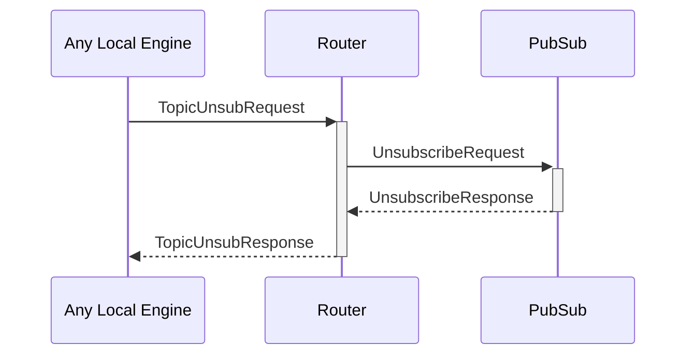

# TopicUnsubRequest

## Purpose

<!-- --8<-- [start:purpose] -->
Unsubscription request for a pub/sub topic.
<!-- --8<-- [end:purpose] -->

## Type

<!-- --8<-- [start:type] -->
**Reception:**

[[TopicUnsubRequestV1#topicunsubrequestv1]]

--8<-- "../types/topic-unsub-request-v1.md:type"

**Triggers:**

[[TopicUnsubResponseV1#topicunsubresponsev1]]

--8<-- "../types/topic-unsub-response-v1.md:type"
<!-- --8<-- [end:type] -->

## Structure

| Field   | Type                            | Description                                                      |
|---------|---------------------------------|------------------------------------------------------------------|
| `topic` | *[[TopicIdentity#topicidentity]]*           | Topic ID to unsubscribe                                          |
| `scope` | *[[RoutingScope#routingscope]]* | Whether the unsubscription request should be sent to the network |

## Behavior

If the topic does not exist yet in the [[RoutingTable#routingtable]],
the [[EngineIdentity#engineidentity]] of the requesting engine is added to the [[RoutingTable#routingtable]],
and  a *[[TopicSubResponse#topicsubresponse]]* is returned with a success result.

Otherwise, if the topic does not exist yet:
- when the `scope` is *LocalOnly*, an error is returned
- when the `scope` is *Any*, the [[Router#router]] sends a [[SubscribeRequest#subscriberequest]] to [[PubSub#pubsub]]

## Message flow

<!-- --8<-- [start:messages] -->

<!-- --8<-- [end:messages] -->

