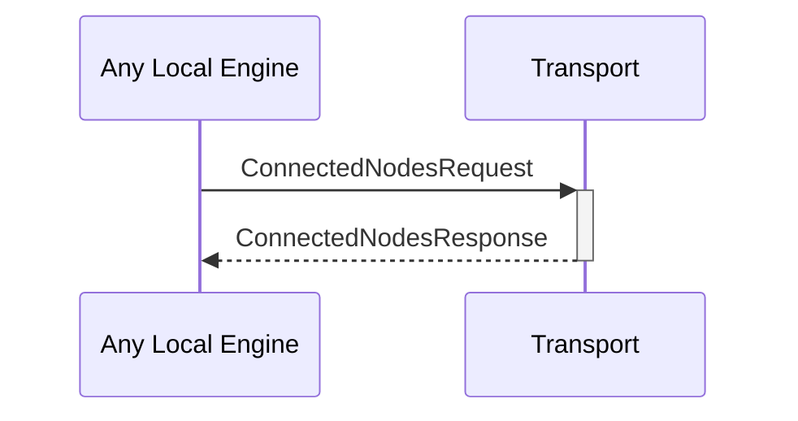

# ConnectedNodesRequest
# ConnectedNodesResponse

## Purpose

<!-- ANCHOR: purpose -->
Request the list of currently connected nodes.
<!-- ANCHOR_END: purpose -->

## Type

<!-- ANCHOR: type -->
**Reception:**

*unit*

**Triggers:**

[[ConnectedNodesResponseV1#connectednodesresponsev1]]

{{#include ../types/connected-nodes-response-v1.md:type}}
<!-- ANCHOR_END: type -->

## Behavior

<!-- ANCHOR: behavior -->
Return the list of currently connected nodes from the [[ConnectionPool#connectionpool]].
<!-- ANCHOR_END: behavior -->

## Message flow

<!-- ANCHOR: messages -->

<!-- ANCHOR_END: messages -->

