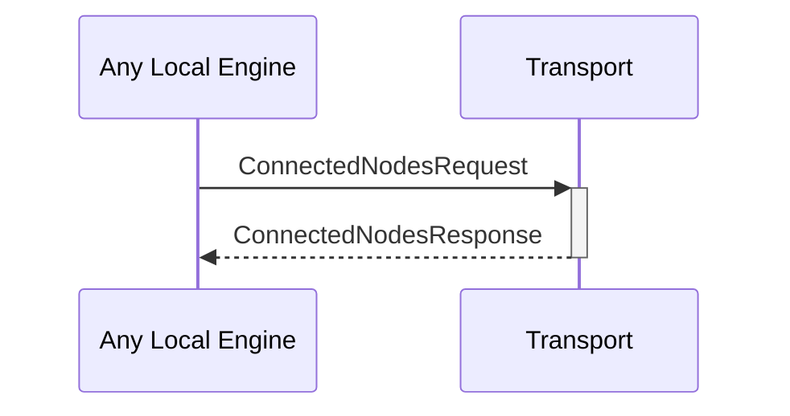

# ConnectedNodesRequest
# ConnectedNodesResponse

## Purpose

<!-- --8<-- [start:purpose] -->
Request the list of currently connected nodes.
<!-- --8<-- [end:purpose] -->

## Type

<!-- --8<-- [start:type] -->
**Reception:**

*unit*

**Triggers:**

[[ConnectedNodesResponseV1#connectednodesresponsev1]]

--8<-- "../types/connected-nodes-response-v1.md:type"
<!-- --8<-- [end:type] -->

## Behavior

<!-- --8<-- [start:behavior] -->
Return the list of currently connected nodes from the [[ConnectionPool#connectionpool]].
<!-- --8<-- [end:behavior] -->

## Message flow

<!-- --8<-- [start:messages] -->

<!-- --8<-- [end:messages] -->

