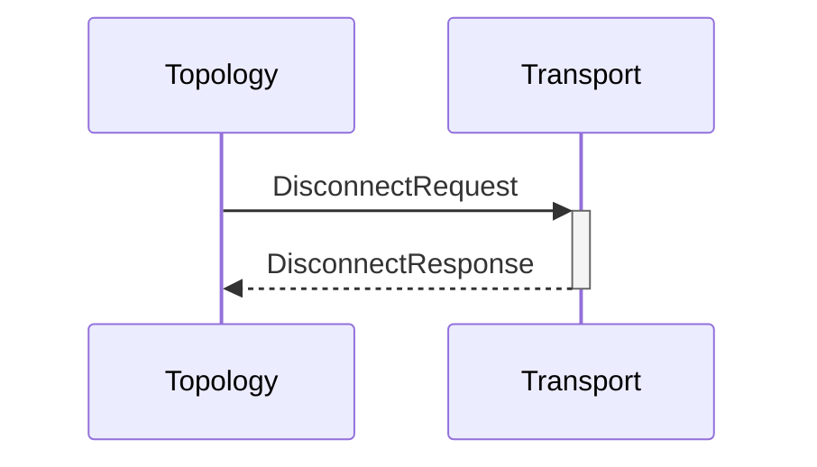

# DisconnectRequest
# DisconnectResponse

## Purpose

Establish disconnection to a node.

<!-- ANCHOR: type -->
**Reception:**

[[DisconnectRequestV1#disconnectrequestv1]]

{{#include ../types/disconnect-request-v1.md:type}}

**Triggers:**

[[DisconnectResponseV1#disconnectresponsev1]]

{{#include ../types/disconnect-response-v1.md:type}}
<!-- ANCHOR_END: type -->

## Behavior

Disconnect from the specified node, if connected.

## Message flow

<!-- ANCHOR: messages -->

<!-- ANCHOR_END: messages -->

