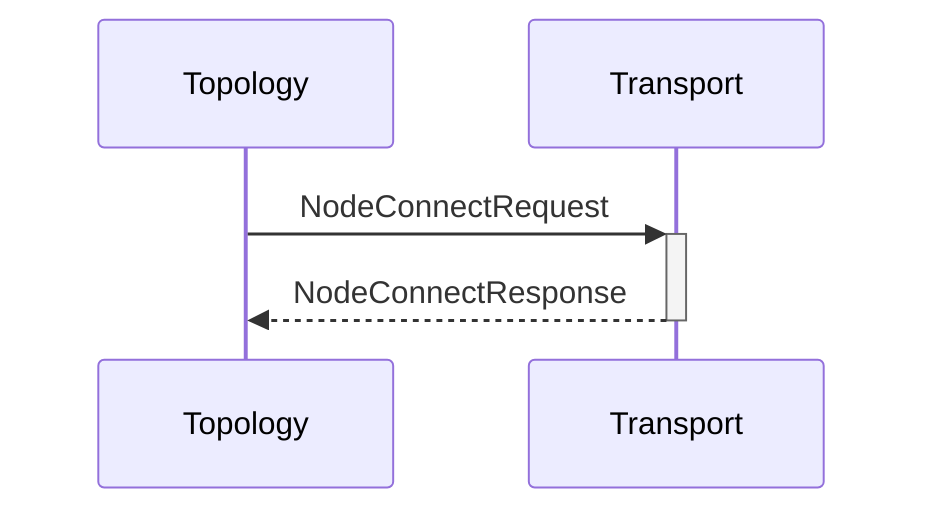

# NodeConnectRequest

# NodeConnectResponse

## Purpose

<!-- --8<-- [start:purpose] -->
Establish connection to a node.
<!-- --8<-- [end:purpose] -->

## Type

<!-- --8<-- [start:type] -->
**Reception:**

[[NodeConnectRequestV1]]

--8<-- "../types/node-connect-request-v1.md:type"

**Triggers:**

[[NodeConnectResponseV1]]

--8<-- "../types/node-connect-response-v1.md:type"
<!-- --8<-- [end:type] -->

## Behavior

Establish connection to the specified node, if not yet connected.

## Message flow

<!-- --8<-- [start:messages] -->

<!-- --8<-- [end:messages] -->

