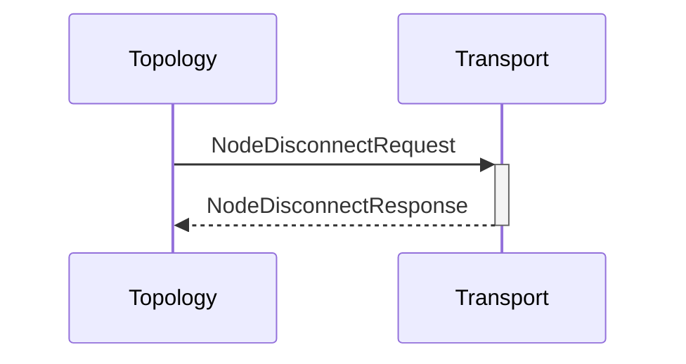

# NodeDisconnectRequest

# NodeDisconnectResponse

## Purpose

<!-- --8<-- [start:purpose] -->
Disconnect from a node.
<!-- --8<-- [end:purpose] -->

## Type

<!-- --8<-- [start:type] -->
**Reception:**

[[NodeDisconnectRequestV1]]

--8<-- "../types/node-disconnect-request-v1.md:type"

**Triggers:**

[[NodeDisconnectResponseV1]]

--8<-- "../types/node-disconnect-response-v1.md:type"
<!-- --8<-- [end:type] -->

## Behavior

Disconnect from the specified node, if connected.

## Message flow

<!-- --8<-- [start:messages] -->

<!-- --8<-- [end:messages] -->

