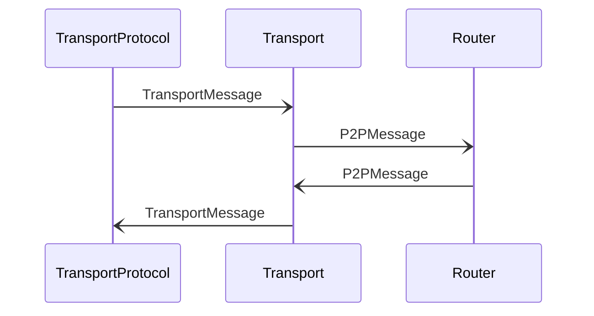

# P2PMessage {#p2pmessage-transport}

## Purpose

<!-- ANCHOR: purpose -->
An outgoing message to be delivered to another node over the network.
<!-- ANCHOR_END: purpose -->

## Type

<!-- ANCHOR: type -->
**Reception:**

[[P2PMessageV1#p2pmessagev1]]

{{#include ../../router/types/p2p-message-v1.md:type}}

**Triggers:**

[[TransportMessage#transportmessage]]
<!-- ANCHOR_END: type -->

## Behavior

<!-- ANCHOR: behavior -->
The *Transport* engine looks up the transport addresses associated with the destination peer identity
using a *[[LookupIdentityRequest#lookupidentityrequest]]* to the [[Network Identity Store#network-identity-store]] engine.
Address choice is influenced by the [[TransportPrefs#transportprefs]] specified in the encapsulated [[EngineMessage#enginemessage]].
If this lookup fails, the message is dropped.

*Transport* then wraps the *[[P2PMessage#p2pmessage]]* in a *[[TransportMessage#transportmessage]]*
with the selected *[[TransportAddress#transportaddress]]*.
and sends it to the network using the corresponding transport protocol,
establishing a new connection if not connected yet to the destination.

Once the connection is set up, *Transport* announces this via a *[[NodeConnected#nodeconnected]]* notification.
At the end of the connection, a *[[NodeDisconnected#nodedisconnected]]* notification is sent instead.

When a connection cannot be established immediately, the message is queued and sending periodically retried,
possibly via different transport addresses,
until the `expiry` time specified in the encapsulated [[EngineMessage#enginemessage]] is reached,
after which the message is dropped.
<!-- ANCHOR_END: behavior -->

## Message flow

<!-- ANCHOR: messages -->

<!-- ANCHOR_END: messages -->

