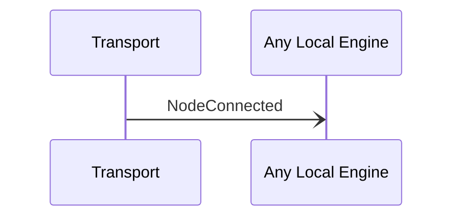

# NodeConnected

## Purpose

<!-- --8<-- [start:purpose] -->
Notification sent when a transport connection is established to a node.
<!-- --8<-- [end:purpose] -->

## Type

<!-- --8<-- [start:type] -->
[[NodeTransportAddress#nodetransportaddress]]

{{#include ../types/node-transport-address.md:type}}
<!-- --8<-- [end:type] -->

## Message flow

<!-- --8<-- [start:messages] -->

<!-- --8<-- [end:messages] -->

