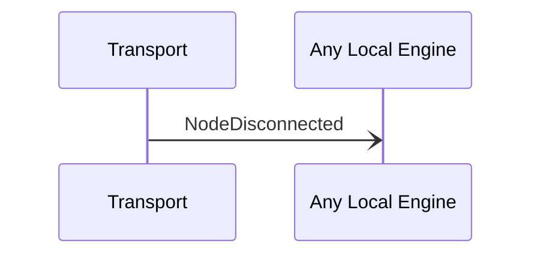

# NodeDisconnected

<!-- ANCHOR: purpose -->
Notification sent when a transport connection is closed to a node.
<!-- ANCHOR_END: purpose -->

## Type

<!-- ANCHOR: type -->
[[NodeTransportAddress#nodetransportaddress]]

{{#include ../types/node-transport-address.md:type}}
<!-- ANCHOR_END: type -->

## Message flow

<!-- ANCHOR: messages -->

<!-- ANCHOR_END: messages -->
