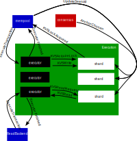

# Execution

**Purpose**

Given a total order of
[[TransactionCandidate|transaction candidates]]
(from the [[Mempool Engines|mempool]]),[^1]
the [[Execution Engines|execution engine]] updates "the" state of the
[replicated state machine](
https://en.wikipedia.org/wiki/State_machine_replication)
by executing them.
The [[Execution Engines|execution engine]] uses state dependency
 [[TransactionLabel|labels]] to calculate updates concurrently when
 possible.
Furthermore, partial order information can suffice to start concurrent
 computation, even before mempool and consensus determine a total order.
[[TransactionCandidate|Transaction candidates]] that include side effects
(such as sending messages to a user or solver)
perform those effects from the [[Executor]] process within the [[Execution Engines]].

In V1, following each state update, the [[Mempool Engines|mempool]]'s [[Worker Engine]] is informed, so that it can garbage collect information and log results.

<!-- Tobias: mention update of learner graph, here or elsewhere? -->

**Background**

The [[Ordering Machine|ordering machine]] maintains a
[replicated state machine](
https://en.wikipedia.org/wiki/State_machine_replication),
which is a core concept of [distributed systems](
https://en.wikipedia.org/wiki/Distributed_computing).
The architecture of the ordering machine is an adaptation of
[_Calvin: Fast Distributed Transactions for Partitioned Database Systems_](
http://cs.yale.edu/homes/thomson/publications/calvin-sigmod12.pdf),
to [Narwhal's](
https://arxiv.org/abs/2105.11827) scale-out architecture.
The execution engine exploits concurrency of transactions,
using the idea of [serializability](
https://en.wikipedia.org/wiki/Serializability)
(a key concept of [Transaction processing systems](
https://en.wikipedia.org/wiki/Transaction_processing) and databases).
Given that we follow a pre-determined total order of transactions,
we have what has been called
[deterministic execution scheduling](
    https://www.cs.umd.edu/~abadi/papers/determinism-vldb10.pdf).
In V1,
the mempool alone suffices to determine the total order
(without the need for any [[Consensus Engine]]).

**Scope**

The Execution Engine group is responsible for
updating and maintaining the state of the state machine.
It relies on the
[[Mempool Engines|mempool]] to store and order
[[TransactionCandidate|transaction candidates]].[^4]

<!--
All state reads outside of Transaction Candidates (including for backups,
[merkleization](https://en.wikipedia.org/wiki/Merkle_tree), etc.) can be done through the Read Backend, which does not exist in V1.
-->
In specifying the [[Execution Engines]],
we abstract over the contents of the state machine,
or exactly what has to be done to update it given a [[TransactionCandidate]].
The state of Anoma's state machine will contain
[[Resource| Resources]], [[Nullifier|Nullifiers]],
and [[Commitment|Commitments]],
and executing each [[TransactionCandidate|Transaction Candidate]] will require,
among other things,
checking the respective [[Resource Logic]]s of the involved resources.
Roughly,
the state and precise "code" of transactions are
essentially a type parameter.[^2]

For V1,
we assume that there is
a single validator that is maintaining a single state machine.
V1 does not include any kind of garbage collection or deletion of old state.

<!-- Each Validator maintains its own Execution Engine group for each chain it maintains (for chimera chains, it maintains 1 execution engine group per [[Base Chain|base chain]]).
These are complete replicas of the state machine, with complete replication of Transaction Candidate execution.
Future optimizations may allow for distributed proofs of various kinds allowing some validators to skip some of the execution.

We do, however, allow for checkpointing:
By performing a full-state read from a weak quorum of validators, a validator can learn the complete state of the state machine at a particular timestamp (for V1, this is a [[TxFingerprint]]), and then compute all the Transaction Candidates thereafter.
It should not have to compute from genesis.
No one should need to store a complete history of all Transaction Candidates or past state values.
-->

## Functionality

### High Level Protocols
The main functionality of the Execution engine is
 serializable [[TransactionCandidate]] execution.
We want to *execute* each [[TransactionCandidate]],
i.e., read the necessary values from storage,
evaluate the executor function,
and write the computed results to state,
concurrently but [serializably](
https://en.wikipedia.org/wiki/Serializability):
each Transaction Candidate's reads and writes should be
*as if* the [[TransactionCandidate]]s were executed in
the total order chosen by the [[Mempool Engines|mempool]].[^5]
As this order is fixed, we can use
[deterministic execution scheduling](https://www.cs.umd.edu/~abadi/papers/determinism-vldb10.pdf).

We can imagine the simplest system as executing each
 [[TransactionCandidate]], after they are ordered, sequentially in the
 fixed order.
However, we want to exploit concurrency of transactions as much as
 possible to minimize latency.
Several optimizations improve over sequential execution.
We can increase concurrency of transaction by partitioning state
 as key/value pairs: we can execute [[TransactionCandidate]]s
 that only access disjoint sets of keys *concurrently* (or even in
 parallel).

### Responsibilities

#### State
The core purpose of the Execution Engine group is
 updating and maintaining the state of the RSM.
As an abstraction, we assume state is stored as mutable *Data*
 (unlimited size blobs of binary), each of which is accessed using an
 immutable *Key*.
If we want to mutate a Key associated with specific Data, that means
 that we have to delete the Data associated with the old Key, and
 write a copy of the data to the new Key.
Keys that have never had Data written to them are mapped to an empty
 value.
Thus, we can
 [create, read, update, and delete](https://en.wikipedia.org/wiki/Create,_read,_update_and_delete) Keys.
These are the only primitives we use.[^6]

<!-- Tobias: do we need to talk about re-sharding here? -->
<!-- Isaac: As it stands, we haven't even mentioned Shards yet, so no. -->

For V1, we do not assume any key structure, so [[TransactionLabel]]s
 will have an explicit list of Keys they can use, rather than
 something more clever.[^3]

#### Transaction Candidate Labels

[[TransactionCandidate]]s are *[[TransactionLabel|labeled]]* with a
 set of keys they can read, and a set of keys they can write.
Writing $\wp\mathit{Keys}$ for the powerset of all keys, we have the
 following:
<!--{v2 only} For Chimera Chains, there is a label for each base chain.-->

$\mathsf{read–keys}:   \mathit{Tx\_Candidates} \rightarrow \wp\mathit{Keys}$

$\mathsf{write–keys}: \mathit{Tx\_Candidates} \rightarrow \wp\mathit{Keys}$

The Execution Engines must not allow a [[TransactionCandidate]] to
 affect any key outside of its write set, aborting the transaction
 with an error message.
Moreover, each [[TransactionCandidate]]'s effects must be a
 deterministic function of the [[TransactionCandidate]] and the values
 of the keys in its read set in RSM state.

#### Executor Function

In order to define a state machine, we assume a fixed
 *Executor Function*:

$\mathsf{executor\_function}\colon
\left(\mathit{Data}^{\mathit{Keys}} \times \mathit{Tx\_Candidates}\right)
\to \left(  \wp(\mathit{Keys}\times \mathit{Data})\times \mathit{IO–commands} \right)$

Inputs:
- the previous state, represented as a function from Keys to Data
- the [[TransactionCandidate]] itself

Outputs:
- The new $\left\langle \mathit{key}, \mathit{data}\right\rangle$
   pairs to be written to state.
  - Naively, these must include all the Keys in $\mathsf{write}(T)$,
     but we have an optimization for cases where $T$ does not actually
     update this Key.
  - This new state must be a deterministic result of the inputs.
- IO side-effects *are allowed*, including sending messages to users
   or other Identities in the Anoma network.
  The [[Executor]] may run these IO effects,
  but running IO effects is orthogonal to
  reading and writing to state,
  i.e., running IO effects must not affect the key value store.
  Whether or not the executor runs IO effects will (in V2) depend on
  additional information provided in
  [[TransactionRequest|transaction requests]] that
  the worker can pass to the executor (in the [[ExecuteTransaction]] message).
  <!-- quick fix begin--> In V1,
  the issuer of the [[TransactionRequest|transaction request]]
  is always informed about the result of execution
  in the form of an [[ExecutionSummary]].<!-- quick fix end-->

When the execution engine group _executes_ a [[TransactionCandidate]],
 it read the keys from the state that would be reached by execution
 all preceding [[TransactionCandidate]]s[^7]
 (for V1, these are totally ordered w.r.t.
 [[TxFingerprint|transaction fingerprints]]) to compute the
 $\mathsf{executor\_function}$, and then updates its state.
After executing a [[TransactionCandidate]], the state of the write
 keys must reflect the result of the $\mathsf{executor\_function}$ as
 applied to the read keys.

#### Timestamps

Each Transaction Candidate has a logical *[[TxFingerprint|timestamp]]*
 which conveys ordering information relative to other
 [[TransactionCandidate|transaction candidates]].
[[TxFingerprint|Timestamps]], and thus [[TransactionCandidate]]s, are
 partially ordered.
For V1, [[TxFingerprint|timestamps]] are
[[TxFingerprint|transaction fingerprints]], and with
 only one [[Worker Engine]], these are totally ordered, according to
 the lexicographic order of _batch number_ and _transaction number_
 (where the latter is unique w.r.t. each batch).

The state stored at each [[TxFingerprint|timestamp]] must be the one
 that would result from applying the $\mathsf{executor\_function}$ to
 each [[TransactionCandidate]] in the total order of their
 [[TxFingerprint|timestamps]].

## Engines Overview

!!! todo

    adapt

    

### Shards

[[Shard|Shards]] store and update the state of the RSM.
Different shards may be on different machines.[^8]
Within a Validator, Keys are partitioned across the
 [[Shard|Shards]] for load-balancing.
Redistributing state between [[Shard|Shards]] is called *re-sharding*.
For V1, we assume there will be no re-sharding.

<!-- NOT RELEVANT TO V1
Each Shard is specific to a blockchain, and each shard in a chimera chain is specific to 1 base chain.
However, as an optimization, an implementation could conceivably use 1 process to do the work of multiple shards with different base chains so long as those shards are identical, and fork that process if / when the base chains diverge.
-->

For each Key, each [[Shard]] maintains a (partially-ordered) timeline
 of [[TxFingerprint|timestamps]] of [[TransactionCandidate]]s that
 read or write to that Key.[^9]

This requires [[Shard|Shards]] to receive and process ordering information
 from [[Mempool Engines|mempool]] and [[Consensus Engine|consensus]].
[[Shard|Shards]] also store the data written by each
 [[TransactionCandidate]] that writes to that Key.
This is [multi-version concurrent storage](
    https://en.wikipedia.org/wiki/Multiversion_concurrency_control).

When a [[Shard]] has determined the value a [[TransactionCandidate]]
 reads from a key, it sends that value to the corresponding
 *[[Executor]]*.
<!-- NOT IN V1
In the [[Shard]] page, we detail optimizations for getting read values
 to [[Executor]]s as quickly as possible.
-->

### Executors aka Executor Processes

[Executors](execution/executor.md) are processes that compute the
 Executor Function and communicate results to the [[Shard|Shards]].
Each [[TransactionCandidate]] is assigned its own [[Executor|Executor]]
 process, which receives the full [[TransactionExecutable]] from the
 [[Mempool Engines|mempool]] [[Worker Engine|workers]].
The Execution Engines might keep a pool of [[Executor|Executors]], or spin a
 new one up with each [[TransactionCandidate]].

The [[Executor|Executor]] sends [[KVSReadRequest|read requests]] to the
 relevant [[Shard|Shards]] to obtain values the [[TransactionCandidate]]
 needs to read at runtime;
 then the [[Executor|Executor]] computes the Executor Function on the values
 received from the [[Shard|Shards]], and finally sends any values to be
 written to the relevant [[Shard|Shards]].
To save on communication costs,
 [[Executor|Executors]]
 can be co-located with
 [[Shard|Shards]],
 [[Worker Engine]]s,
 or both.

### Read Backend

For V1, we elide the Read Backend: all [[TransactionCandidate]]s go
 through the [[Mempool Engines|mempool]].

<!--
## Life of a Transaction

- When the [[Mempool Engines|mempool engine]] stores a transaction candidate,
  the mempool worker informs the relevant shards about
  the read and write requests that it should prepare for
  such that the executor's read and write requests will be served correctly
  and "immediate" inputs are provided as soon as possible.

- The worker requests a handle to a new [[Executor Process]]
  from the [[Execution Supervisor]]
  or the worker may spawn a new [[Executor Process]].[^10]
  Once the executor process is up and running,
  the transaction candidate's "code", Label and Timestamp
  are sent to the [[Executor Process]] in an [[ExecuteTransaction]] message.
  The Timestamp amounts to the [[TxFingerprint|transaction fingerprint]]
  i.e., a batch number and transaction number.

- For each key to be read _immediately_,
  when the relevant Shard learns the precise data to be read at that time,[^11]
  it communicates that data to the Executor;
  [[KVSReadRequest]]s are served in the same way,
  i.e.,
  the Executor communicates with the relevant shards
  performing the missing optional [[KVSReadRequest|read requests]].

- When the Executor Process receives all the data it uses as input,
  the executor computes the result of executor function in order
  to produce the data to be written.
  It then sends the data to the relevant shards
  using KVSWriteRequest.
- As an optimization, we allow executors to start computing before all reads are available, if possible.

- For each key to which the Executor Process has to write,
  the shard has (implicitly) granted write locks,
  i.e., the shards will  wait until it  receives data
  to be written from the executor process;
  it does  store the data (and potentially serves pending read requests).
- As an optimization, we allow optional writes, which allow the executor to inform the shard that it doesn't want to update the data, without having to re-transmit it.

- The shard informs the mempool worker about finished executor processes,
  in the form of state updates,
  once it has receive writes on all keys
  or lock releases
  or abort signals from the curator of a transaction.
-->

<!-- think a bit more about IO ... -->

[^1]: For V1, the mempool is already determining a total order,
    because we only have a single unique worker
    and transaction fingerprints already provide all information of a total order.

[^2]: In fact, this could be made precise using abstract data types.

[^3]: In V2,
    we make the additional assumption that Keys can have structure.
    For example,
    we can arrange them in a forest,
    to allow us to easily express sub-trees using prefixes.
        This would allow labels to express
    potentially infinite sets of keys in a compact way.
    This will also require that we address the challenge of re-sharding state,
    i.e., re-partitioning the state,
    e.g., due to migration of validators around the globe.

[^4]: From V2 onwards, mempool interacts with consensus to establish
    a total order.

[^5]: Again, note that from V2 onwards,
    this will be in collaboration with consensus.

[^6]: However, we also assume [mulit-version storage](
    https://en.wikipedia.org/wiki/Concurrency_control).

[^7]: Recall that we may known what this state is as soon as
    all _relevant_ previous transactions are executed,
    i.e., those that may have an effect on the keys read.

[^8]: For V2, the number of shards may be variable
    and the challenge of re-sharding needs to be addressed.

[^9]: The timeline is based on a shard-specific view of the mempool DAG.

<!-- NOT USED IN V1
[^10]: In principle,
    this may be a set of executor processes in general
    if we are able to split up executor processes into
    a set of processes or threads that are collocated with shards.

[^11]: This value may either be a genesis value or
    the value of the previous write to that key.
-->
