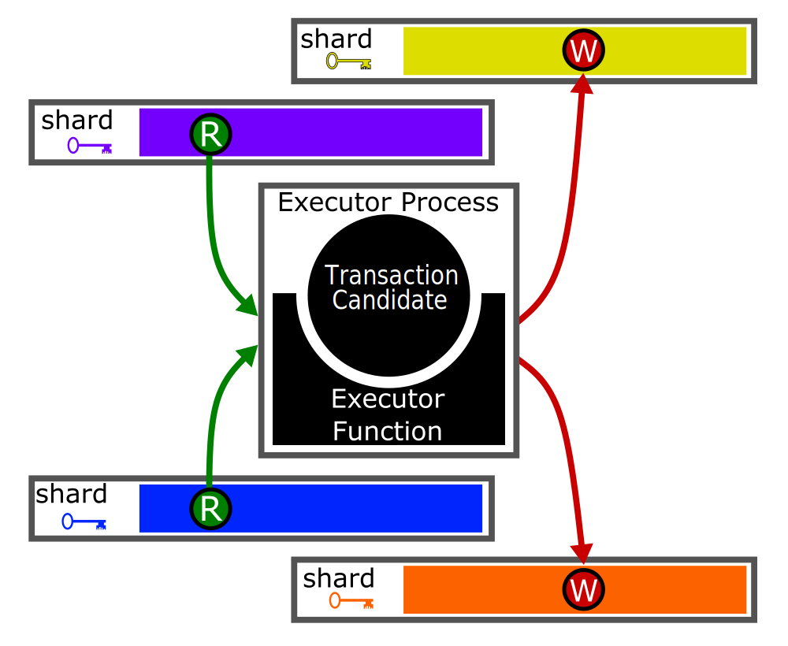

# Executor / Executor Process

Conceptually, Executors  run the
 [executor function](../execution.md#executor-function) in order to
 compute transaction outputs, including state updates
 (see [[Execution Engines|here]] for more on the executor function).
Executors may be co-located with [[Shard|shards]], or with
 [[Worker Engine|mempool workers]].
The [[Execution Engines]] might keep a pool of Executors,
 or spin a new one up with each [[TransactionCandidate]].

<!--
## Life of a Transaction

To quickly understand what an Executor does,
let us look at the life of a transaction within the Execution Engine.

- When the [[Mempool Engines|mempool]] stores a transaction,
  the execution engine assigns an executor process,
  using that transaction's text. <! FIXME 'text' is executable ?  >
- Once the [[Mempool Engines|mempool]] has assigned a timestamp
  (for V1, this is a [[TxFingerprint]]) to a transaction,
  it communicates that timestamp to each of the shards in the transaction's label,
  and establishes communication channels between the shards and
  the transaction's executor process.
  Each shard then stores that timestamp in its timeline.
- For each key read,
  when the relevant Shard learns the precise data to be read at that time
  (identifies a unique previous transaction and
  learns the data written by that transaction),
  it communicates that data to the Executor process.
  - As an optimization,
    we may want to allow "lazy" reads.
    When an Executor realizes it needs the value for a lazy read,
    it sends a [[KVSReadRequest]] message to the relevant Shard.
- When it receives all the data it needs to read,
  the executor process runs the executor function in order to learn
  the values to be written.
  It then communicates these values to the relevant shards.
  - As an optimization,
    we may allow executor processes to start computing before
    all reads are available, if possible.
  - As an optimization,
    we may consider special writes such as "don't change this data,"
    (which would only work for keys the transaction both reads and writes).
    These are represented using [[KVSReadRequest]] messages with
    `datum` set to `None`.
- For each key written,
  the shard waits to receive data written from the executor process,
  and stores it.
-->

# Executor Incoming Messages

To specify the Executor interface,
here are all the messages the Executor needs to be able to receive.

## [[ExecuteTransaction]]

--8<-- "executor/execute-transaction.md:blurb "
--8<-- "executor/execute-transaction.md:details "

## [[KVSRead]]

--8<-- "executor/KVS-read.md:blurb "
--8<-- "executor/KVS-read.md:details "
