# Shard

The Shards together store and update the
 [state](../execution.md#state) of the replicated state machine and
  together are a component of the [[Execution Engines]].
They provide [[Executor]]s with input data and update the state
 according to the results of [[Executor]]s' computations.

<!-- Isaac: Do we assume this?
For V1, we assume there is only a single shard.
-->
<!-- NOT RELEVANT FOR V1:
    ---
    Different shards may be on different physical machines.
    (‼ in fact, machine ideally should always be distributable,
    so we can save on all of these different physcial machine explanations in
    the operational spec)
    Redistributing state between shards is called *Re-Sharding*.
    Each Shard is specific to exactly one learner.
    However,
    as an optimization,
    an implementation could conceivably use a single process to do
    the work of multiple shards with different learners
    so long as those shards are identical, and
    fork that process if and when the learners diverge.
-->

Each shard is responsible for a set of [[KVSKey]]s
and these sets are disjoint for different shards.
For each of the keys that a shard is responsible for, the shard maintains a
 (partially-ordered) timeline of [[TxFingerprint|time‍stamps]] of
 [[TransactionCandidate|transaction candidates]] that may read or write to keys.
For V1, these [[TxFingerprint|time‍stamps]] are [[TxFingerprint]]s and
they are totally ordered, because there is only
a single [[Worker Engine|Worker Engine]].
Shards also keep a history of data written by each
 [[TransactionCandidate]] to each key.
This is [multi-version concurrent storage](
    https://en.wikipedia.org/wiki/Multiversion_concurrency_control).

<!-- ‼ duplication of prose to be avoided via includes
    using `ANCHOR` ... ANCHOR_END "mechanics"
    https://rust-lang.github.io/mdBook/format/mdbook.html#including-portions-of-a-file
-->

## State (of the shard)

For each [[Worker Engine|Worker Engine]], the Shard maintains:
-  [[TxFingerprint|A timestamp]], such that all
   _[[KVSAcquireLock|write lock requests]]_[^1] for
   transaction candidates with earlier timestamps that this worker curates
   have already been received.
  Together, these timestamps represent [`heardAllWrites`](
  ./shard.md#heardallwrites).
<!-- not relevant for V1
- In versions > V1, another [[TxFingerprint|timestamp]], before which
   the Shard will receive no further *read* requests from this
   [[Worker Engine|Worker Engine]].
  For [[WorkerEngine]], this cannot be *after* the corresponding
   *write* [[TxFingerprint|timestamp]].
  We will also maintain these from each Read Backend worker.
  Together, these represent `heardAllReads`.
-->
For each [key](../execution.md#state) (assigned to this Shard):
- A set of [[TxFingerprint|time‍stamps]] of known
   [[TransactionCandidate|transaction candidates]] that read and/or write that key, and for
   each, some subset of:
  - A value written to that key at that [[TxFingerprint|time‍stamps]]
     by that [[TransactionCandidate]] using a [[KVSWrite]] message
  - A marker indicating that this [[TransactionCandidate]] may
     (or will) write to this key, but this Shard has not yet received
     a corresponding [[KVSWrite]] message.
  - A marker indicating that this [[TransactionCandidate]] *will* read
     this value, and an [[ExternalIdentity]] corresponding to the
     relevant [[Executor]].
    This marker is only stored so long as the Shard doesn't know the
     value.
    When this value is determined, this Shard must remove this marker
     and send a [[KVSRead]] message to the [[Executor]].
  - A marker indicating that this [[TransactionCandidate]] *may* read
     this value, and an [[ExternalIdentity]] corresponding to the
     relevant [[Executor]].
    If the [[Executor]] sends a [[KVSReadRequest]] for this key, the
     Shard updates this marker to a "*will* read" marker.
<!-- not relevant for V1
- If a [[TxFingerprint|time‍stamps]] has no corresponding markers or
   values written, we don't have to store it.
- If a value written is before `heardAllReads`, and there are no pending
   reads or writes before it, then we can remove all *earlier* values
   written.
Additionally, the Shard maintains:
- A complete copy of the DAG structure produced by the
   [[Mempool Engines]].
  This includes a set of all [[NarwhalBlockHeader]]s.
  For [[TxFingerprint|time‍stamps]] before `SeenAllRead`, if there are
   no keys with a pending read or write before that
   [[TxFingerprint|timestamp]], we can delete old DAG structure.
- In versions > V1, a complete copy of the sequence of Anchors chosen
   by [[Consensus Engine]].
  This is a sequence of consensus decisions.
  For [[TxFingerprint|time‍stamps]] before `heardAllReads`, if there are
   no keys with a pending read or write before that
   [[TxFingerprint|timestamp]], we can delete old anchors.
-->

## Shard Optimizations

We want to *execute* each [[TransactionCandidate]] (evaluate the
 [executor function](../execution.md#executor-function)
 in order to compute the data written)
 using the idea of [serializability](
    https://en.wikipedia.org/wiki/Serializability):
 each [[TransactionCandidate]]'s reads and writes should be *as if*
 they were executed in the total order determined by
  the [[Mempool Engines|mempool]] (and
  [[Consensus Engine|consensus]], from V2 onward).
In fact, the simplest correct implementation amounts to executing all
 [[TransactionCandidate|transaction candidates]] sequentially, repeatedly applying the
 executor function in a loop.
However, we want to compute concurrently as possible, for minimum
 latency.
We do this using a set of optimizations.

### Optimization: Per-Key Ordering

[[Mempool Engines|Mempool]]
 (and after V1, [[Consensus Engine|consensus]]) provides ordering
 information for  [[TxFingerprint|the time‍stamps]].
Thus, relative to each key,
[[TransactionCandidate|transaction candidates]] can be totally ordered by the
 [Happens Before](https://en.wikipedia.org/wiki/Happened-before)
 relationship.
Since [[TxFingerprint|the only time‍stamps]] in V1 are [[TxFingerprint]]s, and
 V1 has only  [[Worker Engine|one worker engine]], [[TxFingerprint|the set of time‍stamps]] is
 totally ordered, so the
 [Happens Before](https://en.wikipedia.org/wiki/Happened-before)
 relationship is a total order.
With a total ordering of [[TransactionCandidate|transaction candidates]], Shards can send
 read information ([[KVSRead]]s) to [[Executor]]s as soon as the
 previous [[TransactionCandidate]] is complete.
However, [[TransactionCandidate|transaction candidates]] that access on disjoint sets of
 keys can be run in parallel.
In the diagram above, for example, [[TransactionCandidate|transaction candidates]] `c` and
 `d` can run concurrently, as can [[TransactionCandidate|transaction candidates]] `e` and
 `f`, and [[TransactionCandidate|transaction candidates]] `h` and `j`.

### Optimization: Order With Respect To Writes

In fact, Shards can send read information to an [[Executor]] as soon
 as the previous *write*'s [[TransactionCandidate]] has completed
 (sent a [[KVSWrite]]).
All Shards really need to keep track of is a total order of writes,
 and how each read is ordered with respect to writes (which write it
 precedes and which write preceded it).
As soon as the preceding write is complete (the Shard has received a
 [[KVSWrite]]), the reads that depend on it can run concurrently.
There are no "read/read" conflicts.
In the diagram above,
for example, [[TransactionCandidate|transaction candidates]] `a` and `b` can run
 concurrently.

### Optimization: Only Wait to Read

Because we store each version written
 ([multi-version concurrent storage](
    https://en.wikipedia.org/wiki/Multiversion_concurrency_control)),
 we do not have to execute writes in order.
A Shard does not have to wait to write a later data version to a key
 just because previous reads have not finished executing yet.
In the diagram above, for example, only green _happens-before_ arrows
 require waiting.
[[TransactionCandidate|transaction candidates]] `a`, `b`, `c`, and `j` can all be executed
 concurrently, as can [[TransactionCandidate|transaction candidates]] `d`, `e`, and `i`.

<!-- not relevant for V1
### Optimization: Execute With Partial Order

Some [[Mempool Engines|mempools, including Narwhal]],
can provide partial order information on transactions
even before consensus has determined a total order.
This allows the Ordering Machine to execute some transactions before
a total ordering is known.
In general, for a given key,
a shard can send read information to an executor when
it knows precisely which write happens most recently before the read,
and that write has executed.

#### heardAllWrites

-->

### heardAllWrites

In order to know which write happens most recently before a given
 read, the Shard must know that no further writes will be added to
 the timeline before the read.
[[Mempool Engines|Mempool]] and [[Consensus Engine|consensus]] should
 communicate a lower bound on timestamps to the Shards, called
 `heardAllWrites`.
The Shard is guaranteed to never receive another [[KVSAcquireLock]]
 with a write operation and
  [[TxFingerprint|a timestamp]] before  `heardAllWrites`.
In general, a Shard cannot send a [[KVSRead]] for
 [[TxFingerprint|a timestamp]] unless
  [[TxFingerprint|the timestamp]] is before `heardAllWrites`.
For V1, `heardAllWrites` consists of a [[TxFingerprint]] from the
 [[Worker Engine|sole worker engine]] such that [[Worker Engine|the worker engine]] is certain
 (based on [[KVSLockAcquired]]s) that the Shard has already seen all
 the [[KVSAcquireLock]]s it will ever send at or before that
 [[TxFingerprint]].

<!-- the rest of this is not relevant for V1

This can be on a per-key basis or simply a global lower bound.
Occasionally,
`heardAllWrites` should be updated with later timestamps.
Each round of consensus should produce a lower bound for `heardAllWrites`,
but the [[Mempool Engines|mempool]] may already have sent better bounds.
Each Shard must keep track of `heardAllWrites` on
each key's multi-version timeline.

Transactions
(like transaction `j` in the diagram below)
containing only write operations
can execute with a timestamp after `heardAllWrites`,
but this simply means calculating the data they will write.
Since that does not depend on state,
this can of course be done at any time.

#### heardAllReads

We want to allow Typhon to eventually garbage-collect old state.
[[Mempool Engines|mempool]] and [[Consensus Engine|consensus]] should
communicate a lower bound timestamp to the execution engine,
called `heardAllReads`,
before which there will be
no more read transactions send to the execution engine.
Occasionally, `heardAllReads` should be updated with later timestamps.
Each Shard must keep track of `heardAllReads` on
each key's multi-version timeline, so it can garbage collect old values.

In the example above, our happens-before arrows have been replaced with
_may-happen-before_ arrows,
representing partial ordering information from the [[Mempool Engines|mempool]].
Note that not all transactions can be executed with
this partial order information.

#### Conflicts

There are three types of conflicts that can prevent a transaction from
being executable without more ordering information.
- *Write/Write Conflicts*
  occur when a shard cannot identify the most recent write before a given read.
  In the diagram above,
  transaction `e` cannot execute because it is not clear whether
  transaction `b` or transaction `c` wrote most recently to the yellow key.
- *Read/Write Conflicts*
  occur when  shard cannot identify whether a read operation occurs before or
  after a write,
  so it is not clear if it should read the value from that write or
  from a previous write.
  In the diagram above,
  transaction `g` cannot execute because it is not clear whether
  it would read the data written to the blue key by transaction `d` or
  transaction `i`.
- *Transitive Conflicts*
  occur when a shard cannot get the data for a read because
  the relevant write is conflicted.
  In the diagram above,
  transaction `h` cannot execute because
  it cannot read the data written to the yellow key by transaction `g`, since
  transaction `g` is conflicted.

As the [[Mempool Engines|mempool]] and [[Consensus Engine|consensus]] provide
the execution engine with more and more ordering information, and
the partial order of timestamps is refined,
all conflicts eventually resolve.
In the diagram above,
suppose consensus orders transaction `g` before transaction `i`.
The Read/Write conflict is resolved:
transaction `g` reads the data transaction `d` writes to the blue key.
Then the transitive conflict is also resolved:
transaction `h` will be able to execute.
-->

<!-- V1 does not have any read-only transactions.
### Optimization: Client Reads as Read-Only Transactions

With the above optimizations, transactions containing only read operations do not affect other transactions (or scheduling) at all.
Therefore, they can bypass [[Mempool Engines|mempool]] and [[Consensus Engine|consensus]] altogether.
Clients can simply send read-only transactions directly to the execution engine (with a label and a timestamp), and if the timestamp is after `heardAllReads`, the execution engine can simply place the transaction in the timeline of the relevant shards and execute it when possible.
In the diagram above, transaction `f` is read-only.

If client reads produce signed responses, then signed responses from a weak quorum of validators would form a *light client proof*.
-->

# Shard Incoming Messages

Shards receive and react to the following messages:

--8<-- "shard/KVS-acquire-lock.md:all"

--8<-- "shard/KVS-read-request.md:all"

--8<-- "shard/KVS-write.md:all"

--8<-- "shard/update-seen-all.md:all"

[^1]: For the purpose of this discussion, we call
    a _write lock request_ a [[KVSAcquireLock]] message
    for a key for which a [[KVSWrite|write request]] will or may be issued.
