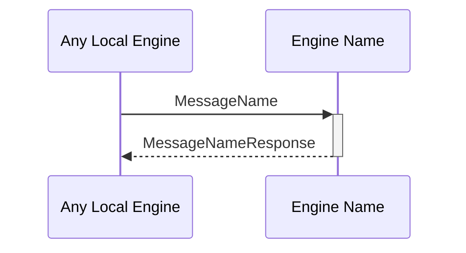

# MessageName
# MessageNameResponse (if applicable)

## Purpose

<!-- --8<-- [start:purpose] -->
Describe the purpose of the message.
<!-- --8<-- [end:purpose] -->

## Type

<!--
Link to the types of received and triggered messages.

Reception:
- Link to the latest version of the type that corresponds to the message.

Triggers:
- Request-Response pattern:
  - link to response type and include the type definition
  - see MessageNameResponseV1 below
- Other patterns:
  - list of messages that may be triggered, link to the message (not to the type, and no includes)
  - see OtherMessageName below
-->

<!-- --8<-- [start:type] -->
**Reception:**

[[MessageNameV1#messagenamev1]]

{{#include ../types/message-name-v1.md:type}}

**Triggers:**

[[MessageNameResponseV1#messagenameresponsev1]]

{{#include ../types/message-name-response-v1.md:type}}

[[OtherMessageName#othermessagename]]
<!-- --8<-- [end:type] -->

## Behavior

<!-- --8<-- [start:behavior] -->
Describe the message reception behavior, processing logic, and possible triggers.
<!-- --8<-- [end:behavior] -->

## Message flow

<!-- --8<-- [start:messages] -->

<!-- --8<-- [end:messages] -->

