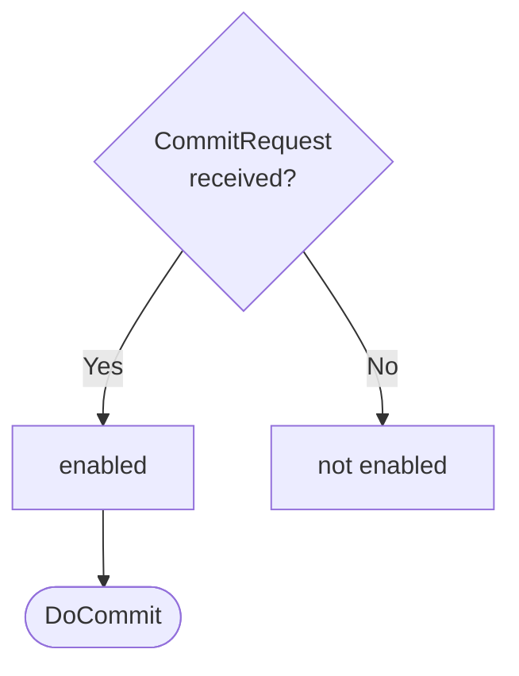

??? note "Juvix preamble"

    ```juvix
    module node_architecture.engines.commitment_dynamics;

    import prelude open;
    import node_architecture.basics open;
    import node_architecture.types.engine_dynamics open;
    import node_architecture.types.engine_environment open;
    import node_architecture.types.identity_types open;
    import node_architecture.engines.commitment_overview open;
    import node_architecture.engines.commitment_environment open;
    import node_architecture.types.anoma_message as Anoma;
    ```

# `Commitment` Dynamics

## Overview

The dynamics of the Commitment Engine define how it processes incoming commitment requests and produces the corresponding responses.

## Action labels

<!-- --8<-- [start:commitment-action-label] -->
```juvix
type CommitmentActionLabel :=
  | -- --8<-- [start:DoCommit]
    DoCommit CommitmentMsg
    -- --8<-- [end:DoCommit]
;
```
<!-- --8<-- [end:commitment-action-label] -->

### `DoCommit`

!!! quote ""

    --8<-- "./commitment_dynamics.juvix.md:DoCommit"

This action label corresponds to generating a commitment (signature) for the given request.

??? quote "`DoCommit` action effect"

    This action does the following:

    | Aspect | Description |
    |--------|-------------|
    | State update          | The state remains unchanged. |
    | Messages to be sent   | A `CommitResponse` message is sent back to the requester. |
    | Engines to be spawned | No engine is created by this action. |
    | Timer updates         | No timers are set or cancelled. |

## Matchable arguments

<!-- --8<-- [start:commitment-matchable-argument] -->
```juvix
type CommitmentMatchableArgument :=
  | -- --8<-- [start:ArgCommit]
    ArgCommit CommitmentMsg
    -- --8<-- [end:ArgCommit]
;
```
<!-- --8<-- [end:commitment-matchable-argument] -->

### `ArgCommit`

!!! quote ""

    ```
    --8<-- "./commitment_dynamics.juvix.md:ArgCommit"
    ```

This matchable argument contains the commitment request data.

## Precomputation results

The Commitment Engine does not require any non-trivial pre-computations.

<!-- --8<-- [start:commitment-precomputation-entry] -->
```juvix
syntax alias CommitmentPrecomputation := Unit;
```
<!-- --8<-- [end:commitment-precomputation-entry] -->

## Guards

??? quote "Auxiliary Juvix code"

    Type alias for the guard.

    ```juvix
    CommitmentGuard : Type :=
      Guard
        CommitmentLocalState
        CommitmentMsg
        CommitmentMailboxState
        CommitmentTimerHandle
        CommitmentMatchableArgument
        CommitmentActionLabel
        CommitmentPrecomputation;
    ```

### `commitGuard`

<figure markdown>

<figcaption>commitGuard flowchart</figcaption>
</figure>

<!-- --8<-- [start:commit-guard] -->
```juvix
commitGuard
  (t : TimestampedTrigger CommitmentMsg CommitmentTimerHandle)
  (env : CommitmentEnvironment) : Maybe (GuardOutput CommitmentMatchableArgument CommitmentActionLabel CommitmentPrecomputation)
  := case getMessageFromTimestampedTrigger t of {
      | just (CommitRequest data) := just (
        mkGuardOutput@{
          args := [ArgCommit (CommitRequest data)];
          label := DoCommit (CommitRequest data);
          other := unit
        })
      | _ := nothing
  };
```
<!-- --8<-- [end:commit-guard] -->

## Action function

??? quote "Auxiliary Juvix code"

    Type alias for the action function.

    ```juvix
    CommitmentActionInput : Type :=
      ActionInput
        CommitmentLocalState
        CommitmentMsg
        CommitmentMailboxState
        CommitmentTimerHandle
        CommitmentMatchableArgument
        CommitmentActionLabel
        CommitmentPrecomputation;

    CommitmentActionEffect : Type :=
      ActionEffect
        CommitmentLocalState
        CommitmentMsg
        CommitmentMailboxState
        CommitmentTimerHandle
        CommitmentMatchableArgument
        CommitmentActionLabel
        CommitmentPrecomputation;
    ```

<!-- --8<-- [start:action-function] -->
```juvix
-- Not yet implemented
axiom signData : SigningKey -> Signable -> Either String Commitment;

axiom dummyActionEffect : CommitmentActionEffect;

commitmentAction (input : CommitmentActionInput) : CommitmentActionEffect :=
  let env := ActionInput.env input;
      out := ActionInput.guardOutput input;
      localState := EngineEnvironment.localState env;
  in
  case GuardOutput.label out of {
    | DoCommit (CommitRequest data) := let
        signedData := signData (CommitmentLocalState.signingKey localState) data;
        responseMsgCom := case signedData of {
          | Left errorMsg := CommitResponse@{
              commitment := emptyCommitment;
              error := just errorMsg
            }
          | Right commitment' := CommitResponse@{
              commitment := commitment';
              error := nothing
            }
        };
        senderCom := getMessageSenderFromTimestampedTrigger (ActionInput.timestampedTrigger input);
        targetCom := case senderCom of {
          | just s := s
          | nothing := Left "unknown"
        };
      in mkActionEffect@{
        newEnv := env; -- No state change
        producedMessages := [mkEnvelopedMessage@{
          sender := just (EngineEnvironment.name env);
          packet := mkMessagePacket@{
            target := targetCom;
            mailbox := nothing;
            message := Anoma.MsgCommitment responseMsgCom
          }
        }];
        timers := [];
        spawnedEngines := []
      }
    | DoCommit (CommitResponse _ _) := dummyActionEffect
  };
```
<!-- --8<-- [end:action-function] -->

## Conflict solver

```juvix
commitmentConflictSolver : Set CommitmentMatchableArgument -> List (Set CommitmentMatchableArgument)
  | _ := [];
```

## `Commitment` Engine Summary

--8<-- "./docs/node_architecture/engines/commitment.juvix.md:commitment-engine-family"