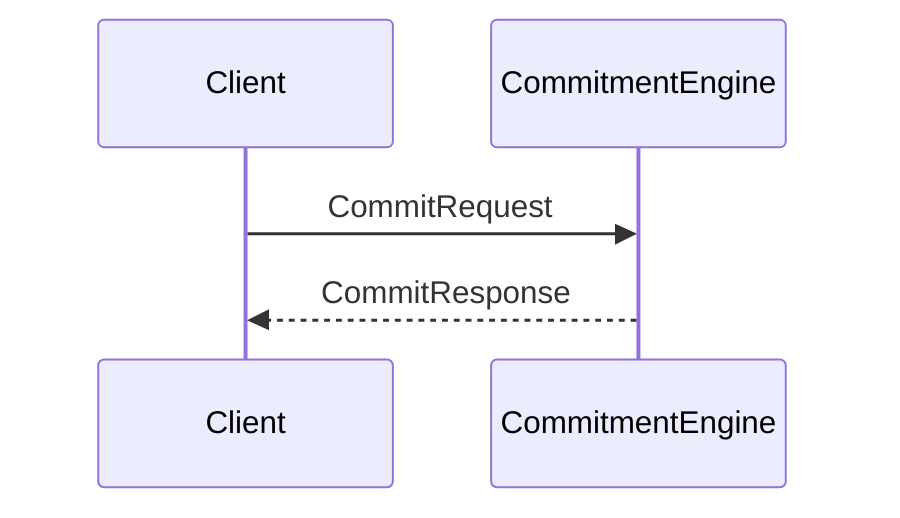

??? quote "Juvix imports"

    ```juvix
    module node_architecture.engines.commitment_overview;
    import prelude open;
    import node_architecture.types.identity_types open;
    ```

# Commitment Engine Family Overview

## Purpose

The **Commitment Engine** is responsible for generating commitments (signatures) by a particular identity. Commitment engine instances are generated by the **Identity Management Engine** when an identity is generated or connected. Only the original caller and anyone to whom they pass the engine instance reference can send messages to the instance and generate commitments by the corresponding identity.

## Message Interface

The Commitment Engine communicates using the following messages:

- `CommitRequest` and `CommitResponse`

### `CommitRequest` and `CommitResponse`

#### `CommitRequest`

```juvix
type CommitRequest := mkCommitRequest {
  data : Signable;
};
```

A `CommitRequest` instructs a commitment engine instance to produce a commitment (signature) over the provided data.

- `data`: The data to sign.

#### `CommitResponse`

```juvix
type CommitResponse := mkCommitResponse {
  commitment : Commitment;
  error : Maybe String;
};
```

A `CommitResponse` contains the commitment (signature) generated by the commitment engine instance in response to a CommitRequest.

- `commitment`: The generated commitment (signature).
- `error`: An error message if commitment generation failed.

### Commitment Messages

We define the messages that the Commitment Engine handles:

```juvix
type CommitmentMsg :=
  | MsgCommitRequest CommitRequest
  | MsgCommitResponse CommitResponse;
```

### Engine Components

- [[commitment_environment|Commitment Engine Environment]]
- [[commitment_dynamics|Commitment Engine Dynamics]]

### Message Sequence Diagrams
#### Commitment Sequence

<figure markdown="span">

<figcaption markdown="span">
Sequence diagram for commitment generation.
</figcaption>
</figure>