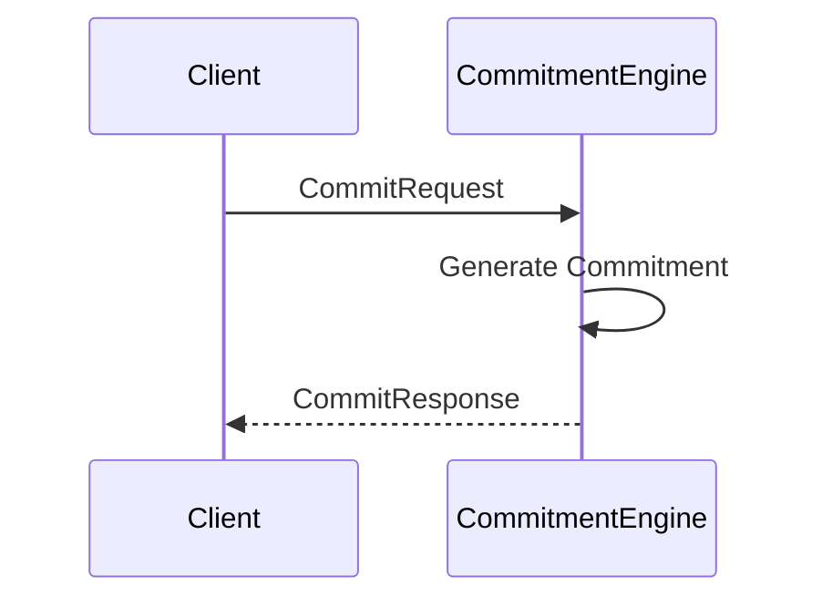

??? quote "Juvix imports"

    ```juvix
    module node_architecture.engines.commitment_overview;
    import prelude open;
    import node_architecture.identity_types open;
    ```

# `Commitment` Engine Family Overview

--8<-- "./docs/node_architecture/engines/commitment.juvix.md:commitment-engine-family"

The Commitment engine is responsible for generating commitments (signatures) by a particular identity. Commitment engine instances are generated by the Identity Management Engine when an identity is generated or connected.

## Purpose

The Commitment Engine maintains signing capabilities for a specific identity and handles commitment (signature) requests for that identity. Only the original caller and anyone to whom they pass the engine instance reference can send messages to the instance and generate commitments by the corresponding identity.

## Message interface

<!-- --8<-- [start:CommitmentMsg] -->
```juvix
type CommitmentMsg :=
  | -- --8<-- [start:CommitRequest]
    CommitRequest {
      data : Signable
    }
    -- --8<-- [end:CommitRequest]
  | -- --8<-- [start:CommitResponse]
    CommitResponse {
      commitment : Commitment
    }
    -- --8<-- [end:CommitResponse]
  ;
```
<!-- --8<-- [end:CommitmentMsg] -->

### `CommitRequest` message

!!! quote "CommitRequest"

    ```
    --8<-- "./commitment_overview.juvix.md:CommitRequest"
    ```

A `CommitRequest` instructs a commitment engine instance to produce a commitment (signature) over the provided data.

- `data`: The data to sign.

### `CommitResponse` message

!!! quote "CommitResponse"

    ```
    --8<-- "./commitment_overview.juvix.md:CommitResponse"
    ```

A `CommitResponse` contains the commitment (signature) generated by the commitment engine instance in response to a CommitRequest.

- `commitment`: The generated commitment (signature).
- `error`: An error message if commitment generation failed.

## Message sequence diagrams

### Commitment Generation Sequence

<!-- --8<-- [start:message-sequence-diagram] -->
<figure markdown="span">



<figcaption markdown="span">
Sequence diagram for commitment generation.
</figcaption>
</figure>
<!-- --8<-- [end:message-sequence-diagram] -->

## Engine Components

- [[commitment_environment|`Commitment` Engine Environment]]
- [[commitment_dynamics|`Commitment` Engine Dynamics]]

## Useful links
