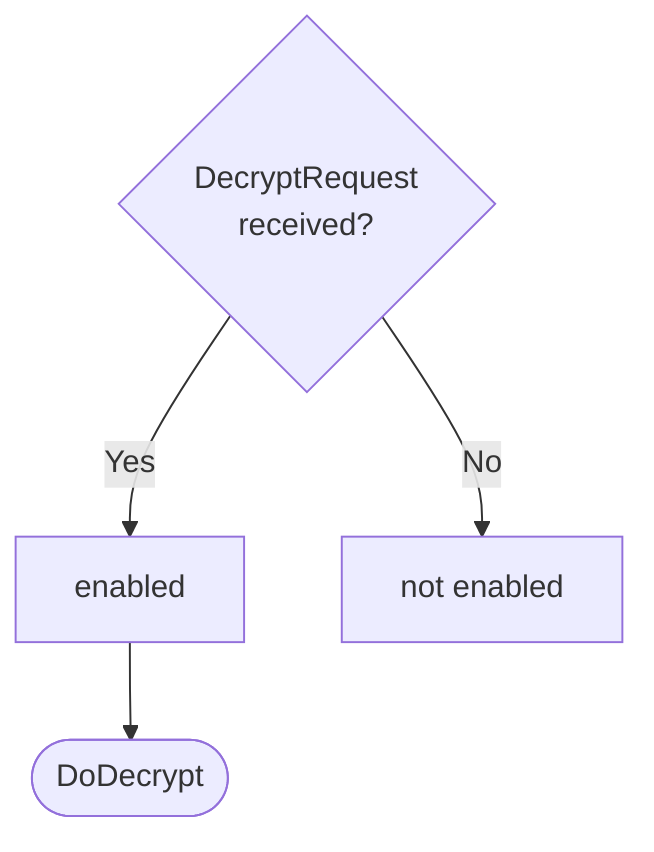

??? quote "Juvix imports"

    ```juvix
    module node_architecture.engines.decryption_dynamics;
    import prelude open;
    import node_architecture.types.messages open;
    import system_architecture.identity.identity open;
    import node_architecture.types.engine_dynamics open;
    import node_architecture.types.engine_environment open;
    import node_architecture.engines.decryption_environment open;
    import node_architecture.engines.decryption_overview open;
    import node_architecture.types.identities open;
    import node_architecture.identity_types open;
    import node_architecture.types.anoma_message open;
    ```

# `Decryption` Dynamics

## Overview

The dynamics of the Decryption Engine define how it processes incoming decryption requests and produces the corresponding responses.

## Action labels

<!-- --8<-- [start:decryption-action-label] -->
```juvix
type DecryptionActionLabel :=
  | -- --8<-- [start:DoDecrypt]
    DoDecrypt {
      data : ByteString
    }
    -- --8<-- [end:DoDecrypt]
;
```
<!-- --8<-- [end:decryption-action-label] -->

### `DoDecrypt`

!!! quote ""

    --8<-- "./decryption_dynamics.juvix.md:DoDecrypt"

This action label corresponds to decrypting the data in the given request.

??? quote "`DoDecrypt` action effect"

    This action does the following:

    | Aspect | Description |
    |--------|-------------|
    | State update          | The state remains unchanged. |
    | Messages to be sent   | A `DecryptResponse` message is sent back to the requester. |
    | Engines to be spawned | No engine is created by this action. |
    | Timer updates         | No timers are set or cancelled. |

## Matchable arguments

<!-- --8<-- [start:decryption-matchable-argument] -->

```juvix
type DecryptionMatchableArgument :=
  | -- --8<-- [start:ReplyTo]
  ReplyTo (Option EngineID) (Option MailboxID)
  -- --8<-- [end:ReplyTo]
;
```
<!-- --8<-- [end:decryption-matchable-argument] -->

### `ReplyTo`

!!! quote ""

    ```
    --8<-- "./docs/node_architecture/engines/decryption_dynamics.juvix.md:ReplyTo"
    ```

This matchable argument contains the address and mailbox ID of where the response message should be sent.

## Precomputation results

The Decryption Engine does not require any non-trivial pre-computations.

<!-- --8<-- [start:decryption-precomputation-entry] -->
```juvix
syntax alias DecryptionPrecomputation := Unit;
```
<!-- --8<-- [end:decryption-precomputation-entry] -->

## Guards

??? quote "Auxiliary Juvix code"

    Type alias for the guard.

    ```juvix
    -- --8<-- [start:decryption-guard]
    DecryptionGuard : Type :=
      Guard
        DecryptionLocalState
        DecryptionMailboxState
        DecryptionTimerHandle
        DecryptionMatchableArgument
        DecryptionActionLabel
        DecryptionPrecomputation;
    -- --8<-- [end:decryption-guard]

    -- --8<-- [start:decryption-guard-output]
    DecryptionGuardOutput : Type :=
      GuardOutput DecryptionMatchableArgument DecryptionActionLabel DecryptionPrecomputation;
    -- --8<-- [end:decryption-guard-output]
    ```

### `decryptGuard`

<figure markdown>

<figcaption>decryptGuard flowchart</figcaption>
</figure>

<!-- --8<-- [start:decrypt-guard] -->
```juvix
decryptGuard
  (t : TimestampedTrigger DecryptionTimerHandle)
  (env : DecryptionEnvironment) : Option DecryptionGuardOutput
  := case getMessageFromTimestampedTrigger t of {
      | some (MsgDecryption (DecryptRequest data)) := do {
        sender <- getSenderFromTimestampedTrigger t;
        pure (mkGuardOutput@{
                  args := [ReplyTo (some sender) none] ;
                  label := DoDecrypt data;
                  other := unit
                });
        }
      | _ := none
  };
```
<!-- --8<-- [end:decrypt-guard] -->

## Action function

??? quote "Auxiliary Juvix code"

    Type alias for the action function.

    ```juvix
    DecryptionActionInput : Type :=
      ActionInput
        DecryptionLocalState
        DecryptionMailboxState
        DecryptionTimerHandle
        DecryptionMatchableArgument
        DecryptionActionLabel
        DecryptionPrecomputation;

    DecryptionActionEffect : Type :=
      ActionEffect
        DecryptionLocalState
        DecryptionMailboxState
        DecryptionTimerHandle
        DecryptionMatchableArgument
        DecryptionActionLabel
        DecryptionPrecomputation;
    ```

<!-- --8<-- [start:action-function] -->
```juvix
decryptionAction (input : DecryptionActionInput) : DecryptionActionEffect :=
  let env := ActionInput.env input;
      out := ActionInput.guardOutput input;
      localState := EngineEnvironment.localState env;
  in
  case GuardOutput.label out of {
    | DoDecrypt data :=
      case GuardOutput.args out of {
        | (ReplyTo (some whoAsked) _) :: _ := let
            decryptedData :=
              Decryptor.decrypt (DecryptionLocalState.decryptor localState)
                (DecryptionLocalState.backend localState)
                data;
            responseMsg := case decryptedData of {
              | none := DecryptResponse@{
                  data := emptyByteString;
                  err := some "Decryption Failed"
                }
              | some plaintext := DecryptResponse@{
                  data := plaintext;
                  err := none
                }
            };
          in mkActionEffect@{
            newEnv := env; -- No state change
            producedMessages := [mkEngineMessage@{
              sender := mkPair none (some (EngineEnvironment.name env));
              target := whoAsked;
              mailbox := some 0;
              msg := MsgDecryption responseMsg
            }];
            timers := [];
            spawnedEngines := []
          }
        | _ := mkActionEffect@{newEnv := env; producedMessages := []; timers := []; spawnedEngines := []}
      }
  };
```
<!-- --8<-- [end:action-function] -->

## Conflict solver

```juvix
decryptionConflictSolver : Set DecryptionMatchableArgument -> List (Set DecryptionMatchableArgument)
  | _ := [];
```

## `Decryption` Engine Summary

--8<-- "./docs/node_architecture/engines/decryption.juvix.md:decryption-engine-family"
