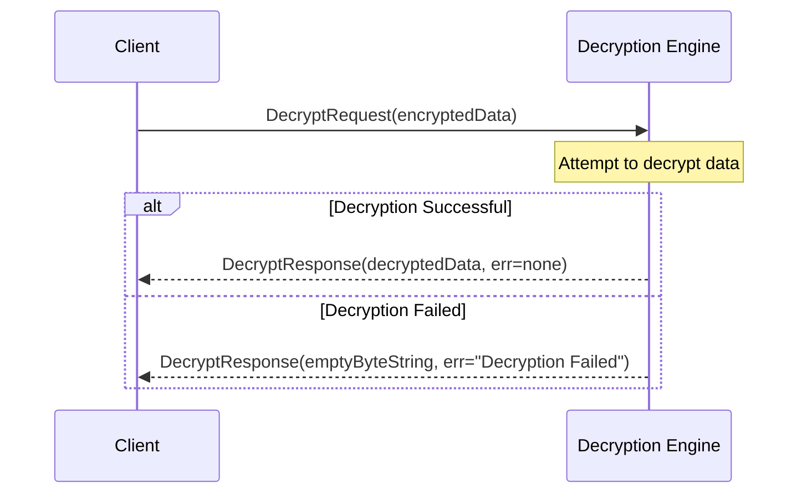

??? quote "Juvix imports"

    ```juvix
    module node_architecture.engines.decryption_overview;
    import prelude open;
    import node_architecture.types.identities open;
    ```

# `Decryption` Engine Family Overview

--8<-- "./docs/node_architecture/engines/decryption.juvix.md:decryption-engine-family"

The Decryption engine handles decryption of data encrypted to a specific identity. Decryption engine instances are generated by the Identity Management Engine when an identity is generated or connected.

## Purpose

The Decryption Engine maintains decryption capabilities for a specific identity and handles decryption requests for that identity. Only the original caller and anyone to whom they pass the engine instance reference can send messages to the instance and decrypt data encrypted to the corresponding identity.

## Message interface

<!-- --8<-- [start:DecryptionMsg] -->
```juvix
type DecryptionMsg :=
  | -- --8<-- [start:DecryptRequest]
    DecryptRequest {
      data : Ciphertext
    }
    -- --8<-- [end:DecryptRequest]
  | -- --8<-- [start:DecryptResponse]
    DecryptResponse {
      data : Plaintext;
      err : Option String
    }
    -- --8<-- [end:DecryptResponse]
  ;
```
<!-- --8<-- [end:DecryptionMsg] -->

### `DecryptRequest` message

!!! quote "DecryptRequest"

    ```
    --8<-- "./decryption_overview.juvix.md:DecryptRequest"
    ```

A `DecryptRequest` instructs a decryption engine instance to decrypt data as the internal identity corresponding to that engine instance.

- `data`: The encrypted ciphertext to decrypt.

### `DecryptResponse` message

!!! quote "DecryptResponse"

    ```
    --8<-- "./decryption_overview.juvix.md:DecryptResponse"
    ```

A `DecryptResponse` contains the data decrypted by a decryption engine instance in response to a DecryptRequest.

- `data`: The decrypted data.
- `err`: An error message if decryption failed.

## Message sequence diagrams

### Decryption Sequence

<!-- --8<-- [start:message-sequence-diagram] -->
<figure markdown="span">



<figcaption markdown="span">
Sequence diagram for decryption.
</figcaption>
</figure>
<!-- --8<-- [end:message-sequence-diagram] -->

## Engine Components

- [[Decryption Environment|`Decryption` Engine Environment]]
- [[Decryption Dynamics|`Decryption` Engine Dynamics]]

## Useful links
