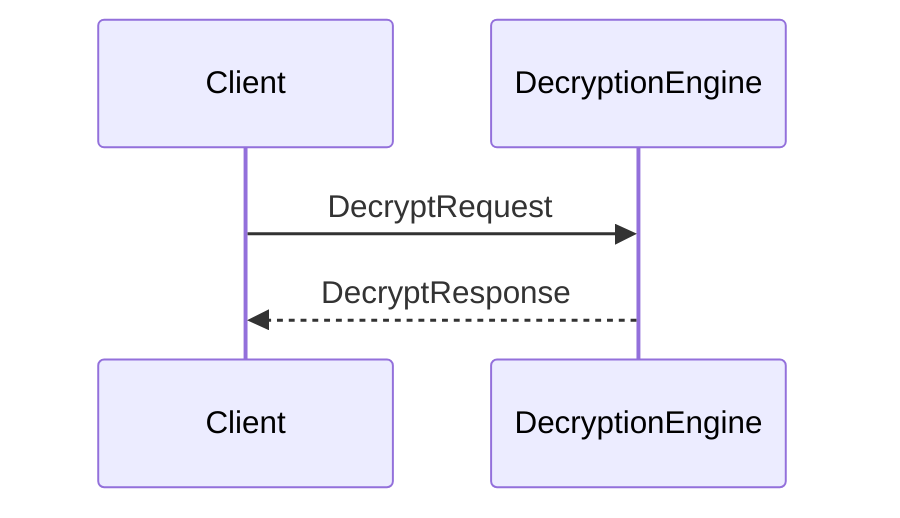

??? quote "Juvix imports"

    ```juvix
    module node_architecture.engines.decryption_overview;
    import prelude open;
    import node_architecture.basics open;
    import node_architecture.types.identity_types open;
    ```

# Decryption Engine Family Overview

## Purpose

The Decryption Engine handles decryption of data encrypted to a specific identity. Decryption engine instances are generated by the Identity Management Engine when an identity is generated or connected. Only the original caller and anyone to whom they pass the engine instance reference can send messages to the instance and decrypt data encrypted to the corresponding identity.

## Message Interface

The Decryption Engine communicates using the following messages:

- `DecryptRequest` and `DecryptResponse`

### `DecryptRequest` and `DecryptResponse`

#### `DecryptRequest`

```juvix
type DecryptRequest := mkDecryptRequest {
  data : ByteString;
};
```

A `DecryptRequest` instructs a decryption engine instance to decrypt data as the internal identity corresponding to that engine instance.

- `data`: The encrypted ciphertext to decrypt.

#### `DecryptResponse`

```juvix
type DecryptResponse := mkDecryptResponse {
  data : ByteString;
  error : Maybe String;
};
```

A DecryptResponse contains the data decrypted by a decryption engine instance in response to a DecryptRequest.

- `data`: The decrypted data.
- `error`: An error message if decryption failed.

### Decryption Messages

We define the messages that the Decryption Engine handles:

```juvix
type DecryptionMsg :=
  | MsgDecryptRequest DecryptRequest
  | MsgDecryptResponse DecryptResponse;
```

###Engine Components

- [[decryption_environment|Decryption Engine Environment]]
- [[decryption_dynamics|Decryption Engine Dynamics]]

Message Sequence Diagrams
Decryption Sequence
<figure markdown="span">

<figcaption markdown="span">
Sequence diagram for decryption.
</figcaption>
</figure>

## Useful links