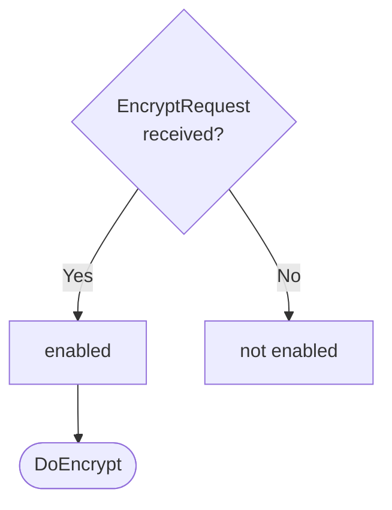

??? note "Juvix preamble"

    ```juvix
    module node_architecture.engines.encryption_dynamics;

    import prelude open;
    import node_architecture.basics open;
    import node_architecture.types.engine_dynamics open;
    import node_architecture.types.engine_environment open;
    import node_architecture.engines.encryption_environment open;
    import node_architecture.engines.encryption_overview open;
    import node_architecture.types.identity_types open;
    import node_architecture.types.anoma_message as Anoma;
    ```

# `Encryption` Dynamics

## Overview

The dynamics of the Encryption Engine define how it processes incoming encryption requests and produces the corresponding responses.

## Action labels

<!-- --8<-- [start:encryption-action-label] -->
```juvix
type EncryptionActionLabel :=
  | -- --8<-- [start:DoEncrypt]
    DoEncrypt EncryptionMsg
    -- --8<-- [end:DoEncrypt]
;
```
<!-- --8<-- [end:encryption-action-label] -->

### `DoEncrypt`

!!! quote ""

    --8<-- "./encryption_dynamics.juvix.md:DoEncrypt"

This action label corresponds to encrypting the data in the given request.

??? quote "`DoEncrypt` action effect"

    This action does the following:

    | Aspect | Description |
    |--------|-------------|
    | State update          | The state remains unchanged (stateless operation). |
    | Messages to be sent   | An `EncryptResponse` message is sent back to the requester. |
    | Engines to be spawned | No engine is created by this action. |
    | Timer updates         | No timers are set or cancelled. |

## Matchable arguments

<!-- --8<-- [start:encryption-matchable-argument] -->
```juvix
type EncryptionMatchableArgument :=
  | -- --8<-- [start:ArgEncrypt]
    ArgEncrypt EncryptionMsg
    -- --8<-- [end:ArgEncrypt]
;
```
<!-- --8<-- [end:encryption-matchable-argument] -->

### `ArgEncrypt`

!!! quote ""

    ```
    --8<-- "./encryption_dynamics.juvix.md:ArgEncrypt"
    ```

This matchable argument contains the encryption request data.

## Precomputation results

The Encryption Engine does not require any non-trivial pre-computations.

<!-- --8<-- [start:encryption-precomputation-entry] -->
```juvix
syntax alias EncryptionPrecomputation := Unit;
```
<!-- --8<-- [end:encryption-precomputation-entry] -->

## Guards

??? quote "Auxiliary Juvix code"

    Type alias for the guard.

    ```juvix
    EncryptionGuard : Type :=
      Guard
        EncryptionLocalState
        EncryptionMsg
        EncryptionMailboxState
        EncryptionTimerHandle
        EncryptionMatchableArgument
        EncryptionActionLabel
        EncryptionPrecomputation;
    ```

### `encryptGuard`

<figure markdown>

<figcaption>encryptGuard flowchart</figcaption>
</figure>

<!-- --8<-- [start:encrypt-guard] -->
```juvix
encryptGuard
  (t : TimestampedTrigger EncryptionMsg EncryptionTimerHandle)
  (env : EncryptionEnvironment) : Maybe (GuardOutput EncryptionMatchableArgument EncryptionActionLabel EncryptionPrecomputation)
  := case getMessageFromTimestampedTrigger t of {
      | just (EncryptRequest data externalIdentity useReadsFor) := just (
        mkGuardOutput@{
          args := [ArgEncrypt (EncryptRequest data externalIdentity useReadsFor)];
          label := DoEncrypt (EncryptRequest data externalIdentity useReadsFor);
          other := unit
        })
      | _ := nothing
  };
```
<!-- --8<-- [end:encrypt-guard] -->

## Action function

??? quote "Auxiliary Juvix code"

    Type alias for the action function.

    ```juvix
    EncryptionActionInput : Type :=
      ActionInput
        EncryptionLocalState
        EncryptionMsg
        EncryptionMailboxState
        EncryptionTimerHandle
        EncryptionMatchableArgument
        EncryptionActionLabel
        EncryptionPrecomputation;

    EncryptionActionEffect : Type :=
      ActionEffect
        EncryptionLocalState
        EncryptionMsg
        EncryptionMailboxState
        EncryptionTimerHandle
        EncryptionMatchableArgument
        EncryptionActionLabel
        EncryptionPrecomputation;
    ```

<!-- --8<-- [start:action-function] -->
```juvix
-- Not yet implemented
axiom encryptData : ExternalIdentity -> ByteString -> Either String ByteString;
axiom resolveReadsFor : ExternalIdentity -> ExternalIdentity;

axiom dummyActionEffect : EncryptionActionEffect;

encryptionAction (input : EncryptionActionInput) : EncryptionActionEffect :=
  let env := ActionInput.env input;
      out := ActionInput.guardOutput input;
  in
  case GuardOutput.label out of {
    | DoEncrypt (EncryptRequest data externalIdentity useReadsFor) := let
        finalIdentity := case useReadsFor of {
          | true := resolveReadsFor externalIdentity
          | false := externalIdentity
        };
        encryptedData := encryptData finalIdentity data;
        responseMsgEnc := case encryptedData of {
          | Left errorMsg := EncryptResponse@{
              ciphertext := emptyByteString; -- Placeholder
              error := just errorMsg
            }
          | Right ciphertext' := EncryptResponse@{
              ciphertext := ciphertext';
              error := nothing
            }
        };
        senderEnc := getMessageSenderFromTimestampedTrigger (ActionInput.timestampedTrigger input);
        targetEnc := case senderEnc of {
          | just s := s
          | nothing := Left "unknown"
        };
      in mkActionEffect@{
        newEnv := env; -- No state change
        producedMessages := [mkEnvelopedMessage@{
          sender := just (EngineEnvironment.name env);
          packet := mkMessagePacket@{
            target := targetEnc;
            mailbox := nothing;
            message := Anoma.MsgEncryption responseMsgEnc
          }
        }];
        timers := [];
        spawnedEngines := []
      }
    | DoEncrypt (EncryptResponse _ _) := dummyActionEffect
  };
```
<!-- --8<-- [end:action-function] -->

## Conflict solver

```juvix
encryptionConflictSolver : Set EncryptionMatchableArgument -> List (Set EncryptionMatchableArgument)
  | _ := [];
```

## `Encryption` Engine Summary

--8<-- "./docs/node_architecture/engines/encryption.juvix.md:encryption-engine-family"
