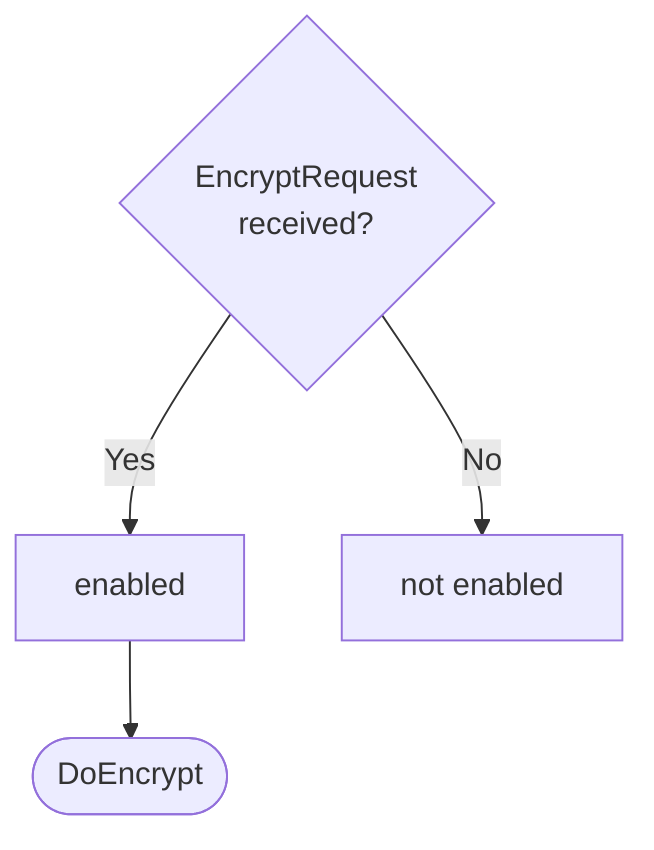

??? note "Juvix preamble"

    ```juvix
    module node_architecture.engines.encryption_dynamics;

    import prelude open;
    import node_architecture.basics open;
    import Stdlib.Trait.Ord as Ord;
    import Stdlib.Data.List.Base open;
    import system_architecture.identity.identity open hiding {ExternalIdentity};
    import node_architecture.types.engine_dynamics open;
    import node_architecture.types.engine_environment open;
    import node_architecture.engines.reads_for_overview open;
    import node_architecture.engines.encryption_environment open;
    import node_architecture.engines.encryption_overview open;
    import node_architecture.identity_types open;
    import node_architecture.types.anoma_message open;
    ```

# `Encryption` Dynamics

## Overview

The dynamics of the Encryption Engine define how it processes incoming encryption requests and produces the corresponding responses.

## Action labels

<!-- --8<-- [start:encryption-action-label] -->
```juvix
type EncryptionActionLabel :=
  | -- --8<-- [start:DoEncrypt]
    DoEncrypt {
      data : Plaintext;
      externalIdentity : ExternalIdentity;
      useReadsFor : Bool
    }
    -- --8<-- [end:DoEncrypt]
  | -- --8<-- [start:DoHandleReadsForResponse]
    DoHandleReadsForResponse {
      externalIdentity : ExternalIdentity;
      readsForEvidence : Set ReadsForEvidence
    };
    -- --8<-- [end:DoHandleReadsForResponse]
;
```
<!-- --8<-- [end:encryption-action-label] -->

### `DoEncrypt`

!!! quote ""

    --8<-- "./encryption_dynamics.juvix.md:DoEncrypt"

This action label corresponds to encrypting the data in the given request.

??? quote "`DoEncrypt` action effect"

    This action does the following:

    | Aspect | Description |
    |--------|-------------|
    | State update          | If `useReadsFor` is true, the state is updated to store pending requests. Otherwise, the state remains unchanged. |
    | Messages to be sent   | If `useReadsFor` is false, an `EncryptResponse` message is sent back to the requester. If `useReadsFor` is true and it's the first request for this identity, a `QueryReadsForEvidenceRequest` is sent to the ReadsFor Engine. |
    | Engines to be spawned | No engines are created by this action. |
    | Timer updates         | No timers are set or cancelled. |

### `DoHandleReadsForResponse`

!!! quote ""

    --8<-- "./encryption_dynamics.juvix.md:DoHandleReadsForResponse"

This action label corresponds to receiving reads for evidence and using it to address relevant pending requests.

??? quote "`DoHandleReadsForResponse` action effect"

    This action does the following:

    | Aspect | Description |
    |--------|-------------|
    | State update          | The state is updated to remove the processed pending requests for the given external identity. |
    | Messages to be sent   | `EncryptResponse` messages are sent to all requesters who were waiting for this ReadsFor evidence. |
    | Engines to be spawned | No engines are created by this action. |
    | Timer updates         | No timers are set or cancelled. |

## Matchable arguments

<!-- --8<-- [start:encryption-matchable-argument] -->

```juvix
type EncryptionMatchableArgument :=
  | -- --8<-- [start:ReplyTo]
  ReplyTo (Maybe Address) (Maybe MailboxID)
  -- --8<-- [end:ReplyTo]
;
```
<!-- --8<-- [end:encryption-matchable-argument] -->

### `ReplyTo`

!!! quote ""

    ```
    --8<-- "./docs/node_architecture/engines/encryption_dynamics.juvix.md:ReplyTo"
    ```

This matchable argument contains the address and mailbox ID of where the response message should be sent.

## Precomputation results

The Encryption Engine does not require any non-trivial pre-computations.

<!-- --8<-- [start:encryption-precomputation-entry] -->
```juvix
syntax alias EncryptionPrecomputation := Unit;
```
<!-- --8<-- [end:encryption-precomputation-entry] -->

## Guards

??? quote "Auxiliary Juvix code"

    Type alias for the guard.

    ```juvix
    -- --8<-- [start:encryption-guard]
    EncryptionGuard : Type :=
      Guard
        EncryptionLocalState
        EncryptionMailboxState
        EncryptionTimerHandle
        EncryptionMatchableArgument
        EncryptionActionLabel
        EncryptionPrecomputation;
    -- --8<-- [end:encryption-guard]

    -- --8<-- [start:encryption-guard-output]
    EncryptionGuardOutput : Type :=
      GuardOutput EncryptionMatchableArgument EncryptionActionLabel EncryptionPrecomputation;
    -- --8<-- [end:encryption-guard-output]
    ```

### `encryptGuard`

<figure markdown>

<figcaption>encryptGuard flowchart</figcaption>
</figure>

<!-- --8<-- [start:encrypt-guard] -->
```juvix
encryptGuard
  (t : TimestampedTrigger EncryptionTimerHandle)
  (env : EncryptionEnvironment) : Maybe EncryptionGuardOutput
  := case getMessageFromTimestampedTrigger t of {
      | just (MsgEncryption (EncryptRequest data externalIdentity useReadsFor)) := do {
        sender <- getMessageSenderFromTimestampedTrigger t;
        pure (mkGuardOutput@{
                  args := [ReplyTo (just sender) nothing] ;
                  label := DoEncrypt data externalIdentity useReadsFor;
                  other := unit
                });
        }
      | _ := nothing
  };
```
<!-- --8<-- [end:encrypt-guard] -->

### `readsForResponseGuard`

<!-- --8<-- [start:reads-for-response-guard] -->
```juvix
readsForResponseGuard
  (t : TimestampedTrigger EncryptionTimerHandle)
  (env : EncryptionEnvironment) : Maybe EncryptionGuardOutput
  := case getMessageFromTimestampedTrigger t of {
      | just (MsgReadsFor (QueryReadsForEvidenceResponse externalIdentity evidence error)) :=
          case getMessageSenderFromTimestampedTrigger t of {
            | just sender :=
                case Ord.isEQ (Ord.cmp sender (EncryptionLocalState.readsForEngineAddress (EngineEnvironment.localState env))) of {
                  | true := just (mkGuardOutput@{
                      args := [];
                      label := DoHandleReadsForResponse externalIdentity evidence;
                      other := unit
                    })
                  | false := nothing
                }
            | nothing := nothing
          }
      | _ := nothing
  };
```
<!-- --8<-- [end:reads-for-response-guard] -->

## Action function

??? quote "Auxiliary Juvix code"

    Type alias for the action function.

    ```juvix
    EncryptionActionInput : Type :=
      ActionInput
        EncryptionLocalState
        EncryptionMailboxState
        EncryptionTimerHandle
        EncryptionMatchableArgument
        EncryptionActionLabel
        EncryptionPrecomputation;

    EncryptionActionEffect : Type :=
      ActionEffect
        EncryptionLocalState
        EncryptionMailboxState
        EncryptionTimerHandle
        EncryptionMatchableArgument
        EncryptionActionLabel
        EncryptionPrecomputation;
    ```

<!-- --8<-- [start:action-function] -->
```juvix
encryptResponse (externalIdentity : ExternalIdentity) (env : EncryptionEnvironment) (evidence : Set ReadsForEvidence) (req : Pair Address Plaintext) : EnvelopedMessage :=
  let localState := EngineEnvironment.localState env;
      whoAsked := fst req;
      data := snd req;
      encryptedData :=
        Encryptor.encrypt
          (EncryptionLocalState.encryptor localState evidence externalIdentity)
          (EncryptionLocalState.backend localState)
          data;
      responseMsg := EncryptResponse@{
        ciphertext := encryptedData;
        error := nothing
      };
      envelope := mkEnvelopedMessage@{
        sender := just (EngineEnvironment.name env);
        packet := mkMessagePacket@{
          target := whoAsked;
          mailbox := just 0;
          message := MsgEncryption responseMsg
        }
      };
      in envelope;

encryptionAction (input : EncryptionActionInput) : EncryptionActionEffect :=
  let env := ActionInput.env input;
      out := ActionInput.guardOutput input;
      localState := EngineEnvironment.localState env;
  in
  case GuardOutput.label out of {
    | DoEncrypt data externalIdentity' useReadsFor := 
        case GuardOutput.args out of {
          | (ReplyTo (just whoAsked) _) :: _ :=
              case useReadsFor of {
                | false := 
                    let encryptedData := 
                      Encryptor.encrypt
                        (EncryptionLocalState.encryptor localState
                          Set.empty
                          externalIdentity')
                        (EncryptionLocalState.backend localState)
                        data;
                        responseMsg := EncryptResponse@{
                          ciphertext := encryptedData;
                          error := nothing
                        };
                        envelope := mkEnvelopedMessage@{
                          sender := just (EngineEnvironment.name env);
                          packet := mkMessagePacket@{
                            target := whoAsked;
                            mailbox := just 0;
                            message := MsgEncryption responseMsg
                          }
                        };
                    in mkActionEffect@{
                      newEnv := env; -- No state change
                      producedMessages := [envelope];
                      timers := [];
                      spawnedEngines := []
                    }
                | true := 
                    -- Need to request ReadsForEvidence from ReadsFor Engine
                    let existingRequests := Map.lookup externalIdentity' (EncryptionLocalState.pendingRequests localState);
                        newPendingList := case existingRequests of {
                          | just reqs := reqs ++ [mkPair whoAsked data]
                          | nothing := [mkPair whoAsked data]
                        };
                        newPendingRequests := Map.insert externalIdentity' newPendingList (EncryptionLocalState.pendingRequests localState);
                        newLocalState := localState@EncryptionLocalState{
                          pendingRequests := newPendingRequests
                        };
                        newEnv' := env@EngineEnvironment{
                          localState := newLocalState
                        };
                        -- Only send request to ReadsFor Engine if this is the first pending request for this identity
                        messagesToSend := case existingRequests of {
                          | just _ := [] -- Request already sent, do nothing
                          | nothing := let requestMsg := QueryReadsForEvidenceRequest@{
                                          externalIdentity := externalIdentity'
                                        };
                                        envelope := mkEnvelopedMessage@{
                                          sender := just (EngineEnvironment.name env);
                                          packet := mkMessagePacket@{
                                            target := EncryptionLocalState.readsForEngineAddress localState;
                                            mailbox := just 0;
                                            message := MsgReadsFor requestMsg
                                          }
                                        };
                                        in [envelope]
                        };
                    in mkActionEffect@{
                      newEnv := newEnv';
                      producedMessages := messagesToSend;
                      timers := [];
                      spawnedEngines := []
                    }
              }
          | _ := mkActionEffect@{newEnv := env; producedMessages := []; timers := []; spawnedEngines := []}
      }
    | DoHandleReadsForResponse externalIdentity evidence := 
        -- Retrieve pending requests
        case Map.lookup externalIdentity (EncryptionLocalState.pendingRequests localState) of {
          | just reqs := 
              let messages := map (encryptResponse externalIdentity env evidence) reqs;
                  newPendingRequests := Map.delete externalIdentity (EncryptionLocalState.pendingRequests localState);
                  newLocalState := localState@EncryptionLocalState{
                    pendingRequests := newPendingRequests
                  };
                  newEnv' := env@EngineEnvironment{
                    localState := newLocalState
                  };
              in mkActionEffect@{
                newEnv := newEnv';
                producedMessages := messages;
                timers := [];
                spawnedEngines := []
              }
          | nothing := 
              -- No pending requests, do nothing
              mkActionEffect@{
                newEnv := env;
                producedMessages := [];
                timers := [];
                spawnedEngines := []
              }
        }
  };
```
<!-- --8<-- [end:action-function] -->

## Conflict solver

```juvix
encryptionConflictSolver : Set EncryptionMatchableArgument -> List (Set EncryptionMatchableArgument)
  | _ := [];
```

## `Encryption` Engine Summary

--8<-- "./docs/node_architecture/engines/encryption.juvix.md:encryption-engine-family"
