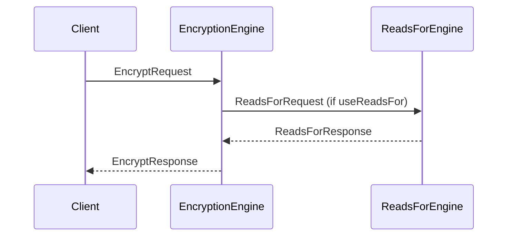

??? quote "Juvix imports"

    ```juvix
    module node_architecture.engines.encryption_overview;
    import prelude open;
    import node_architecture.basics open;
    import node_architecture.types.identity_types open;
    ```

# Encryption Engine Family Overview

## Purpose

The **Encryption Engine** is responsible for encrypting data to external identities, possibly using known `reads_for` relationships. It automatically utilizes "reads_for" relationship information from the **Reads For Engine** along with caller preference information to choose which identity to encrypt to.

The Encryption Engine is a stateless function, and calls to it do not need to be ordered. The runtime should implement this intelligently for efficiency.

## Message Interface

The Encryption Engine communicates using the following messages:

- `EncryptRequest` and `EncryptResponse`

### `EncryptRequest` and `EncryptResponse`

#### `EncryptRequest`

```juvix
type EncryptRequest := mkEncryptRequest {
  data : ByteString;
  externalIdentity : ExternalIdentity;
  useReadsFor : Bool;
};
```

An `EncryptRequest` instructs the Encryption Engine to encrypt data to a particular external identity, possibly using known reads_for relationships.

- `data`: The data to encrypt.
- `externalIdentity`: The external identity to encrypt to.
- `useReadsFor`: Whether or not to use known `reads_for` relationships.

### `EncryptResponse`

```juvix
type EncryptResponse := mkEncryptResponse {
  ciphertext : ByteString;
  error : Maybe String;
};
```

An `EncryptResponse` contains the data encrypted by the Encryption Engine in response to an EncryptRequest.

- `ciphertext`: The encrypted data.
- `error`: An error message if encryption failed.

## Encryption Messages

We define the messages that the Encryption Engine handles:

```juvix
type EncryptionMsg :=
  | MsgEncryptRequest EncryptRequest
  | MsgEncryptResponse EncryptResponse;
```

## Engine Components

- [[encryption_environment|Encryption Engine Environment]]
- [[encryption_dynamics|Encryption Engine Dynamics]]

## Message Sequence Diagrams

### Encryption Sequence

<figure markdown="span">

<figcaption markdown="span">
Sequence diagram for encryption.
</figcaption>
</figure>