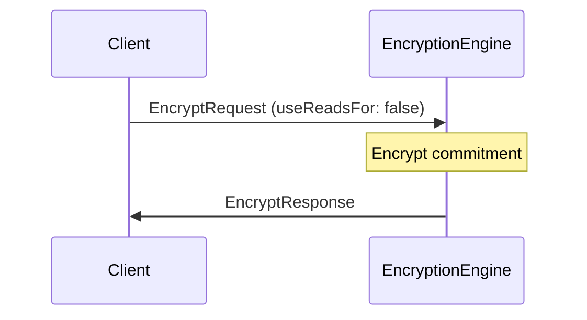
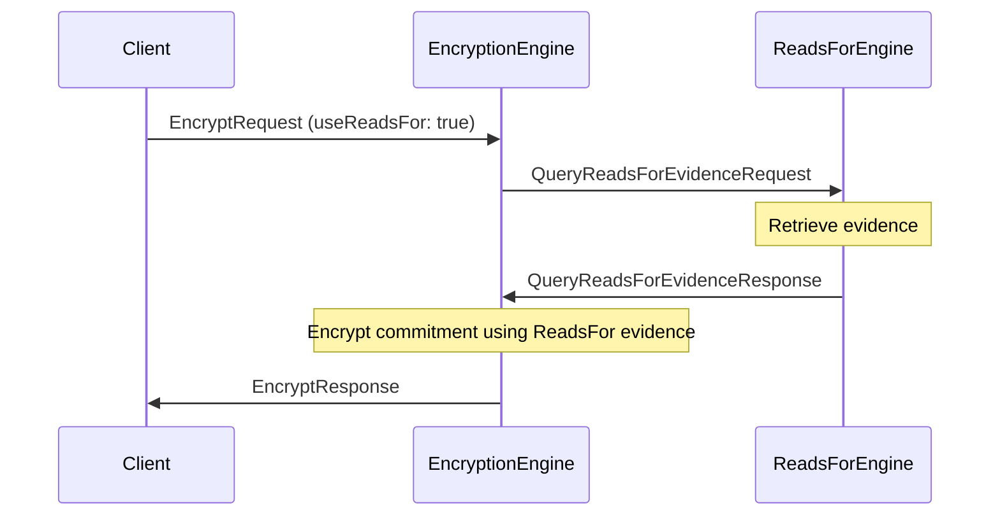

??? quote "Juvix imports"

    ```juvix
    module node_architecture.engines.encryption_overview;
    import prelude open;
    import node_architecture.types.identities open;
    ```

# `Encryption` Engine Family Overview

--8<-- "./docs/node_architecture/engines/encryption.juvix.md:encryption-engine-family"

The `Encryption` engine is responsible for encrypting data to external identities,
possibly using known `reads_for` relationships. It automatically utilizes
"reads_for" relationship information from the Reads For Engine along with caller
preference information to choose which identity to encrypt to.

## Purpose

The `Encryption` Engine encrypts data to external identities, optionally using
known `reads_for` relationships. It is a stateless function, and calls to it do
not need to be ordered. The runtime should implement this intelligently for
efficiency.

## Message interface

<!-- --8<-- [start:EncryptionMsg] -->
```juvix
type EncryptionMsg :=
  | -- --8<-- [start:EncryptRequest]
    EncryptRequest {
      data : Plaintext;
      externalIdentity : ExternalIdentity;
      useReadsFor : Bool
    }
    -- --8<-- [end:EncryptRequest]
  | -- --8<-- [start:EncryptResponse]
    EncryptResponse {
      ciphertext : Ciphertext;
      err : Option String
    }
    -- --8<-- [end:EncryptResponse]
  ;
```
<!-- --8<-- [end:EncryptionMsg] -->

### `EncryptRequest` message

!!! quote "`EncryptRequest`"

    ```
    --8<-- "./encryption_overview.juvix.md:EncryptRequest"
    ```

An `EncryptRequest` instructs the Encryption Engine to encrypt data to a particular external identity, possibly using known reads_for relationships.

- `data`: The data to encrypt.
- `externalIdentity`: The external identity to encrypt to.
- `useReadsFor`: Whether to use known `reads_for` relationships or not.

### `EncryptResponse` message

!!! quote "`EncryptResponse`"

    ```
    --8<-- "./encryption_overview.juvix.md:EncryptResponse"
    ```

An `EncryptResponse` contains the data encrypted by the `Encryption` Engine in
response to an `EncryptRequest`.

- `ciphertext`: The encrypted data.
- `err`: An error message if encryption failed.

## Message sequence diagrams

### Encryption Sequence (Without `ReadsFor` evidence)

<!-- --8<-- [start:message-sequence-diagram-no-reads-for] -->
<figure markdown="span">



<figcaption markdown="span">
Sequence diagram for verification (no reads for).
</figcaption>
</figure>
<!-- --8<-- [end:message-sequence-diagram-no-reads-for] -->

### Encryption Sequence (With `ReadsFor` evidence)

<!-- --8<-- [start:message-sequence-diagram-reads-for] -->
<figure markdown="span">



<figcaption markdown="span">
Sequence diagram for verification (reads for).
</figcaption>
</figure>
<!-- --8<-- [end:message-sequence-diagram-reads-for] -->

## Engine Components

- [[Encryption Environment|`Encryption` Engine Environment]]
- [[Encryption Dynamics|`Encryption` Engine Dynamics]]

## Useful links
