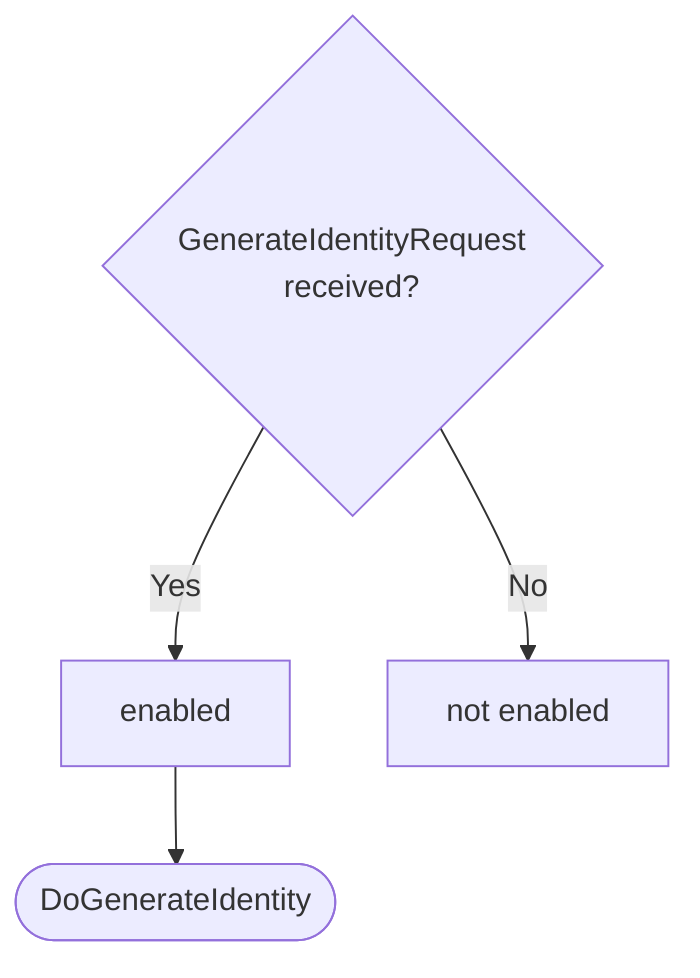
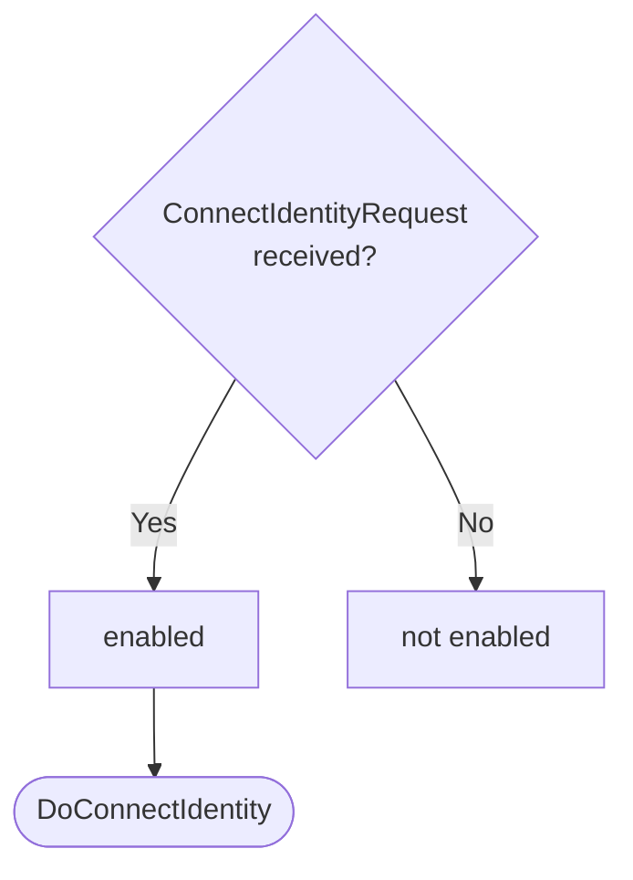
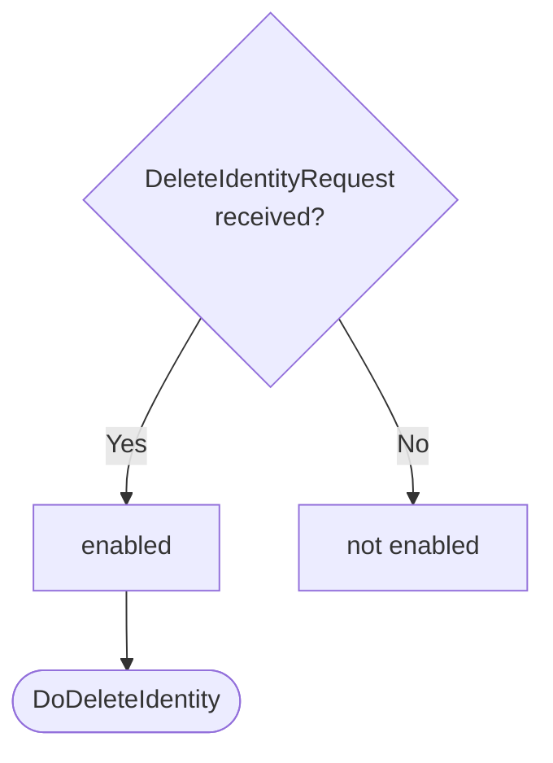

??? note "Juvix preamble"

    ```juvix
    module node_architecture.engines.identity_management_dynamics;

    import prelude open;
    import node_architecture.basics open;
    import node_architecture.types.engine_dynamics open;
    import node_architecture.types.engine_environment open;
    import node_architecture.engines.identity_management_environment open;
    import node_architecture.engines.identity_management_overview open;
    import node_architecture.types.identity_types open;
    import node_architecture.types.anoma_message as Anoma;
    ```

# `Identity Management` Dynamics

## Overview

The dynamics of the Identity Management Engine define how it processes incoming messages (requests) and produces the corresponding responses and actions.

## Action labels

<!-- --8<-- [start:identity-management-action-label] -->
```juvix
type IdentityManagementActionLabel :=
  | -- --8<-- [start:DoGenerateIdentity]
    DoGenerateIdentity IdentityManagementMsg
    -- --8<-- [end:DoGenerateIdentity]
  | -- --8<-- [start:DoConnectIdentity]
    DoConnectIdentity IdentityManagementMsg
    -- --8<-- [end:DoConnectIdentity]
  | -- --8<-- [start:DoDeleteIdentity]
    DoDeleteIdentity IdentityManagementMsg
    -- --8<-- [end:DoDeleteIdentity]
;
```
<!-- --8<-- [end:identity-management-action-label] -->

### `DoGenerateIdentity`

!!! quote ""

    --8<-- "./identity_management_dynamics.juvix.md:DoGenerateIdentity"

This action label corresponds to generating a new identity.

### `DoConnectIdentity`

!!! quote ""

    --8<-- "./identity_management_dynamics.juvix.md:DoConnectIdentity"

This action label corresponds to connecting to an existing identity.

### `DoDeleteIdentity`

!!! quote ""

    --8<-- "./identity_management_dynamics.juvix.md:DoDeleteIdentity"

This action label corresponds to deleting an existing identity.

## Matchable arguments

<!-- --8<-- [start:identity-management-matchable-argument] -->
```juvix
type IdentityManagementMatchableArgument :=
  | -- --8<-- [start:ArgGenerateIdentity]
    ArgGenerateIdentity IdentityManagementMsg
    -- --8<-- [end:ArgGenerateIdentity]
  | -- --8<-- [start:ArgConnectIdentity]
    ArgConnectIdentity IdentityManagementMsg
    -- --8<-- [end:ArgConnectIdentity]
  | -- --8<-- [start:ArgDeleteIdentity]
    ArgDeleteIdentity IdentityManagementMsg
    -- --8<-- [end:ArgDeleteIdentity]
;
```
<!-- --8<-- [end:identity-management-matchable-argument] -->

### `ArgGenerateIdentity`

!!! quote ""

    ```
    --8<-- "./identity_management_dynamics.juvix.md:ArgGenerateIdentity"
    ```

This matchable argument contains the generate identity request data.

### `ArgConnectIdentity`

!!! quote ""

    ```
    --8<-- "./identity_management_dynamics.juvix.md:ArgConnectIdentity"
    ```

This matchable argument contains the connect identity request data.

### `ArgDeleteIdentity`

!!! quote ""

    ```
    --8<-- "./identity_management_dynamics.juvix.md:ArgDeleteIdentity"
    ```

This matchable argument contains the delete identity request data.

## Precomputation results

The Identity Management Engine does not require any non-trivial pre-computations.

<!-- --8<-- [start:identity-management-precomputation-entry] -->
```juvix
syntax alias IdentityManagementPrecomputation := Unit;
```
<!-- --8<-- [end:identity-management-precomputation-entry] -->

## Guards

??? quote "Auxiliary Juvix code"

    Type alias for the guard.

    ```juvix
    IdentityManagementGuard : Type :=
      Guard
        IdentityManagementLocalState
        IdentityManagementMsg
        IdentityManagementMailboxState
        IdentityManagementTimerHandle
        IdentityManagementMatchableArgument
        IdentityManagementActionLabel
        IdentityManagementPrecomputation;
    ```

### `generateIdentityGuard`

<figure markdown>

<figcaption>generateIdentityGuard flowchart</figcaption>
</figure>

<!-- --8<-- [start:generate-identity-guard] -->
```juvix
generateIdentityGuard
  (t : TimestampedTrigger IdentityManagementMsg IdentityManagementTimerHandle)
  (env : IdentityManagementEnvironment) : Maybe (GuardOutput IdentityManagementMatchableArgument IdentityManagementActionLabel IdentityManagementPrecomputation)
  := case getMessageFromTimestampedTrigger t of {
      | just (GenerateIdentityRequest x y z) := just (
        mkGuardOutput@{
          args := [ArgGenerateIdentity (GenerateIdentityRequest x y z)];
          label := DoGenerateIdentity (GenerateIdentityRequest x y z);
          other := unit
        })
      | _ := nothing
  };
```
<!-- --8<-- [end:generate-identity-guard] -->

### `connectIdentityGuard`

<figure markdown>

<figcaption>connectIdentityGuard flowchart</figcaption>
</figure>

<!-- --8<-- [start:connect-identity-guard] -->
```juvix
connectIdentityGuard
  (t : TimestampedTrigger IdentityManagementMsg IdentityManagementTimerHandle)
  (env : IdentityManagementEnvironment) : Maybe (GuardOutput IdentityManagementMatchableArgument IdentityManagementActionLabel IdentityManagementPrecomputation)
  := case getMessageFromTimestampedTrigger t of {
      | just (ConnectIdentityRequest x y z) := just (
        mkGuardOutput@{
          args := [ArgConnectIdentity (ConnectIdentityRequest x y z)];
          label := DoConnectIdentity (ConnectIdentityRequest x y z);
          other := unit
        })
      | _ := nothing
  };
```
<!-- --8<-- [end:connect-identity-guard] -->

### `deleteIdentityGuard`

<figure markdown>

<figcaption>deleteIdentityGuard flowchart</figcaption>
</figure>

<!-- --8<-- [start:delete-identity-guard] -->
```juvix
deleteIdentityGuard
  (t : TimestampedTrigger IdentityManagementMsg IdentityManagementTimerHandle)
  (env : IdentityManagementEnvironment) : Maybe (GuardOutput IdentityManagementMatchableArgument IdentityManagementActionLabel IdentityManagementPrecomputation)
  := case getMessageFromTimestampedTrigger t of {
      | just (DeleteIdentityRequest x y) := just (
        mkGuardOutput@{
          args := [ArgDeleteIdentity (DeleteIdentityRequest x y)];
          label := DoDeleteIdentity (DeleteIdentityRequest x y);
          other := unit
        })
      | _ := nothing
  };
```
<!-- --8<-- [end:delete-identity-guard] -->

## Action function

??? quote "Auxiliary Juvix code"

    Type alias for the action function.

    ```juvix
    IdentityManagementActionInput : Type :=
      ActionInput
        IdentityManagementLocalState
        IdentityManagementMsg
        IdentityManagementMailboxState
        IdentityManagementTimerHandle
        IdentityManagementMatchableArgument
        IdentityManagementActionLabel
        IdentityManagementPrecomputation;

    IdentityManagementActionEffect : Type :=
      ActionEffect
        IdentityManagementLocalState
        IdentityManagementMsg
        IdentityManagementMailboxState
        IdentityManagementTimerHandle
        IdentityManagementMatchableArgument
        IdentityManagementActionLabel
        IdentityManagementPrecomputation;
    ```

<!-- --8<-- [start:action-function] -->
```juvix
-- Not yet implemented
axiom generateNewExternalIdentity : IDParams -> ExternalIdentity;

axiom dummyActionEffect : IdentityManagementActionEffect;

identityManagementAction (input : IdentityManagementActionInput) : IdentityManagementActionEffect :=
  let env := ActionInput.env input;
      out := ActionInput.guardOutput input;
  in
  case GuardOutput.label out of {
    | DoGenerateIdentity (GenerateIdentityRequest backend' params' capabilities') := let
        newIdentity := generateNewExternalIdentity params';
        identityInfo := mkIdentityInfo@{
          backend := backend';
          capabilities := capabilities';
          commitmentEngine := nothing; -- Placeholder for engine reference
          decryptionEngine := nothing; -- Placeholder for engine reference
        };
        updatedIdentities := Map.insert newIdentity identityInfo (IdentityManagementLocalState.identities (EngineEnvironment.localState env));
        newLocalState := mkIdentityManagementLocalState@{
          identities := updatedIdentities
        };
        newEnv' := env@EngineEnvironment{
          localState := newLocalState
        };
        responseMsg := GenerateIdentityResponse@{
          commitmentEngine := IdentityInfo.commitmentEngine identityInfo;
          decryptionEngine := IdentityInfo.decryptionEngine identityInfo;
          externalIdentity := newIdentity;
          error := nothing
        };
        sender := getMessageSenderFromTimestampedTrigger (ActionInput.timestampedTrigger input);
        target' := case sender of {
          | just s := s
          | nothing := Left "unknown"
        };
      in mkActionEffect@{
        newEnv := newEnv';
        producedMessages := [mkEnvelopedMessage@{
          sender := just (EngineEnvironment.name env);
          packet := mkMessagePacket@{
            target := target';
            mailbox := nothing;
            message := Anoma.MsgIdentityManagement responseMsg
          }
        }];
        timers := [];
        spawnedEngines := []
      }
    | DoConnectIdentity (ConnectIdentityRequest externalIdentity' backend' capabilities') := let
        identityInfo := mkIdentityInfo@{
          backend := backend';
          capabilities := capabilities';
          commitmentEngine := nothing; -- Placeholder
          decryptionEngine := nothing; -- Placeholder
        };
        updatedIdentities := Map.insert externalIdentity' identityInfo (IdentityManagementLocalState.identities (EngineEnvironment.localState env));
        newLocalState := mkIdentityManagementLocalState@{
          identities := updatedIdentities
        };
        newEnv' := env@EngineEnvironment{
          localState := newLocalState
        };
        responseMsg := ConnectIdentityResponse@{
          commitmentEngine := IdentityInfo.commitmentEngine identityInfo;
          decryptionEngine := IdentityInfo.decryptionEngine identityInfo;
          error := nothing
        };
        sender := getMessageSenderFromTimestampedTrigger (ActionInput.timestampedTrigger input);
        target' := case sender of {
          | just s := s
          | nothing := Left "unknown"
        };
      in mkActionEffect@{
        newEnv := newEnv';
        producedMessages := [mkEnvelopedMessage@{
          sender := just (EngineEnvironment.name env);
          packet := mkMessagePacket@{
            target := target';
            mailbox := nothing;
            message := Anoma.MsgIdentityManagement responseMsg
          }
        }];
        timers := [];
        spawnedEngines := []
      }
    | DoDeleteIdentity (DeleteIdentityRequest externalIdentity' backend') := let
        updatedIdentities := Map.delete externalIdentity' (IdentityManagementLocalState.identities (EngineEnvironment.localState env));
        newLocalState := mkIdentityManagementLocalState@{
          identities := updatedIdentities
        };
        newEnv' := env@EngineEnvironment{
          localState := newLocalState
        };
        responseMsg := DeleteIdentityResponse@{
          error := nothing
        };
        sender := getMessageSenderFromTimestampedTrigger (ActionInput.timestampedTrigger input);
        target' := case sender of {
          | just s := s
          | nothing := Left "unknown"
        };
      in mkActionEffect@{
        newEnv := newEnv';
        producedMessages := [mkEnvelopedMessage@{
          sender := just (EngineEnvironment.name env);
          packet := mkMessagePacket@{
            target := target';
            mailbox := nothing;
            message := Anoma.MsgIdentityManagement responseMsg
          }
        }];
        timers := [];
        spawnedEngines := []
      }
    | _ := dummyActionEffect
  };
```
<!-- --8<-- [end:action-function] -->

## Conflict solver

```juvix
identityManagementConflictSolver : Set IdentityManagementMatchableArgument -> List (Set IdentityManagementMatchableArgument)
  | _ := [];
```

## `Identity Management` Engine Summary

--8<-- "./docs/node_architecture/engines/identity_management.juvix.md:identity-management-engine-family"
