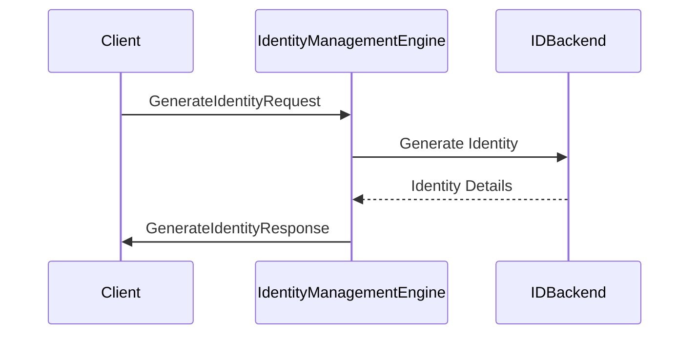

---
icon: octicons/gear-16
search:
  exclude: false
categories:
- engine-family
tags:
- identity_management
- engine-overview
---

??? quote "Juvix imports"

    ```juvix
    module node_architecture.engines.identity_management_overview;
    import prelude open;
    import node_architecture.basics open;
    import node_architecture.types.identity_types open;
    ```
    
# Identity Management Engine Family Overview

## Purpose

The Identity Management Engine is responsible for generating, connecting, and deleting identities using various backends. It provides a unified interface over different identity backends, including:

- Internal identities stored in local memory.
- Identities stored in hardware devices (e.g., Ledger).
- Identities accessed via browser extensions.
- Identities stored on remote machines accessible over the network.

When an identity is generated or connected, the Identity Management Engine returns handles to the corresponding commitment and decryption engine instances. These handles can be used to generate commitments or decrypt data associated with the identity.

## Message Interface

The Identity Management Engine communicates using the following messages:

- `GenerateIdentityRequest` and `GenerateIdentityResponse`
- `ConnectIdentityRequest` and `ConnectIdentityResponse`
- `DeleteIdentityRequest` and `DeleteIdentityResponse`

### `GenerateIdentityRequest` and `GenerateIdentityResponse`

#### `GenerateIdentityRequest`

```juvix
type GenerateIdentityRequest := mkGenerateIdentityRequest {
  backend : IDBackend;
  params : IDParams;
  capabilities : Capabilities;
};
```

A `GenerateIdentityRequest` instructs the Identity Management Engine to generate a new identity using the specified backend, parameters, and capabilities.

- `backend`: The backend to use for identity generation.
- `params`: Parameters to pass to the backend (e.g., cryptosystem, security level).
- `capabilities`: Capabilities to request (e.g., commitment, decryption, or both).

#### `GenerateIdentityResponse`

```juvix
type GenerateIdentityResponse := mkGenerateIdentityResponse {
  commitmentEngine : Maybe EngineReference;
  decryptionEngine : Maybe EngineReference;
  externalIdentity : ExternalIdentity;
  error : Maybe String;
};
```

A `GenerateIdentityResponse` provides the handles to the decryption and commitment engine instances for the newly generated identity, or an error if a failure occurred.

- `commitmentEngine`: Reference to the newly instantiated commitment engine.
- `decryptionEngine`: Reference to the newly instantiated decryption engine.
- `externalIdentity`: The external identity of the newly created identity.
- `error`: An error message if identity generation failed.

### `ConnectIdentityRequest` and `ConnectIdentityResponse`

#### `ConnectIdentityRequest`

```juvix
type ConnectIdentityRequest := mkConnectIdentityRequest {
  externalIdentity : ExternalIdentity;
  backend : IDBackend;
  capabilities : Capabilities;
};
```

A `ConnectIdentityRequest` instructs the Identity Management Engine to connect to an existing identity using the specified backend.

- `externalIdentity`: The external identity to connect.
- `backend`: The backend to use for the connection.
- `capabilities`: Capabilities to request (e.g., commitment, decryption, or both).

#### `ConnectIdentityResponse`

```juvix
type ConnectIdentityResponse := mkConnectIdentityResponse {
  commitmentEngine : Maybe EngineReference;
  decryptionEngine : Maybe EngineReference;
  error : Maybe String;
};
```

A `ConnectIdentityResponse` provides the handles to the decryption and commitment engine instances for the connected identity, or an error if a failure occurred.

- `commitmentEngine`: Reference to the newly instantiated commitment engine.
- `decryptionEngine`: Reference to the newly instantiated decryption engine.
- `error`: An error message if identity connection failed.

### `DeleteIdentityRequest` and `DeleteIdentityResponse`

#### `DeleteIdentityRequest`

```juvix
type DeleteIdentityRequest := mkDeleteIdentityRequest {
  externalIdentity : ExternalIdentity;
  backend : IDBackend;
};
```

A `DeleteIdentityRequest` instructs the Identity Management Engine to delete an existing identity using the specified backend.

- `externalIdentity`: The external identity to delete.
- `backend`: The backend to use for deletion.

#### `DeleteIdentityResponse`

```juvix
type DeleteIdentityResponse := mkDeleteIdentityResponse {
  error : Maybe String;
};
```

A `DeleteIdentityResponse` provides the response from an attempt to delete an identity.

- `error`: An error message if identity deletion failed.

#### `IdentityManagementMsg`

We define the messages that the Identity Management Engine handles.

```juvix
type IdentityManagementMsg :=
  | MsgGenerateIdentityRequest GenerateIdentityRequest
  | MsgGenerateIdentityResponse GenerateIdentityResponse
  | MsgConnectIdentityRequest ConnectIdentityRequest
  | MsgConnectIdentityResponse ConnectIdentityResponse
  | MsgDeleteIdentityRequest DeleteIdentityRequest
  | MsgDeleteIdentityResponse DeleteIdentityResponse;
```

## Message Sequence Diagrams

### Identity Generation Sequence
<figure markdown="span">


<figcaption markdown="span"> Sequence diagram for identity generation. </figcaption> </figure>

## Engine Components

- [[identity_management_environment|Identity Management Engine Environment]]
- [[identity_management_dynamics|Identity Management Engine Dynamics]]

## Useful links