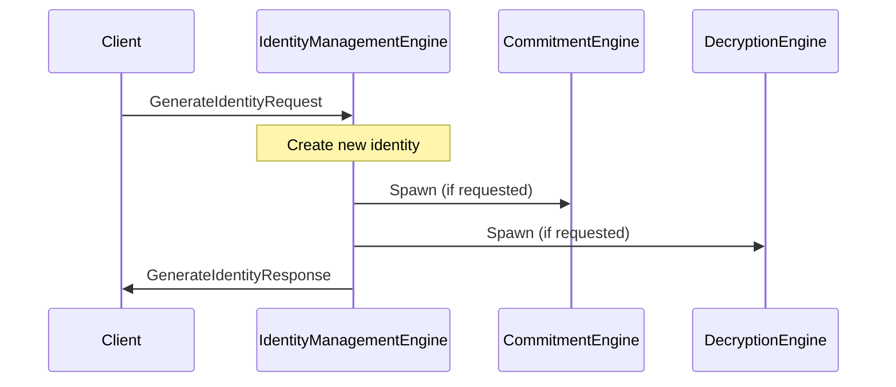
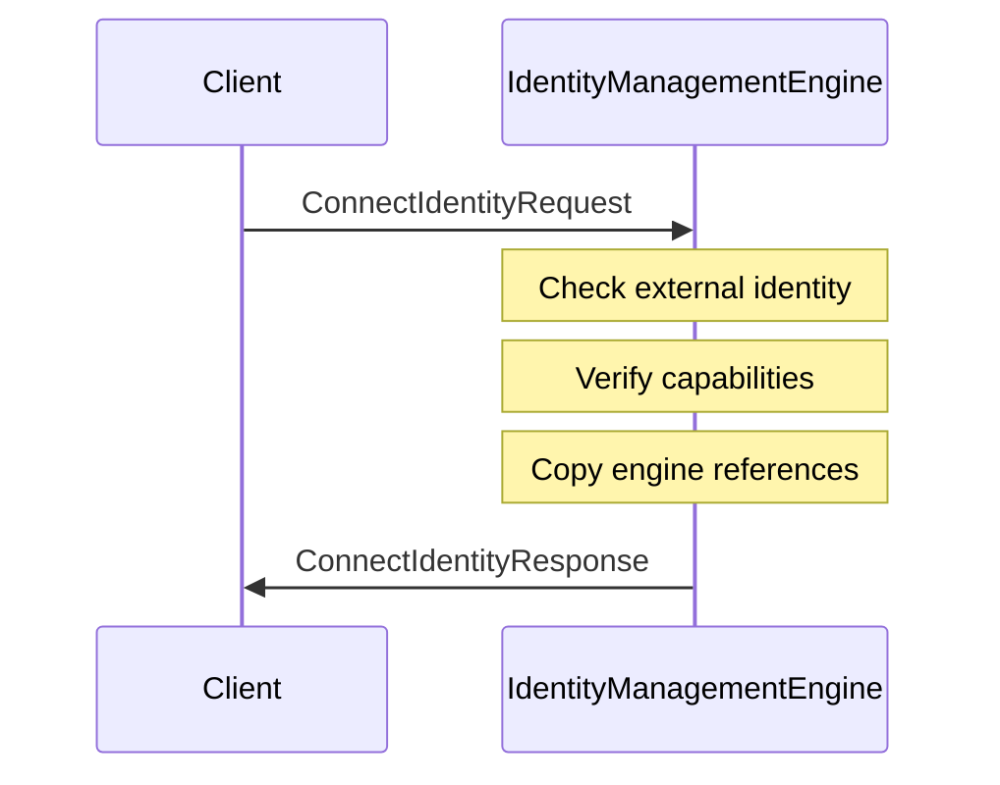
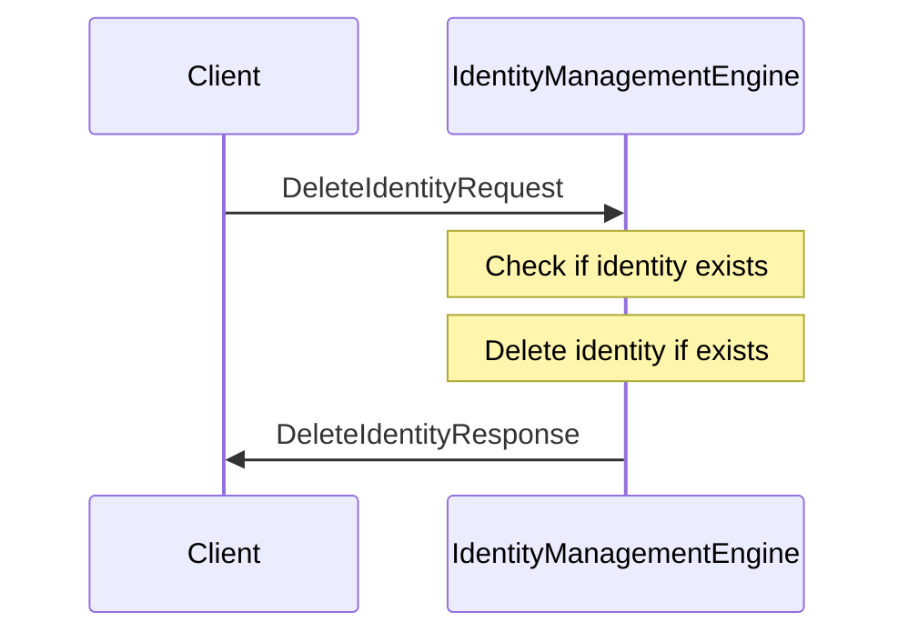

??? quote "Juvix imports"

    ```juvix
    module node_architecture.engines.identity_management_overview;
    import prelude open;
    import node_architecture.types.identities open;
    import node_architecture.identity_types open;
    ```

# `Identity Management` Engine Family Overview

--8<-- "./docs/node_architecture/engines/identity_management.juvix.md:identity-management-engine-family"

The Identity Management Engine is responsible for generating, connecting, and deleting identities using various backends. It provides a unified interface over different identity backends, including internal identities stored in local memory, identities stored in hardware devices, identities accessed via browser extensions, and identities stored on remote machines accessible over the network.

## Purpose

The Identity Management Engine manages identities across various backends. When an identity is generated or connected, it returns handles to the corresponding commitment and decryption engine instances. These handles can be used to generate commitments or decrypt data associated with the identity.

## Message interface

<!-- --8<-- [start:IdentityManagementMsg] -->
```juvix
type IdentityManagementMsg  :=
  | -- --8<-- [start:GenerateIdentityRequest]
    GenerateIdentityRequest {
      backend : Backend;
      params : IDParams;
      capabilities : Capabilities
    }
    -- --8<-- [end:GenerateIdentityRequest]
  | -- --8<-- [start:GenerateIdentityResponse]
    GenerateIdentityResponse {
      commitmentEngine : Option EngineID;
      decryptionEngine : Option EngineID;
      externalIdentity : EngineID;
      err : Option String
    }
    -- --8<-- [end:GenerateIdentityResponse]
  | -- --8<-- [start:ConnectIdentityRequest]
    ConnectIdentityRequest {
      externalIdentity : EngineID;
      backend : Backend;
      capabilities : Capabilities
    }
    -- --8<-- [end:ConnectIdentityRequest]
  | -- --8<-- [start:ConnectIdentityResponse]
    ConnectIdentityResponse {
      commitmentEngine : Option EngineID;
      decryptionEngine : Option EngineID;
      err : Option String
    }
    -- --8<-- [end:ConnectIdentityResponse]
  | -- --8<-- [start:DeleteIdentityRequest]
    DeleteIdentityRequest {
      externalIdentity : EngineID;
      backend : Backend
    }
    -- --8<-- [end:DeleteIdentityRequest]
  | -- --8<-- [start:DeleteIdentityResponse]
    DeleteIdentityResponse {
      err : Option String
    }
    -- --8<-- [end:DeleteIdentityResponse]
  ;
```
<!-- --8<-- [end:IdentityManagementMsg] -->

### `GenerateIdentityRequest` message

!!! quote "GenerateIdentityRequest"

    ```
    --8<-- "./identity_management_overview.juvix.md:GenerateIdentityRequest"
    ```

A `GenerateIdentityRequest` instructs the Identity Management Engine to generate a new identity using the specified backend, parameters, and capabilities.

- `backend`: The backend to use for identity generation.
- `params`: Parameters to pass to the backend (e.g., cryptosystem, security level).
- `capabilities`: Capabilities to request (e.g., commitment, decryption, or both).

### `GenerateIdentityResponse` message

!!! quote "GenerateIdentityResponse"

    ```
    --8<-- "./identity_management_overview.juvix.md:GenerateIdentityResponse"
    ```

A `GenerateIdentityResponse` provides the handles to the decryption and commitment engine instances for the newly generated identity, or an error if a failure occurred.

- `commitmentEngine`: Reference to the newly instantiated commitment engine.
- `decryptionEngine`: Reference to the newly instantiated decryption engine.
- `externalIdentity`: The external identity of the newly created identity.
- `err`: An error message if identity generation failed.

### `ConnectIdentityRequest` message

!!! quote "ConnectIdentityRequest"

    ```
    --8<-- "./identity_management_overview.juvix.md:ConnectIdentityRequest"
    ```

A `ConnectIdentityRequest` instructs the Identity Management Engine to connect to an existing identity using the specified backend.

- `externalIdentity`: The external identity to connect.
- `backend`: The backend to use for the connection.
- `capabilities`: Capabilities to request (e.g., commitment, decryption, or both).

### `ConnectIdentityResponse` message

!!! quote "ConnectIdentityResponse"

    ```
    --8<-- "./identity_management_overview.juvix.md:ConnectIdentityResponse"
    ```

A `ConnectIdentityResponse` provides the handles to the decryption and commitment engine instances for the connected identity, or an error if a failure occurred.

- `commitmentEngine`: Reference to the newly instantiated commitment engine.
- `decryptionEngine`: Reference to the newly instantiated decryption engine.
- `err`: An error message if identity connection failed.

### `DeleteIdentityRequest` message

!!! quote "DeleteIdentityRequest"

    ```
    --8<-- "./identity_management_overview.juvix.md:DeleteIdentityRequest"
    ```

A `DeleteIdentityRequest` instructs the Identity Management Engine to delete an existing identity using the specified backend.

- `externalIdentity`: The external identity to delete.
- `backend`: The backend to use for deletion.

### `DeleteIdentityResponse` message

!!! quote "DeleteIdentityResponse"

    ```
    --8<-- "./identity_management_overview.juvix.md:DeleteIdentityResponse"
    ```

A `DeleteIdentityResponse` provides the response from an attempt to delete an identity.

- `err`: An error message if identity deletion failed.

## Message sequence diagrams

### Generating an Identity

<!-- --8<-- [start:message-sequence-diagram-generate] -->
<figure markdown="span">



<figcaption markdown="span">
Generating an identity
</figcaption>
</figure>
<!-- --8<-- [end:message-sequence-diagram-generate] -->

### Connecting to an Existing Identity

<!-- --8<-- [start:message-sequence-diagram-connect] -->
<figure markdown="span">



<figcaption markdown="span">
Connecting to an existing identity
</figcaption>
</figure>
<!-- --8<-- [end:message-sequence-diagram-connect] -->

### Deleting an Identity

<!-- --8<-- [start:message-sequence-diagram-delete] -->
<figure markdown="span">



<figcaption markdown="span">
Deleting an identity
</figcaption>
</figure>
<!-- --8<-- [end:message-sequence-diagram-delete] -->

## Engine Components

- [[identity_management_environment|`Identity Management` Engine Environment]]
- [[identity_management_dynamics|`Identity Management` Engine Dynamics]]

## Useful links
