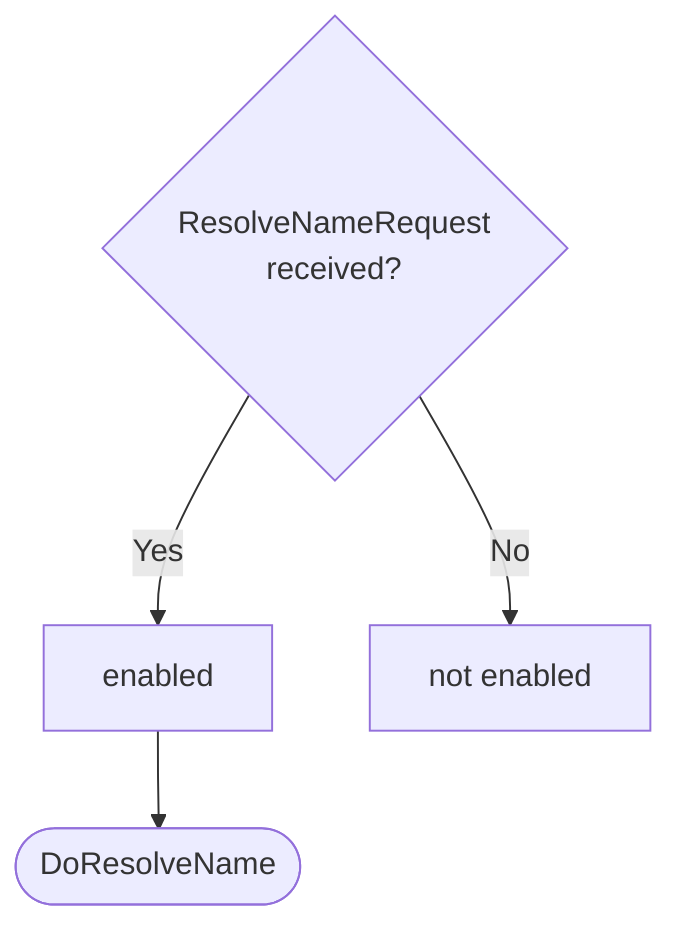

??? note "Juvix preamble"

    ```juvix
    module node_architecture.engines.naming_dynamics;

    import prelude open;
    import node_architecture.basics open;
    import Data.Set.AVL open;
    import Stdlib.Data.List.Base open;
    import Stdlib.Trait.Ord open;
    import Stdlib.Data.Bool.Base open;
    import node_architecture.types.engine_dynamics open;
    import node_architecture.types.engine_environment open;
    import node_architecture.identity_types open;
    import node_architecture.engines.naming_overview open;
    import node_architecture.engines.naming_environment open;
    import node_architecture.types.anoma_message open;
    ```

# `Naming` Dynamics

## Overview

The dynamics of the Naming Engine define how it processes incoming messages and updates its state accordingly.

## Action labels

<!-- --8<-- [start:naming-action-label] -->
```juvix
type NamingActionLabel :=
  | -- --8<-- [start:DoResolveName]
    DoResolveName {
      identityName : IdentityName
    }
    -- --8<-- [end:DoResolveName]
  | -- --8<-- [start:DoSubmitNameEvidence]
    DoSubmitNameEvidence {
      evidence : IdentityNameEvidence
    }
    -- --8<-- [end:DoSubmitNameEvidence]
  | -- --8<-- [start:DoQueryNameEvidence]
    DoQueryNameEvidence {
      externalIdentity : ExternalIdentity
    }
    -- --8<-- [end:DoQueryNameEvidence]
;
```
<!-- --8<-- [end:naming-action-label] -->

### `DoResolveName`

!!! quote ""

    --8<-- "./naming_dynamics.juvix.md:DoResolveName"

This action label corresponds to resolving a name to associated external identities.

??? quote "`DoResolveName` action effect"

    This action does the following:

    | Aspect | Description |
    |--------|-------------|
    | State update          | No change to the local state. |
    | Messages to be sent   | A `ResolveNameResponse` message is sent to the requester, containing matching external identities. |
    | Engines to be spawned | No engines are spawned by this action. |
    | Timer updates         | No timers are set or cancelled. |

### `DoSubmitNameEvidence`

!!! quote ""

    --8<-- "./naming_dynamics.juvix.md:DoSubmitNameEvidence"

This action label corresponds to submitting new name evidence.

??? quote "DoSubmitNameEvidence action effect"

    This action does the following:

    | Aspect | Description |
    |--------|-------------|
    | State update          | If the evidence doesn't already exist, it's added to the `evidenceStore` in the local state. |
    | Messages to be sent   | A `SubmitNameEvidenceResponse` message is sent to the requester, confirming the submission or indicating an error if the evidence already exists. |
    | Engines to be spawned | No engines are spawned by this action. |
    | Timer updates         | No timers are set or cancelled. |

### `DoQueryNameEvidence`

!!! quote ""

    --8<-- "./naming_dynamics.juvix.md:DoQueryNameEvidence"

This action label corresponds to querying name evidence for a specific external identity.

??? quote "DoQueryNameEvidence action effect"

    This action does the following:

    | Aspect | Description |
    |--------|-------------|
    | State update          | No change to the local state. |
    | Messages to be sent   | A `QueryNameEvidenceResponse` message is sent to the requester, containing relevant evidence for the specified external identity. |
    | Engines to be spawned | No engines are spawned by this action. |
    | Timer updates         | No timers are set or cancelled. |

## Matchable arguments

<!-- --8<-- [start:naming-matchable-argument] -->

```juvix
type NamingMatchableArgument :=
  | -- --8<-- [start:ReplyTo]
  ReplyTo (Maybe Address) (Maybe MailboxID)
  -- --8<-- [end:ReplyTo]
;
```
<!-- --8<-- [end:naming-matchable-argument] -->

### `ReplyTo`

!!! quote ""

    ```
    --8<-- "./docs/node_architecture/engines/naming_dynamics.juvix.md:ReplyTo"
    ```

This matchable argument contains the address and mailbox ID of where the response message should be sent.

## Precomputation results

The Naming Engine does not require any non-trivial pre-computations.

<!-- --8<-- [start:naming-precomputation-entry] -->
```juvix
syntax alias NamingPrecomputation := Unit;
```
<!-- --8<-- [end:naming-precomputation-entry] -->

## Guards

??? quote "Auxiliary Juvix code"

    Type alias for the guard.

    ```juvix
    -- --8<-- [start:ticker-guard]
    NamingGuard : Type :=
      Guard
        NamingLocalState
        NamingMailboxState
        NamingTimerHandle
        NamingMatchableArgument
        NamingActionLabel
        NamingPrecomputation;
    -- --8<-- [end:ticker-guard]

    -- --8<-- [start:ticker-guard-output]
    NamingGuardOutput : Type :=
      GuardOutput NamingMatchableArgument NamingActionLabel NamingPrecomputation;
    -- --8<-- [end:ticker-guard-output]
    ```

### `resolveNameGuard`

<figure markdown>

<figcaption>resolveNameGuard flowchart</figcaption>
</figure>

<!-- --8<-- [start:resolve-name-guard] -->
```juvix
resolveNameGuard
  (t : TimestampedTrigger NamingTimerHandle)
  (env : NamingEnvironment) : Maybe NamingGuardOutput
  := case getMessageFromTimestampedTrigger t of {
      | just (MsgNaming (ResolveNameRequest x)) := do {
        sender <- getMessageSenderFromTimestampedTrigger t;
        pure (mkGuardOutput@{
                  args := [ReplyTo (just sender) nothing] ;
          label := DoResolveName x;
          other := unit
        });}
      | _ := nothing
  };
```
<!-- --8<-- [end:resolve-name-guard] -->

### `submitNameEvidenceGuard`

<figure markdown>

<figcaption>submitNameEvidenceGuard flowchart</figcaption>
</figure>

<!-- --8<-- [start:submit-name-evidence-guard] -->
```juvix
submitNameEvidenceGuard
  (t : TimestampedTrigger NamingTimerHandle)
  (env : NamingEnvironment) : Maybe NamingGuardOutput
  := case getMessageFromTimestampedTrigger t of {
      | just (MsgNaming (SubmitNameEvidenceRequest x)) := do {
        sender <- getMessageSenderFromTimestampedTrigger t;
        pure (mkGuardOutput@{
                  args := [ReplyTo (just sender) nothing] ;
          label := DoSubmitNameEvidence x;
          other := unit
        });}
      | _ := nothing
  };
```
<!-- --8<-- [end:submit-name-evidence-guard] -->

### `queryNameEvidenceGuard`

<figure markdown>

<figcaption>queryNameEvidenceGuard flowchart</figcaption>
</figure>

<!-- --8<-- [start:query-name-evidence-guard] -->
```juvix
queryNameEvidenceGuard
  (t : TimestampedTrigger NamingTimerHandle)
  (env : NamingEnvironment) : Maybe NamingGuardOutput
  := case getMessageFromTimestampedTrigger t of {
      | just (MsgNaming (QueryNameEvidenceRequest x)) := do {
        sender <- getMessageSenderFromTimestampedTrigger t;
        pure (mkGuardOutput@{
                  args := [ReplyTo (just sender) nothing] ;
                  label := DoQueryNameEvidence x;
                  other := unit
                });
        }
      | _ := nothing
  };
```
<!-- --8<-- [end:query-name-evidence-guard] -->

## Action function

??? quote "Auxiliary Juvix code"

    Type alias for the action function.

    ```juvix
    NamingActionInput : Type :=
      ActionInput
        NamingLocalState
        NamingMailboxState
        NamingTimerHandle
        NamingMatchableArgument
        NamingActionLabel
        NamingPrecomputation;

    NamingActionEffect : Type :=
      ActionEffect
        NamingLocalState
        NamingMailboxState
        NamingTimerHandle
        NamingMatchableArgument
        NamingActionLabel
        NamingPrecomputation;
    ```

<!-- --8<-- [start:action-function] -->
```juvix
namingAction (input : NamingActionInput) : NamingActionEffect :=
  let env := ActionInput.env input;
      out := ActionInput.guardOutput input;
      localState := EngineEnvironment.localState env;
  in
  case GuardOutput.label out of {
    | DoResolveName identityName := 
      case GuardOutput.args out of {
        | (ReplyTo (just whoAsked) _) :: _ := let
            matchingEvidence := AVLfilter \{evidence :=
              isEQ (Ord.cmp (IdentityNameEvidence.identityName evidence) identityName)
             } (NamingLocalState.evidenceStore localState);
            identities := fromList (map \{evidence :=
              IdentityNameEvidence.externalIdentity evidence
             } (toList matchingEvidence));
            responseMsg := ResolveNameResponse@{
              externalIdentities := identities;
              error := nothing
            };
          in mkActionEffect@{
            newEnv := env; -- No state change
            producedMessages := [mkEnvelopedMessage@{
              sender := just (EngineEnvironment.name env);
              packet := mkMessagePacket@{
                target := whoAsked;
                mailbox := just 0;
                message := MsgNaming responseMsg
              }
            }];
            timers := [];
            spawnedEngines := []
          }
        | _ := mkActionEffect@{newEnv := env; producedMessages := []; timers := []; spawnedEngines := []}
      }
    | DoSubmitNameEvidence evidence' := 
      case GuardOutput.args out of {
        | (ReplyTo (just whoAsked) _) :: _ := 
            let evidence := evidence';
                isValid := NamingLocalState.verifyEvidence localState evidence;
            in
            case isValid of {
              | false := 
                  let responseMsg := SubmitNameEvidenceResponse@{
                        error := just "Invalid evidence"
                      };
                  in mkActionEffect@{
                    newEnv := env;
                    producedMessages := [mkEnvelopedMessage@{
                      sender := just (EngineEnvironment.name env);
                      packet := mkMessagePacket@{
                        target := whoAsked;
                        mailbox := just 0;
                        message := MsgNaming responseMsg
                      }
                    }];
                    timers := [];
                    spawnedEngines := []
                  }
              | true :=
                  let alreadyExists := elem \{a b := a && b} true (map \{e :=
                        isEQ (Ord.cmp e evidence)
                      } (toList (NamingLocalState.evidenceStore localState)));
                      newLocalState := case alreadyExists of { 
                        | true := localState
                        | false :=
                            let newEvidenceStore := Set.insert evidence (NamingLocalState.evidenceStore localState);
                            in localState@NamingLocalState{
                              evidenceStore := newEvidenceStore
                            }
                      };
                      newEnv' := env@EngineEnvironment{
                        localState := newLocalState
                      };
                      responseMsg := SubmitNameEvidenceResponse@{
                        error := case alreadyExists of { 
                          | true := just "Evidence already exists" 
                          | false := nothing
                      }};
                  in mkActionEffect@{
                    newEnv := newEnv';
                    producedMessages := [mkEnvelopedMessage@{
                      sender := just (EngineEnvironment.name env);
                      packet := mkMessagePacket@{
                        target := whoAsked;
                        mailbox := just 0;
                        message := MsgNaming responseMsg
                      }
                    }];
                    timers := [];
                    spawnedEngines := []
                  }
            }
        | _ := mkActionEffect@{
            newEnv := env; 
            producedMessages := []; 
            timers := []; 
            spawnedEngines := []
          }
      }
    | DoQueryNameEvidence externalIdentity := 
      case GuardOutput.args out of {
        | (ReplyTo (just whoAsked) _) :: _ := let
            relevantEvidence := AVLfilter \{evidence :=
              isEQ (Ord.cmp (IdentityNameEvidence.externalIdentity evidence) externalIdentity)
             } (NamingLocalState.evidenceStore localState);
            responseMsg := QueryNameEvidenceResponse@{
              evidence := relevantEvidence;
              error := nothing
            };
          in mkActionEffect@{
            newEnv := env; -- No state change
            producedMessages := [mkEnvelopedMessage@{
              sender := just (EngineEnvironment.name env);
              packet := mkMessagePacket@{
                target := whoAsked;
                mailbox := just 0;
                message := MsgNaming responseMsg
              }
            }];
            timers := [];
            spawnedEngines := []
          }
        | _ := mkActionEffect@{newEnv := env; producedMessages := []; timers := []; spawnedEngines := []}
      }
  };
```
<!-- --8<-- [end:action-function] -->

## Conflict solver

```juvix
namingConflictSolver : Set NamingMatchableArgument -> List (Set NamingMatchableArgument)
  | _ := [];
```

## `Naming` Engine Summary

--8<-- "./docs/node_architecture/engines/naming.juvix.md:naming-engine-family"
