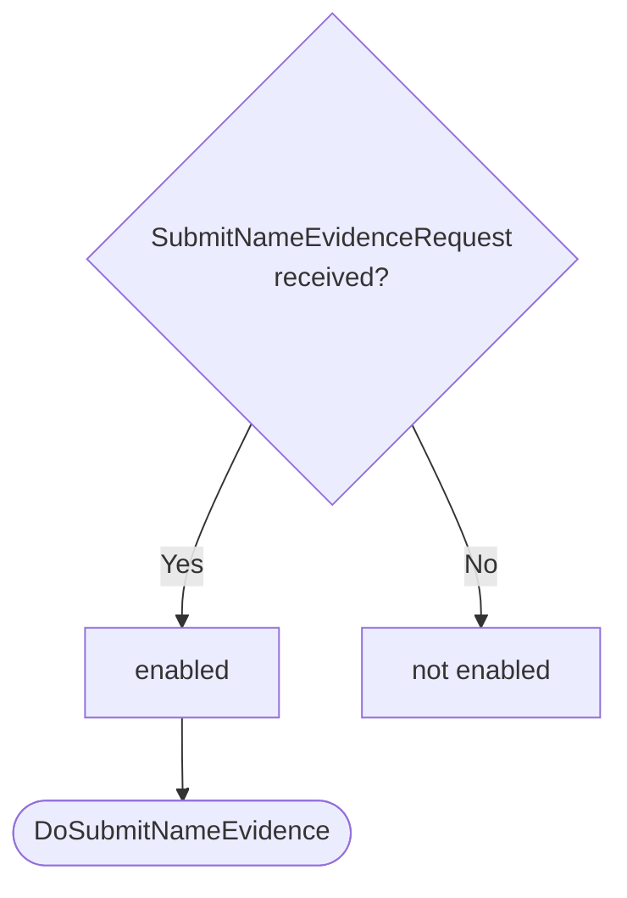
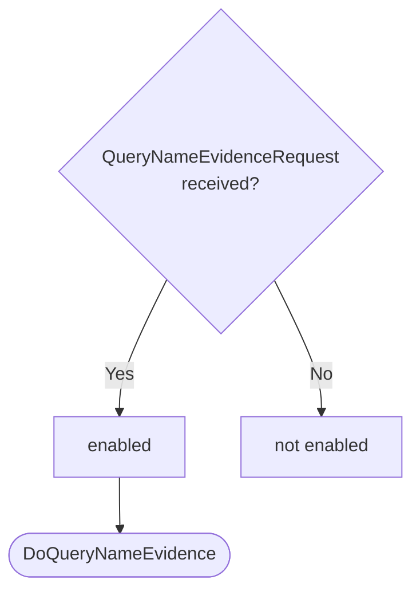

??? note "Juvix preamble"

    ```juvix
    module node_architecture.engines.naming_dynamics;

    import prelude open;
    import node_architecture.basics open;
    import Data.Set.AVL open;
    import Stdlib.Data.List.Base open;
    import Stdlib.Trait.Ord open;
    import Stdlib.Data.Bool.Base open;
    import node_architecture.types.engine_dynamics open;
    import node_architecture.types.engine_environment open;
    import node_architecture.types.identity_types open;
    import node_architecture.engines.naming_overview open;
    import node_architecture.engines.naming_environment open;
    import node_architecture.types.anoma_message as Anoma;
    ```

# `Naming` Dynamics

## Overview

The dynamics of the Naming Engine define how it processes incoming messages and updates its state accordingly.

## Action labels

<!-- --8<-- [start:naming-action-label] -->
```juvix
type NamingActionLabel :=
  | -- --8<-- [start:DoResolveName]
    DoResolveName NamingMsg
    -- --8<-- [end:DoResolveName]
  | -- --8<-- [start:DoSubmitNameEvidence]
    DoSubmitNameEvidence NamingMsg
    -- --8<-- [end:DoSubmitNameEvidence]
  | -- --8<-- [start:DoQueryNameEvidence]
    DoQueryNameEvidence NamingMsg
    -- --8<-- [end:DoQueryNameEvidence]
;
```
<!-- --8<-- [end:naming-action-label] -->

### `DoResolveName`

!!! quote ""

    --8<-- "./naming_dynamics.juvix.md:DoResolveName"

This action label corresponds to resolving a name to associated external identities.

### `DoSubmitNameEvidence`

!!! quote ""

    --8<-- "./naming_dynamics.juvix.md:DoSubmitNameEvidence"

This action label corresponds to submitting new name evidence.

### `DoQueryNameEvidence`

!!! quote ""

    --8<-- "./naming_dynamics.juvix.md:DoQueryNameEvidence"

This action label corresponds to querying name evidence for a specific external identity.

## Matchable arguments

<!-- --8<-- [start:naming-matchable-argument] -->
```juvix
type NamingMatchableArgument :=
  | -- --8<-- [start:ArgResolveName]
    ArgResolveName NamingMsg
    -- --8<-- [end:ArgResolveName]
  | -- --8<-- [start:ArgSubmitNameEvidence]
    ArgSubmitNameEvidence NamingMsg
    -- --8<-- [end:ArgSubmitNameEvidence]
  | -- --8<-- [start:ArgQueryNameEvidence]
    ArgQueryNameEvidence NamingMsg
    -- --8<-- [end:ArgQueryNameEvidence]
;
```
<!-- --8<-- [end:naming-matchable-argument] -->

### `ArgResolveName`

!!! quote ""

    ```
    --8<-- "./naming_dynamics.juvix.md:ArgResolveName"
    ```

This matchable argument contains the resolve name request data.

### `ArgSubmitNameEvidence`

!!! quote ""

    ```
    --8<-- "./naming_dynamics.juvix.md:ArgSubmitNameEvidence"
    ```

This matchable argument contains the submit name evidence request data.

### `ArgQueryNameEvidence`

!!! quote ""

    ```
    --8<-- "./naming_dynamics.juvix.md:ArgQueryNameEvidence"
    ```

This matchable argument contains the query name evidence request data.

## Precomputation results

The Naming Engine does not require any non-trivial pre-computations.

<!-- --8<-- [start:naming-precomputation-entry] -->
```juvix
syntax alias NamingPrecomputation := Unit;
```
<!-- --8<-- [end:naming-precomputation-entry] -->

## Guards

??? quote "Auxiliary Juvix code"

    Type alias for the guard.

    ```juvix
    NamingGuard : Type :=
      Guard
        NamingLocalState
        NamingMsg
        NamingMailboxState
        NamingTimerHandle
        NamingMatchableArgument
        NamingActionLabel
        NamingPrecomputation;
    ```

### `resolveNameGuard`

<figure markdown>

<figcaption>resolveNameGuard flowchart</figcaption>
</figure>

<!-- --8<-- [start:resolve-name-guard] -->
```juvix
resolveNameGuard
  (t : TimestampedTrigger NamingMsg NamingTimerHandle)
  (env : NamingEnvironment) : Maybe (GuardOutput NamingMatchableArgument NamingActionLabel NamingPrecomputation)
  := case getMessageFromTimestampedTrigger t of {
      | just (ResolveNameRequest x) := just (
        mkGuardOutput@{
          args := [ArgResolveName (ResolveNameRequest x)];
          label := DoResolveName (ResolveNameRequest x);
          other := unit
        })
      | _ := nothing
  };
```
<!-- --8<-- [end:resolve-name-guard] -->

### `submitNameEvidenceGuard`

<figure markdown>

<figcaption>submitNameEvidenceGuard flowchart</figcaption>
</figure>

<!-- --8<-- [start:submit-name-evidence-guard] -->
```juvix
submitNameEvidenceGuard
  (t : TimestampedTrigger NamingMsg NamingTimerHandle)
  (env : NamingEnvironment) : Maybe (GuardOutput NamingMatchableArgument NamingActionLabel NamingPrecomputation)
  := case getMessageFromTimestampedTrigger t of {
      | just (SubmitNameEvidenceRequest x) := just (
        mkGuardOutput@{
          args := [ArgSubmitNameEvidence (SubmitNameEvidenceRequest x)];
          label := DoSubmitNameEvidence (SubmitNameEvidenceRequest x);
          other := unit
        })
      | _ := nothing
  };
```
<!-- --8<-- [end:submit-name-evidence-guard] -->

### `queryNameEvidenceGuard`

<figure markdown>

<figcaption>queryNameEvidenceGuard flowchart</figcaption>
</figure>

<!-- --8<-- [start:query-name-evidence-guard] -->
```juvix
queryNameEvidenceGuard
  (t : TimestampedTrigger NamingMsg NamingTimerHandle)
  (env : NamingEnvironment) : Maybe (GuardOutput NamingMatchableArgument NamingActionLabel NamingPrecomputation)
  := case getMessageFromTimestampedTrigger t of {
      | just (QueryNameEvidenceRequest x) := just (
        mkGuardOutput@{
          args := [ArgQueryNameEvidence (QueryNameEvidenceRequest x)];
          label := DoQueryNameEvidence (QueryNameEvidenceRequest x);
          other := unit
        })
      | _ := nothing
  };
```
<!-- --8<-- [end:query-name-evidence-guard] -->

## Action function

??? quote "Auxiliary Juvix code"

    Type alias for the action function.

    ```juvix
    NamingActionInput : Type :=
      ActionInput
        NamingLocalState
        NamingMsg
        NamingMailboxState
        NamingTimerHandle
        NamingMatchableArgument
        NamingActionLabel
        NamingPrecomputation;

    NamingActionEffect : Type :=
      ActionEffect
        NamingLocalState
        NamingMsg
        NamingMailboxState
        NamingTimerHandle
        NamingMatchableArgument
        NamingActionLabel
        NamingPrecomputation;
    ```

<!-- --8<-- [start:action-function] -->
```juvix
axiom dummyActionEffect : NamingActionEffect;

namingAction (input : NamingActionInput) : NamingActionEffect :=
  let env := ActionInput.env input;
      out := ActionInput.guardOutput input;
      localState := EngineEnvironment.localState env;
  in
  case GuardOutput.label out of {
    | DoResolveName (ResolveNameRequest identityName) := let
        matchingEvidence := AVLfilter \{evidence :=
          isEQ (Ord.cmp (IdentityNameEvidence.identityName evidence) identityName)
         } (NamingLocalState.evidenceStore localState);
        identities := fromList (map \{evidence :=
          IdentityNameEvidence.externalIdentity evidence
         } (toList matchingEvidence));
        responseMsg := ResolveNameResponse@{
          externalIdentities := identities;
          error := nothing
        };
        sender := getMessageSenderFromTimestampedTrigger (ActionInput.timestampedTrigger input);
        target' := case sender of {
          | just s := s
          | nothing := Left "unknown"
        };
      in mkActionEffect@{
        newEnv := env; -- No state change
        producedMessages := [mkEnvelopedMessage@{
          sender := just (EngineEnvironment.name env);
          packet := mkMessagePacket@{
            target := target';
            mailbox := nothing;
            message := Anoma.MsgNaming responseMsg
          }
        }];
        timers := [];
        spawnedEngines := []
      }
    | DoSubmitNameEvidence (SubmitNameEvidenceRequest evidence') := let
        evidence := evidence';
        alreadyExists := elem \{a b := a && b} true (map \{e :=
          isEQ (Ord.cmp e evidence)
         } (toList (NamingLocalState.evidenceStore localState)));
        newLocalState := case alreadyExists of { 
              | true := localState
              | false :=
          let newEvidenceStore := Set.insert evidence (NamingLocalState.evidenceStore localState);
          in mkNamingLocalState@{
            evidenceStore := newEvidenceStore
          }};
        newEnv' := env@EngineEnvironment{
          localState := newLocalState
        };
        responseMsg := SubmitNameEvidenceResponse@{
          error := case alreadyExists of { 
            | true := just "Evidence already exists" 
            | false := nothing
        }};
        sender := getMessageSenderFromTimestampedTrigger (ActionInput.timestampedTrigger input);
        target' := case sender of {
          | just s := s
          | nothing := Left "unknown"
        };
      in mkActionEffect@{
        newEnv := newEnv';
        producedMessages := [mkEnvelopedMessage@{
          sender := just (EngineEnvironment.name env);
          packet := mkMessagePacket@{
            target := target';
            mailbox := nothing;
            message := Anoma.MsgNaming responseMsg
          }
        }];
        timers := [];
        spawnedEngines := []
      }
    | DoQueryNameEvidence (QueryNameEvidenceRequest externalIdentity) := let
        relevantEvidence := AVLfilter \{evidence :=
          isEQ (Ord.cmp (IdentityNameEvidence.externalIdentity evidence) externalIdentity)
         } (NamingLocalState.evidenceStore localState);
        responseMsg := QueryNameEvidenceResponse@{
          evidence := relevantEvidence;
          error := nothing
        };
        sender := getMessageSenderFromTimestampedTrigger (ActionInput.timestampedTrigger input);
        target' := case sender of {
          | just s := s
          | nothing := Left "unknown"
        };
      in mkActionEffect@{
        newEnv := env; -- No state change
        producedMessages := [mkEnvelopedMessage@{
          sender := just (EngineEnvironment.name env);
          packet := mkMessagePacket@{
            target := target';
            mailbox := nothing;
            message := Anoma.MsgNaming responseMsg
          }
        }];
        timers := [];
        spawnedEngines := []
      }
    | _ := dummyActionEffect
  };
```
<!-- --8<-- [end:action-function] -->

## Conflict solver

```juvix
namingConflictSolver : Set NamingMatchableArgument -> List (Set NamingMatchableArgument)
  | _ := [];
```

## `Naming` Engine Summary

--8<-- "./docs/node_architecture/engines/naming.juvix.md:naming-engine-family"
