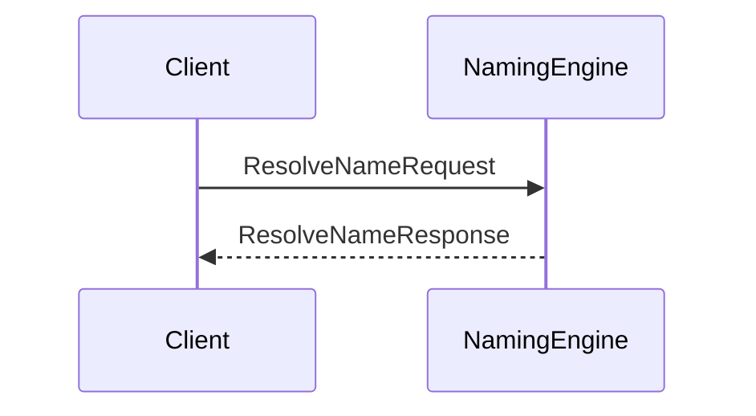
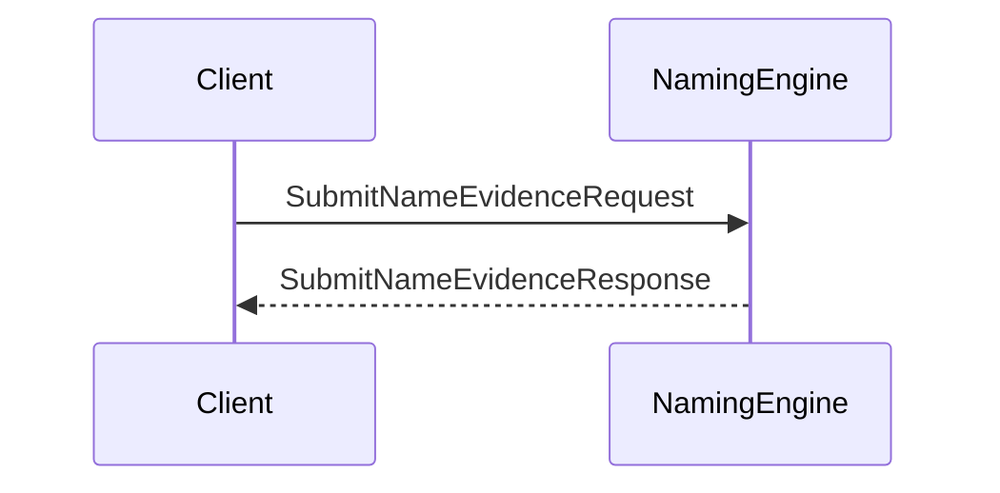

??? quote "Juvix imports"

    ```juvix
    module node_architecture.engines.naming_overview;
    import prelude open;
    import node_architecture.types.identity_types open;
    ```
    
# Naming Engine Family Overview

## Purpose

The **Naming Engine** is responsible for tracking naming information as described in *Identity Names*. It supports name resolution, submitting name evidence, and querying name evidence. This means that the Naming Engine tracks which `IdentityName`s correspond with which `ExternalIdentity`s using `IdentityNameEvidence`.

## Message Interface

The Naming Engine communicates using the following messages:

- `ResolveNameRequest` and `ResolveNameResponse`
- `SubmitNameEvidenceRequest` and `SubmitNameEvidenceResponse`
- `QueryNameEvidenceRequest` and `QueryNameEvidenceResponse`

### `ResolveNameRequest` and `ResolveNameResponse`

#### `ResolveNameRequest`

```juvix
type ResolveNameRequest := mkResolveNameRequest {
  identityName : IdentityName;
};
```

A `ResolveNameRequest` asks the Naming Engine which `ExternalIdentitys` are associated with a given `IdentityName`.

- `identityName`: The name to resolve.

#### `ResolveNameResponse`

```juvix
type ResolveNameResponse := mkResolveNameResponse {
  externalIdentities : Set ExternalIdentity;
  error : Maybe String;
};
```

A `ResolveNameResponse` is returned in response to a `ResolveNameRequest`.

- `externalIdentities`: A set of ExternalIdentitys associated with the IdentityName.
- `error`: An error message if the resolution failed.

### `SubmitNameEvidenceRequest` and `SubmitNameEvidenceResponse`

#### `SubmitNameEvidenceRequest`

```juvix
type SubmitNameEvidenceRequest := mkSubmitNameEvidenceRequest {
  evidence : IdentityNameEvidence;
};
```

A `SubmitNameEvidenceRequest` instructs the Naming Engine to store a new piece of IdentityNameEvidence.

- `evidence`: The evidence supporting the association between an IdentityName and an ExternalIdentity.

#### `SubmitNameEvidenceResponse`

```juvix
type SubmitNameEvidenceResponse := mkSubmitNameEvidenceResponse {
  error : Maybe String;
};
```

A `SubmitNameEvidenceResponse` is sent in response to a `SubmitNameEvidenceRequest`.

- `error`: An error message if the submission failed.

### `QueryNameEvidenceRequest` and `QueryNameEvidenceResponse`

#### `QueryNameEvidenceRequest`

```juvix
type QueryNameEvidenceRequest := mkQueryNameEvidenceRequest {
  externalIdentity : ExternalIdentity;
};
```

A `QueryNameEvidenceRequest` instructs the Naming Engine to return any known IdentityNames and IdentityNameEvidence associated with a specific ExternalIdentity.

- `externalIdentity`: The identity for which to retrieve evidence.

### `QueryNameEvidenceResponse`

```juvix
type QueryNameEvidenceResponse := mkQueryNameEvidenceResponse {
  evidence : Set IdentityNameEvidence;
  error : Maybe String;
};
```

A `QueryNameEvidenceResponse` provides the requested evidence.

- `evidence`: A set of IdentityNameEvidence related to the identity.
- `error`: An error message if the query failed.

## Naming Messages

We define the messages that the Naming Engine handles:

```juvix
type NamingMsg :=
  | MsgResolveNameRequest ResolveNameRequest
  | MsgResolveNameResponse ResolveNameResponse
  | MsgSubmitNameEvidenceRequest SubmitNameEvidenceRequest
  | MsgSubmitNameEvidenceResponse SubmitNameEvidenceResponse
  | MsgQueryNameEvidenceRequest QueryNameEvidenceRequest
  | MsgQueryNameEvidenceResponse QueryNameEvidenceResponse;
```

## Engine Components

- [[naming_environment|Naming Engine Environment]]
- [[naming_dynamics|Naming Engine Dynamics]]

## Message Sequence Diagrams

### Name Resolution Sequence

<figure markdown="span">

<figcaption markdown="span">
Sequence diagram for name resolution.
</figcaption> </figure>

### Submit Name Evidence Sequence
<figure markdown="span">


<figcaption markdown="span"> Sequence diagram for submitting name evidence. </figcaption> </figure>
