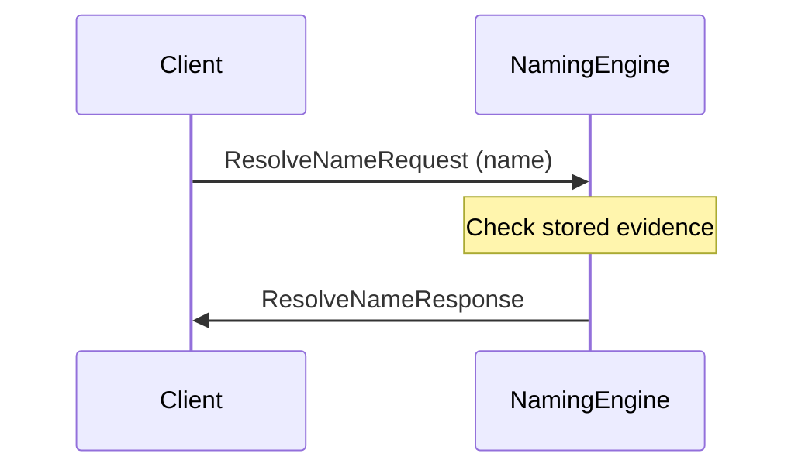
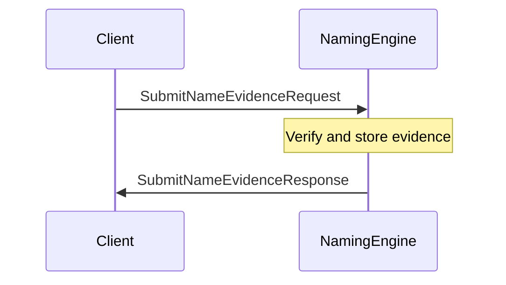
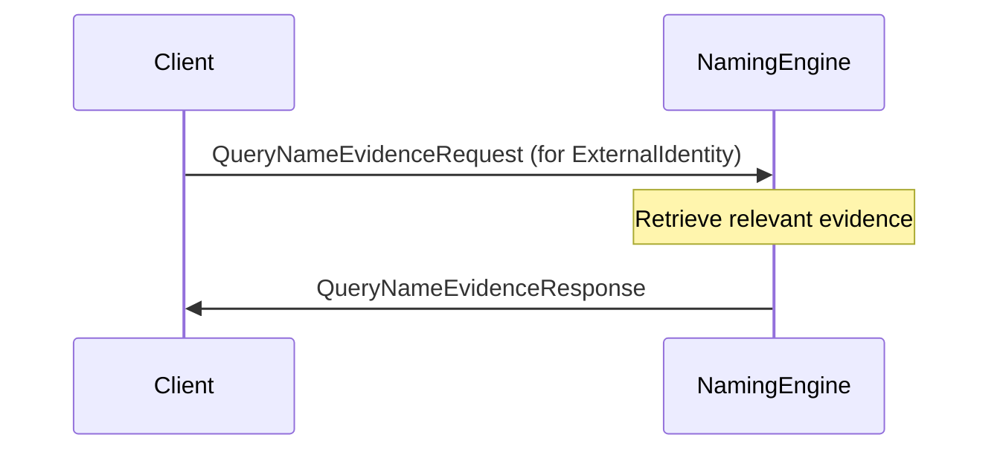

??? quote "Juvix imports"

    ```juvix
    module node_architecture.engines.naming_overview;
    import prelude open;
    import node_architecture.types.identities open;

    ```

# `Naming` Engine Family Overview

--8<-- "./docs/node_architecture/engines/naming.juvix.md:naming-engine-family"

The Naming Engine is responsible for tracking naming information as described in *Identity Names*. It supports name resolution, submitting name evidence, and querying name evidence.

## Purpose

The Naming Engine tracks which `IdentityName`s correspond with which `ExternalIdentity`s using `IdentityNameEvidence`. It provides functionality for resolving names, submitting name evidence, and querying name evidence.

## Message interface

<!-- --8<-- [start:NamingMsg] -->
```juvix
type NamingMsg :=
  | -- --8<-- [start:ResolveNameRequest]
    ResolveNameRequest {
      identityName : IdentityName
    }
    -- --8<-- [end:ResolveNameRequest]
  | -- --8<-- [start:ResolveNameResponse]
    ResolveNameResponse {
      externalIdentities : Set ExternalIdentity;
      err : Option String
    }
    -- --8<-- [end:ResolveNameResponse]
  | -- --8<-- [start:SubmitNameEvidenceRequest]
    SubmitNameEvidenceRequest {
      evidence : IdentityNameEvidence
    }
    -- --8<-- [end:SubmitNameEvidenceRequest]
  | -- --8<-- [start:SubmitNameEvidenceResponse]
    SubmitNameEvidenceResponse {
      err : Option String
    }
    -- --8<-- [end:SubmitNameEvidenceResponse]
  | -- --8<-- [start:QueryNameEvidenceRequest]
    QueryNameEvidenceRequest {
      externalIdentity : ExternalIdentity
    }
    -- --8<-- [end:QueryNameEvidenceRequest]
  | -- --8<-- [start:QueryNameEvidenceResponse]
    QueryNameEvidenceResponse {
      externalIdentity : ExternalIdentity;
      evidence : Set IdentityNameEvidence;
      err : Option String
    }
    -- --8<-- [end:QueryNameEvidenceResponse]
  ;
```
<!-- --8<-- [end:NamingMsg] -->

### `ResolveNameRequest` message

!!! quote "ResolveNameRequest"

    ```
    --8<-- "./naming_overview.juvix.md:ResolveNameRequest"
    ```

A `ResolveNameRequest` asks the Naming Engine which `ExternalIdentity`s are associated with a given `IdentityName`.

- `identityName`: The name to resolve.

### `ResolveNameResponse` message

!!! quote "ResolveNameResponse"

    ```
    --8<-- "./naming_overview.juvix.md:ResolveNameResponse"
    ```

A `ResolveNameResponse` is returned in response to a `ResolveNameRequest`.

- `externalIdentities`: A set of ExternalIdentitys associated with the IdentityName.
- `err`: An error message if the resolution failed.

### `SubmitNameEvidenceRequest` message

!!! quote "SubmitNameEvidenceRequest"

    ```
    --8<-- "./naming_overview.juvix.md:SubmitNameEvidenceRequest"
    ```

A `SubmitNameEvidenceRequest` instructs the Naming Engine to store a new piece of IdentityNameEvidence.

- `evidence`: The evidence supporting the association between an IdentityName and an ExternalIdentity.

### `SubmitNameEvidenceResponse` message

!!! quote "SubmitNameEvidenceResponse"

    ```
    --8<-- "./naming_overview.juvix.md:SubmitNameEvidenceResponse"
    ```

A `SubmitNameEvidenceResponse` is sent in response to a `SubmitNameEvidenceRequest`.

- `err`: An error message if the submission failed.

### `QueryNameEvidenceRequest` message

!!! quote "QueryNameEvidenceRequest"

    ```
    --8<-- "./naming_overview.juvix.md:QueryNameEvidenceRequest"
    ```

A `QueryNameEvidenceRequest` instructs the Naming Engine to return any known IdentityNames and IdentityNameEvidence associated with a specific ExternalIdentity.

- `externalIdentity`: The identity for which to retrieve evidence.

### `QueryNameEvidenceResponse` message

!!! quote "QueryNameEvidenceResponse"

    ```
    --8<-- "./naming_overview.juvix.md:QueryNameEvidenceResponse"
    ```

A `QueryNameEvidenceResponse` provides the requested evidence.

- `evidence`: A set of IdentityNameEvidence related to the identity.
- `err`: An error message if the query failed.

## Message sequence diagrams

### Resolving a Name

<!-- --8<-- [start:message-sequence-diagram-name-resolution] -->
<figure markdown="span">



<figcaption markdown="span">
Resolving a name
</figcaption>
</figure>
<!-- --8<-- [end:message-sequence-diagram-name-resolution] -->

### Submitting Name Evidence

<!-- --8<-- [start:message-sequence-diagram-submit] -->
<figure markdown="span">



<figcaption markdown="span">
Submitting name evidence
</figcaption>
</figure>
<!-- --8<-- [end:message-sequence-diagram-submit] -->

### Querying Name Evidence

<!-- --8<-- [start:message-sequence-diagram-query] -->
<figure markdown="span">



<figcaption markdown="span">
Querying name evidence for an identity.
</figcaption>
</figure>
<!-- --8<-- [end:message-sequence-diagram-query] -->

## Engine Components

- [[Naming Environment|`Naming` Engine Environment]]
- [[Naming Dynamics|`Naming` Engine Dynamics]]

## Useful links

