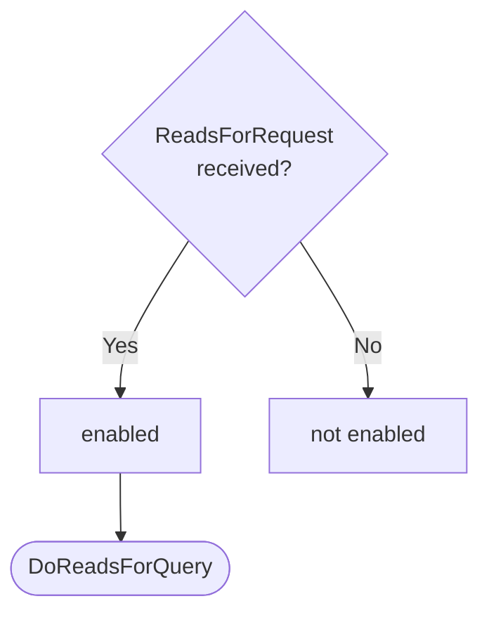
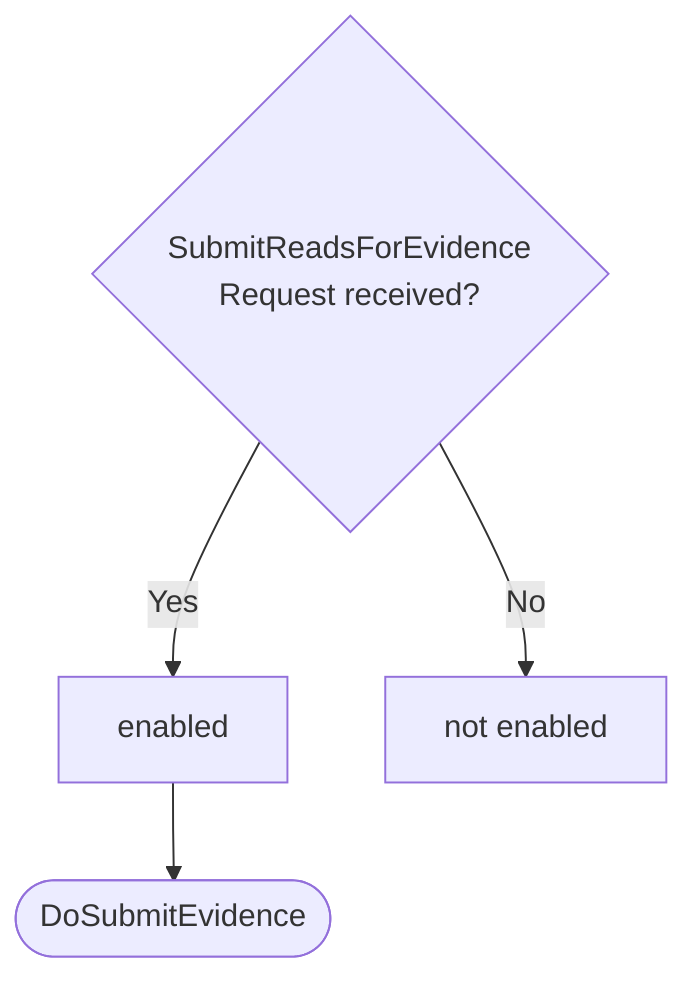

??? note "Juvix preamble"

    ```juvix
    module node_architecture.engines.reads_for_dynamics;

    import prelude open;
    import node_architecture.basics open;
    import Data.Set.AVL open;
    import Stdlib.Data.List.Base open;
    import Stdlib.Trait.Ord open;
    import Stdlib.Data.Bool.Base open;
    import node_architecture.types.engine_dynamics open;
    import node_architecture.types.engine_environment open;
    import node_architecture.types.identity_types open;
    import node_architecture.engines.reads_for_overview open;
    import node_architecture.engines.reads_for_environment open;
    import node_architecture.types.anoma_message as Anoma;
    ```

# `Reads For` Dynamics

## Overview

The dynamics of the Reads For Engine define how it processes incoming messages and updates its state accordingly.

## Action labels

<!-- --8<-- [start:reads-for-action-label] -->
```juvix
type ReadsForActionLabel :=
  | -- --8<-- [start:DoReadsForQuery]
    DoReadsForQuery ReadsForMsg
    -- --8<-- [end:DoReadsForQuery]
  | -- --8<-- [start:DoSubmitEvidence]
    DoSubmitEvidence ReadsForMsg
    -- --8<-- [end:DoSubmitEvidence]
  | -- --8<-- [start:DoQueryEvidence]
    DoQueryEvidence ReadsForMsg
    -- --8<-- [end:DoQueryEvidence]
;
```
<!-- --8<-- [end:reads-for-action-label] -->

### `DoReadsForQuery`

!!! quote ""

    --8<-- "./reads_for_dynamics.juvix.md:DoReadsForQuery"

This action label corresponds to processing a reads_for query.

??? quote "`DoReadsForQuery` action effect"

    This action does the following:

    | Aspect | Description |
    |--------|-------------|
    | State update          | The state remains unchanged. |
    | Messages to be sent   | A `ReadsForResponse` message is sent back to the requester. |
    | Engines to be spawned | No engine is created by this action. |
    | Timer updates         | No timers are set or cancelled. |

### `DoSubmitEvidence`

!!! quote ""

    --8<-- "./reads_for_dynamics.juvix.md:DoSubmitEvidence"

This action label corresponds to submitting new reads_for evidence.

??? quote "`DoSubmitEvidence` action effect"

    This action does the following:

    | Aspect | Description |
    |--------|-------------|
    | State update          | The new evidence is added to the evidence store. |
    | Messages to be sent   | A `SubmitReadsForEvidenceResponse` message is sent back to the requester. |
    | Engines to be spawned | No engine is created by this action. |
    | Timer updates         | No timers are set or cancelled. |

### `DoQueryEvidence`

!!! quote ""

    --8<-- "./reads_for_dynamics.juvix.md:DoQueryEvidence"

This action label corresponds to querying reads_for evidence for a specific identity.

??? quote "`DoQueryEvidence` action effect"

    This action does the following:

    | Aspect | Description |
    |--------|-------------|
    | State update          | The state remains unchanged. |
    | Messages to be sent   | A `QueryReadsForEvidenceResponse` message is sent back to the requester. |
    | Engines to be spawned | No engine is created by this action. |
    | Timer updates         | No timers are set or cancelled. |

## Matchable arguments

<!-- --8<-- [start:reads-for-matchable-argument] -->
```juvix
type ReadsForMatchableArgument :=
  | -- --8<-- [start:ArgReadsForQuery]
    ArgReadsForQuery ReadsForMsg
    -- --8<-- [end:ArgReadsForQuery]
  | -- --8<-- [start:ArgSubmitEvidence]
    ArgSubmitEvidence ReadsForMsg
    -- --8<-- [end:ArgSubmitEvidence]
  | -- --8<-- [start:ArgQueryEvidence]
    ArgQueryEvidence ReadsForMsg
    -- --8<-- [end:ArgQueryEvidence]
;
```
<!-- --8<-- [end:reads-for-matchable-argument] -->

### `ArgReadsForQuery`

!!! quote ""

    ```
    --8<-- "./reads_for_dynamics.juvix.md:ArgReadsForQuery"
    ```

This matchable argument contains the reads_for query request data.

### `ArgSubmitEvidence`

!!! quote ""

    ```
    --8<-- "./reads_for_dynamics.juvix.md:ArgSubmitEvidence"
    ```

This matchable argument contains the evidence submission request data.

### `ArgQueryEvidence`

!!! quote ""

    ```
    --8<-- "./reads_for_dynamics.juvix.md:ArgQueryEvidence"
    ```

This matchable argument contains the evidence query request data.

## Precomputation results

The Reads For Engine does not require any non-trivial pre-computations.

<!-- --8<-- [start:reads-for-precomputation-entry] -->
```juvix
syntax alias ReadsForPrecomputation := Unit;
```
<!-- --8<-- [end:reads-for-precomputation-entry] -->

## Guards

??? quote "Auxiliary Juvix code"

    Type alias for the guard.

    ```juvix
    ReadsForGuard : Type :=
      Guard
        ReadsForLocalState
        ReadsForMsg
        ReadsForMailboxState
        ReadsForTimerHandle
        ReadsForMatchableArgument
        ReadsForActionLabel
        ReadsForPrecomputation;
    ```

### `readsForQueryGuard`

<figure markdown>

<figcaption>readsForQueryGuard flowchart</figcaption>
</figure>

<!-- --8<-- [start:reads-for-query-guard] -->
```juvix
readsForQueryGuard
  (t : TimestampedTrigger ReadsForMsg ReadsForTimerHandle)
  (env : ReadsForEnvironment) : Maybe (GuardOutput ReadsForMatchableArgument ReadsForActionLabel ReadsForPrecomputation)
  := case getMessageFromTimestampedTrigger t of {
      | just (ReadsForRequest x y) := just (
        mkGuardOutput@{
          args := [ArgReadsForQuery (ReadsForRequest x y)];
          label := DoReadsForQuery (ReadsForRequest x y);
          other := unit
        })
      | _ := nothing
  };
```
<!-- --8<-- [end:reads-for-query-guard] -->

### `submitEvidenceGuard`

<figure markdown>

<figcaption>submitEvidenceGuard flowchart</figcaption>
</figure>

<!-- --8<-- [start:submit-evidence-guard] -->
```juvix
submitEvidenceGuard
  (t : TimestampedTrigger ReadsForMsg ReadsForTimerHandle)
  (env : ReadsForEnvironment) : Maybe (GuardOutput ReadsForMatchableArgument ReadsForActionLabel ReadsForPrecomputation)
  := case getMessageFromTimestampedTrigger t of {
      | just (SubmitReadsForEvidenceRequest x) := just (
        mkGuardOutput@{
          args := [ArgSubmitEvidence (SubmitReadsForEvidenceRequest x)];
          label := DoSubmitEvidence (SubmitReadsForEvidenceRequest x);
          other := unit
        })
      | _ := nothing
  };
```
<!-- --8<-- [end:submit-evidence-guard] -->

### `queryEvidenceGuard`

<figure markdown>

<figcaption>queryEvidenceGuard flowchart</figcaption>
</figure>

<!-- --8<-- [start:query-evidence-guard] -->
```juvix
queryEvidenceGuard
  (t : TimestampedTrigger ReadsForMsg ReadsForTimerHandle)
  (env : ReadsForEnvironment) : Maybe (GuardOutput ReadsForMatchableArgument ReadsForActionLabel ReadsForPrecomputation)
  := case getMessageFromTimestampedTrigger t of {
      | just (QueryReadsForEvidenceRequest x) := just (
        mkGuardOutput@{
          args := [ArgQueryEvidence (QueryReadsForEvidenceRequest x)];
          label := DoQueryEvidence (QueryReadsForEvidenceRequest x);
          other := unit
        })
      | _ := nothing
  };
```
<!-- --8<-- [end:query-evidence-guard] -->

## Action function

??? quote "Auxiliary Juvix code"

    Type alias for the action function.

    ```juvix
    ReadsForActionInput : Type :=
      ActionInput
        ReadsForLocalState
        ReadsForMsg
        ReadsForMailboxState
        ReadsForTimerHandle
        ReadsForMatchableArgument
        ReadsForActionLabel
        ReadsForPrecomputation;

    ReadsForActionEffect : Type :=
      ActionEffect
        ReadsForLocalState
        ReadsForMsg
        ReadsForMailboxState
        ReadsForTimerHandle
        ReadsForMatchableArgument
        ReadsForActionLabel
        ReadsForPrecomputation;
    ```

<!-- --8<-- [start:action-function] -->
```juvix
axiom dummyActionEffect : ReadsForActionEffect;

readsForAction (input : ReadsForActionInput) : ReadsForActionEffect :=
  let env := ActionInput.env input;
      out := ActionInput.guardOutput input;
      localState := EngineEnvironment.localState env;
  in
  case GuardOutput.label out of {
    | DoReadsForQuery (ReadsForRequest externalIdentityA externalIdentityB) := let
        hasEvidence := elem \{a b := a && b} true (map \{ evidence :=
          isEQ (Ord.cmp (ReadsForEvidence.fromIdentity evidence) externalIdentityA) &&
          isEQ (Ord.cmp (ReadsForEvidence.toIdentity evidence) externalIdentityB)
        } (toList (ReadsForLocalState.evidenceStore localState)));
        responseMsgRF := ReadsForResponse@{
          readsFor := hasEvidence;
          error := nothing
        };
        senderRF := getMessageSenderFromTimestampedTrigger (ActionInput.timestampedTrigger input);
        targetRF := case senderRF of {
          | just s := s
          | nothing := Left "unknown"
        };
      in mkActionEffect@{
        newEnv := env; -- No state change
        producedMessages := [mkEnvelopedMessage@{
          sender := just (EngineEnvironment.name env);
          packet := mkMessagePacket@{
            target := targetRF;
            mailbox := nothing;
            message := Anoma.MsgReadsFor responseMsgRF
          }
        }];
        timers := [];
        spawnedEngines := []
      }
    | DoSubmitEvidence (SubmitReadsForEvidenceRequest evidence) := let
        newEvidenceStore := Set.insert evidence (ReadsForLocalState.evidenceStore localState);
        newLocalStateRF := mkReadsForLocalState@{
          evidenceStore := newEvidenceStore
        };
        newEnvRF := env@EngineEnvironment{
          localState := newLocalStateRF
        };
        responseMsgSubmit := SubmitReadsForEvidenceResponse@{
          error := nothing
        };
        senderSubmit := getMessageSenderFromTimestampedTrigger (ActionInput.timestampedTrigger input);
        targetSubmit := case senderSubmit of {
          | just s := s
          | nothing := Left "unknown"
        };
      in mkActionEffect@{
        newEnv := newEnvRF;
        producedMessages := [mkEnvelopedMessage@{
          sender := just (EngineEnvironment.name env);
          packet := mkMessagePacket@{
            target := targetSubmit;
            mailbox := nothing;
            message := Anoma.MsgReadsFor responseMsgSubmit
          }
        }];
        timers := [];
        spawnedEngines := []
      }
    | DoQueryEvidence (QueryReadsForEvidenceRequest externalIdentity) := let
        relevantEvidence := AVLfilter \{evidence :=
          isEQ (Ord.cmp (ReadsForEvidence.fromIdentity evidence) externalIdentity) ||
          isEQ (Ord.cmp (ReadsForEvidence.toIdentity evidence) externalIdentity)
        } (ReadsForLocalState.evidenceStore localState);
        responseMsgQuery := QueryReadsForEvidenceResponse@{
          evidence := relevantEvidence;
          error := nothing
        };
        senderQuery := getMessageSenderFromTimestampedTrigger (ActionInput.timestampedTrigger input);
        targetQuery := case senderQuery of {
          | just s := s
          | nothing := Left "unknown"
        };
      in mkActionEffect@{
        newEnv := env; -- No state change
        producedMessages := [mkEnvelopedMessage@{
          sender := just (EngineEnvironment.name env);
          packet := mkMessagePacket@{
            target := targetQuery;
            mailbox := nothing;
            message := Anoma.MsgReadsFor responseMsgQuery
          }
        }];
        timers := [];
        spawnedEngines := []
      }
    | _ := dummyActionEffect
  };
```
<!-- --8<-- [end:action-function] -->

## Conflict solver

```juvix
readsForConflictSolver : Set ReadsForMatchableArgument -> List (Set ReadsForMatchableArgument)
  | _ := [];
```

## `Reads For` Engine Summary

--8<-- "./docs/node_architecture/engines/reads_for.juvix.md:reads-for-engine-family"
