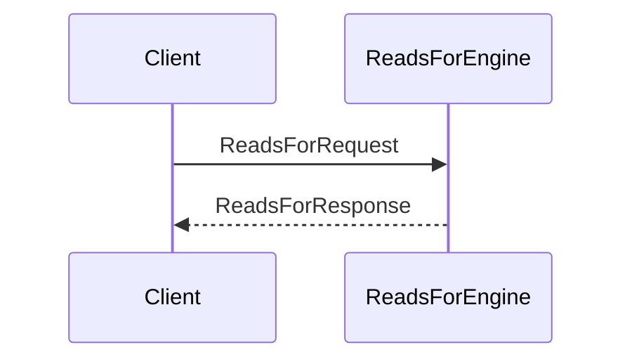
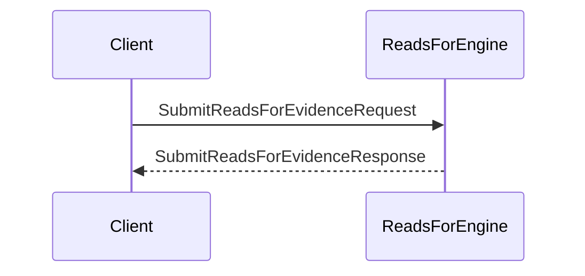

??? quote "Juvix imports"

    ```juvix
    module node_architecture.engines.reads_for_overview;
    import prelude open;
    import node_architecture.types.identity_types open;
    ```
    
# Reads For Engine Family Overview

## Purpose

The **Reads For Engine** manages `reads_for` relationships between identities. A `reads_for` relationship indicates that one identity can read data encrypted for another identity. This is useful in scenarios where data access needs to be delegated or shared.

## Message Interface

The Reads For Engine communicates using the following messages:

- `ReadsForRequest` and `ReadsForResponse`
- `SubmitReadsForEvidenceRequest` and `SubmitReadsForEvidenceResponse`
- `QueryReadsForEvidenceRequest` and `QueryReadsForEvidenceResponse`

### `ReadsForRequest` and `ReadsForResponse`

#### `ReadsForRequest`

```juvix
type ReadsForRequest := mkReadsForRequest {
  externalIdentityA : ExternalIdentity;
  externalIdentityB : ExternalIdentity;
};
```

A `ReadsForRequest` queries whether `externalIdentityA` can read data encrypted to `externalIdentityB`.

- `externalIdentityA`: The identity attempting to read the data.
- `externalIdentityB`: The identity for whom the data was originally encrypted.

### `ReadsForResponse`

```juvix
type ReadsForResponse := mkReadsForResponse {
  readsFor : Bool;
  error : Maybe String;
};
```

A `ReadsForResponse` indicates whether the `reads_for` relationship exists.

- `readsFor`: True if externalIdentityA can read for externalIdentityB, False otherwise.
- `error`: An error message if the query failed.

## `SubmitReadsForEvidenceRequest` and `SubmitReadsForEvidenceResponse`

### `SubmitReadsForEvidenceRequest`

```juvix
type SubmitReadsForEvidenceRequest := mkSubmitReadsForEvidenceRequest {
  evidence : ReadsForEvidence;
};
```

A `SubmitReadsForEvidenceRequest` submits evidence of a `reads_for` relationship.

- `evidence`: The evidence supporting the `reads_for` relationship.

### `SubmitReadsForEvidenceResponse`

```juvix
type SubmitReadsForEvidenceResponse := mkSubmitReadsForEvidenceResponse {
  error : Maybe String;
};
```

A `SubmitReadsForEvidenceResponse` acknowledges the submission of evidence.

- `error`: An error message if the submission failed.

## `QueryReadsForEvidenceRequest` and `QueryReadsForEvidenceResponse`

### `QueryReadsForEvidenceRequest`

```juvix
type QueryReadsForEvidenceRequest := mkQueryReadsForEvidenceRequest {
  externalIdentity : ExternalIdentity;
};
```

A `QueryReadsForEvidenceRequest` queries all `reads_for` evidence related to an identity.

- `externalIdentity`: The identity for which to retrieve evidence.

### `QueryReadsForEvidenceResponse`

```juvix
type QueryReadsForEvidenceResponse := mkQueryReadsForEvidenceResponse {
  evidence : Set ReadsForEvidence;
  error : Maybe String;
};
```

A `QueryReadsForEvidenceResponse` provides the requested evidence.

- `evidence`: A set of ReadsForEvidence related to the identity.
- `error`: An error message if the query failed.

## Reads For Messages

We define the messages that the Reads For Engine handles:

```juvix
type ReadsForMsg :=
  | MsgReadsForRequest ReadsForRequest
  | MsgReadsForResponse ReadsForResponse
  | MsgSubmitReadsForEvidenceRequest SubmitReadsForEvidenceRequest
  | MsgSubmitReadsForEvidenceResponse SubmitReadsForEvidenceResponse
  | MsgQueryReadsForEvidenceRequest QueryReadsForEvidenceRequest
  | MsgQueryReadsForEvidenceResponse QueryReadsForEvidenceResponse;
```

## Engine Components

- [[reads_for_management_environment|Reads For Engine Environment]]
- [[reads_for_management_dynamics|Reads For Management Engine Dynamics]]

## Message Sequence Diagrams

### Reads For Query Sequence

<figure markdown="span">

<figcaption markdown="span">
Sequence diagram for `reads_for` query.
</figcaption> </figure>

### Submit Reads For Evidence Sequence
<figure markdown="span">


<figcaption markdown="span">
Sequence diagram for submitting `reads_for` evidence.
</figcaption>
</figure>
