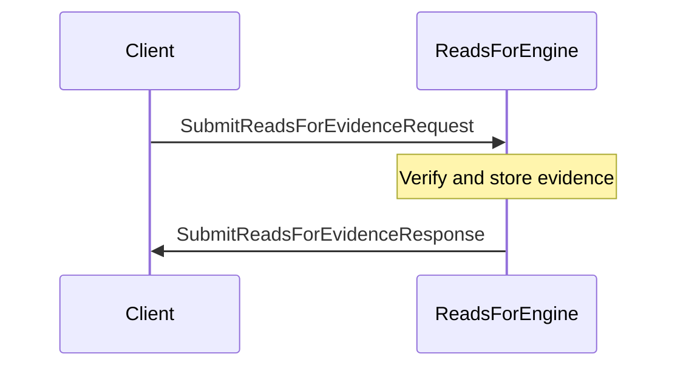
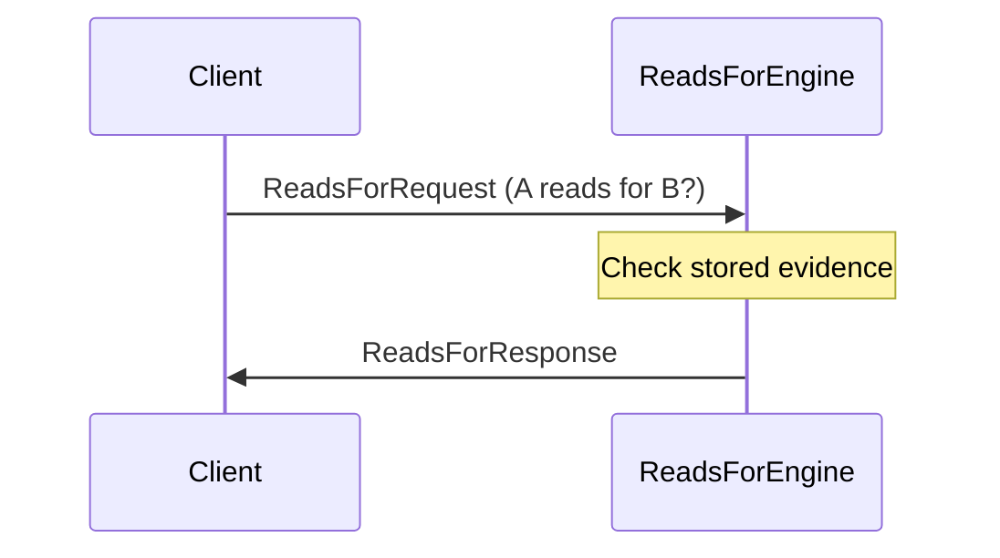
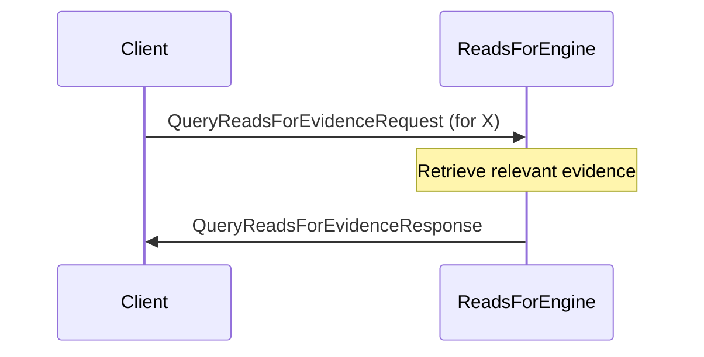

??? quote "Juvix imports"

    ```juvix
    module node_architecture.engines.reads_for_overview;
    import prelude open;
    import node_architecture.types.identities open;
    ```

# `Reads For` Engine Family Overview

--8<-- "./docs/node_architecture/engines/reads_for.juvix.md:reads-for-engine-family"

The Reads For Engine manages `reads_for` relationships between identities. A `reads_for` relationship indicates that one identity can read data encrypted for another identity.

## Purpose

The Reads For Engine maintains and manages the state of `reads_for` relationships between identities. It handles queries about these relationships, allows submission of new evidence, and provides information about existing relationships. This is useful in scenarios where data access needs to be delegated or shared.

## Message interface

<!-- --8<-- [start:ReadsForMsg] -->
```juvix
type ReadsForMsg :=
  | -- --8<-- [start:ReadsForRequest]
    ReadsForRequest {
      externalIdentityA : ExternalIdentity;
      externalIdentityB : ExternalIdentity
    }
    -- --8<-- [end:ReadsForRequest]
  | -- --8<-- [start:ReadsForResponse]
    ReadsForResponse {
      readsFor : Bool;
      err : Option String
    }
    -- --8<-- [end:ReadsForResponse]
  | -- --8<-- [start:SubmitReadsForEvidenceRequest]
    SubmitReadsForEvidenceRequest {
      evidence : ReadsForEvidence
    }
    -- --8<-- [end:SubmitReadsForEvidenceRequest]
  | -- --8<-- [start:SubmitReadsForEvidenceResponse]
    SubmitReadsForEvidenceResponse {
      err : Option String
    }
    -- --8<-- [end:SubmitReadsForEvidenceResponse]
  | -- --8<-- [start:QueryReadsForEvidenceRequest]
    QueryReadsForEvidenceRequest {
      externalIdentity : ExternalIdentity
    }
    -- --8<-- [end:QueryReadsForEvidenceRequest]
  | -- --8<-- [start:QueryReadsForEvidenceResponse]
    QueryReadsForEvidenceResponse {
      externalIdentity : ExternalIdentity;
      evidence : Set ReadsForEvidence;
      err : Option String
    }
    -- --8<-- [end:QueryReadsForEvidenceResponse]
  ;
```
<!-- --8<-- [end:ReadsForMsg] -->

### `ReadsForRequest` message

!!! quote "ReadsForRequest"

    ```
    --8<-- "./reads_for_overview.juvix.md:ReadsForRequest"
    ```

A `ReadsForRequest` queries whether `externalIdentityA` can read data encrypted to `externalIdentityB`.

- `externalIdentityA`: The identity attempting to read the data.
- `externalIdentityB`: The identity for whom the data was originally encrypted.

### `ReadsForResponse` message

!!! quote "ReadsForResponse"

    ```
    --8<-- "./reads_for_overview.juvix.md:ReadsForResponse"
    ```

A `ReadsForResponse` indicates whether the `reads_for` relationship exists.

- `readsFor`: True if externalIdentityA can read for externalIdentityB, False otherwise.
- `err`: An error message if the query failed.

### `SubmitReadsForEvidenceRequest` message

!!! quote "SubmitReadsForEvidenceRequest"

    ```
    --8<-- "./reads_for_overview.juvix.md:SubmitReadsForEvidenceRequest"
    ```

A `SubmitReadsForEvidenceRequest` submits evidence of a `reads_for` relationship.

- `evidence`: The evidence supporting the `reads_for` relationship.

### `SubmitReadsForEvidenceResponse` message

!!! quote "SubmitReadsForEvidenceResponse"

    ```
    --8<-- "./reads_for_overview.juvix.md:SubmitReadsForEvidenceResponse"
    ```

A `SubmitReadsForEvidenceResponse` acknowledges the submission of evidence.

- `err`: An error message if the submission failed.

### `QueryReadsForEvidenceRequest` message

!!! quote "QueryReadsForEvidenceRequest"

    ```
    --8<-- "./reads_for_overview.juvix.md:QueryReadsForEvidenceRequest"
    ```

A `QueryReadsForEvidenceRequest` queries all `reads_for` evidence related to an identity.

- `externalIdentity`: The identity for which to retrieve evidence.

### `QueryReadsForEvidenceResponse` message

!!! quote "QueryReadsForEvidenceResponse"

    ```
    --8<-- "./reads_for_overview.juvix.md:QueryReadsForEvidenceResponse"
    ```

A `QueryReadsForEvidenceResponse` provides the requested evidence.

- `evidence`: A set of ReadsForEvidence related to the identity.
- `err`: An error message if the query failed.

## Message sequence diagrams

### Submitting Reads For Evidence

<!-- --8<-- [start:message-sequence-diagram-submit] -->
<figure markdown="span">



<figcaption markdown="span">
Submitting `reads_for` evidence
</figcaption>
</figure>
<!-- --8<-- [end:message-sequence-diagram-submit] -->

### Querying Reads For Relationship

<!-- --8<-- [start:message-sequence-diagram-query-relationship] -->
<figure markdown="span">



<figcaption markdown="span">
Querying a `reads_for` relationship
</figcaption>
</figure>
<!-- --8<-- [end:message-sequence-diagram-query-relationship] -->

### Querying Reads For Evidence

<!-- --8<-- [start:message-sequence-diagram-query-evidence] -->
<figure markdown="span">



<figcaption markdown="span">
Querying `reads_for` evidence for an identity
</figcaption>
</figure>
<!-- --8<-- [end:message-sequence-diagram-query-evidence] -->

## Engine Components

- [[Reads For Environment|`Reads For` Engine Environment]]
- [[Reads For Dynamics|`Reads For` Engine Dynamics]]

## Useful links
