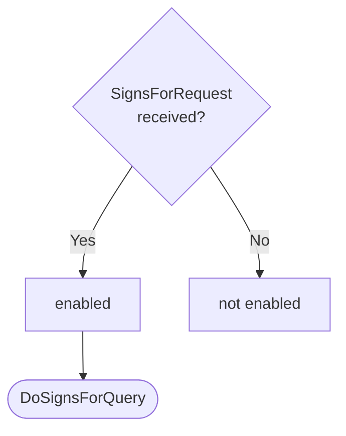
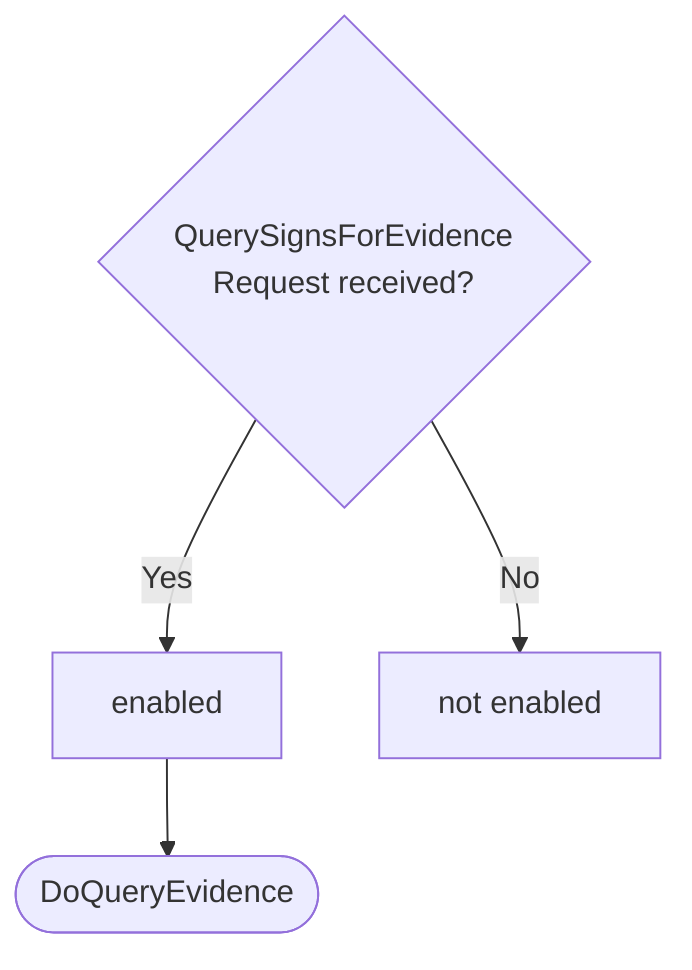

??? note "Juvix preamble"

    ```juvix
    module node_architecture.engines.signs_for_dynamics;

    import prelude open;
    import Stdlib.Data.List.Base open;
    import Data.Set.AVL open;
    import Stdlib.Trait.Ord open;
    import Stdlib.Data.Bool.Base open;
    import node_architecture.basics open;
    import node_architecture.types.engine_dynamics open;
    import node_architecture.types.engine_environment open;
    import node_architecture.types.identity_types open;
    import node_architecture.engines.signs_for_environment open;
    import node_architecture.engines.signs_for_overview open;
    import node_architecture.types.anoma_message as Anoma;
    ```

# `Signs For` Dynamics

## Overview

The dynamics of the Signs For Engine define how it processes incoming messages and updates its state accordingly.

## Action labels

<!-- --8<-- [start:signs-for-action-label] -->
```juvix
type SignsForActionLabel :=
  | -- --8<-- [start:DoSignsForQuery]
    DoSignsForQuery {
      externalIdentityA : ExternalIdentity;
      externalIdentityB : ExternalIdentity
    }
    -- --8<-- [end:DoSignsForQuery]
  | -- --8<-- [start:DoSubmitEvidence]
    DoSubmitEvidence {
      evidence : SignsForEvidence
    }
    -- --8<-- [end:DoSubmitEvidence]
  | -- --8<-- [start:DoQueryEvidence]
    DoQueryEvidence {
      externalIdentity : ExternalIdentity
    }
    -- --8<-- [end:DoQueryEvidence]
;
```
<!-- --8<-- [end:signs-for-action-label] -->

### `DoSignsForQuery`

!!! quote ""

    --8<-- "./signs_for_dynamics.juvix.md:DoSignsForQuery"

This action label corresponds to processing a signs_for query.

??? quote "`DoSignsForQuery` action effect"

    This action does the following:

    | Aspect | Description |
    |--------|-------------|
    | State update          | The state remains unchanged. |
    | Messages to be sent   | A `SignsForResponse` message is sent back to the requester. |
    | Engines to be spawned | No engine is created by this action. |
    | Timer updates         | No timers are set or cancelled. |

### `DoSubmitEvidence`

!!! quote ""

    --8<-- "./signs_for_dynamics.juvix.md:DoSubmitEvidence"

This action label corresponds to submitting new signs_for evidence.

??? quote "`DoSubmitEvidence` action effect"

    This action does the following:

    | Aspect | Description |
    |--------|-------------|
    | State update          | The new evidence is added to the evidence store. |
    | Messages to be sent   | A `SubmitSignsForEvidenceResponse` message is sent back to the requester. |
    | Engines to be spawned | No engine is created by this action. |
    | Timer updates         | No timers are set or cancelled. |

### `DoQueryEvidence`

!!! quote ""

    --8<-- "./signs_for_dynamics.juvix.md:DoQueryEvidence"

This action label corresponds to querying signs_for evidence for a specific identity.

??? quote "`DoQueryEvidence` action effect"

    This action does the following:

    | Aspect | Description |
    |--------|-------------|
    | State update          | The state remains unchanged. |
    | Messages to be sent   | A `QuerySignsForEvidenceResponse` message is sent back to the requester. |
    | Engines to be spawned | No engine is created by this action. |
    | Timer updates         | No timers are set or cancelled. |

## Matchable arguments

<!-- --8<-- [start:signs-for-matchable-argument] -->

```juvix
type SignsForMatchableArgument :=
  | -- --8<-- [start:ReplyTo]
  ReplyTo (Maybe Address) (Maybe MailboxID)
  -- --8<-- [end:ReplyTo]
;
```
<!-- --8<-- [end:signs-for-matchable-argument] -->

### `ReplyTo`

!!! quote ""

    ```
    --8<-- "./docs/node_architecture/engines/signs_for_dynamics.juvix.md:ReplyTo"
    ```

This matchable argument contains the address and mailbox ID of where the response message should be sent.

## Precomputation results

The Signs For Engine does not require any non-trivial pre-computations.

<!-- --8<-- [start:signs-for-precomputation-entry] -->
```juvix
syntax alias SignsForPrecomputation := Unit;
```
<!-- --8<-- [end:signs-for-precomputation-entry] -->

## Guards

??? quote "Auxiliary Juvix code"

    Type alias for the guard.

    ```juvix
    -- --8<-- [start:signs-for-guard]
    SignsForGuard : Type :=
      Guard
        SignsForLocalState
        SignsForMsg
        SignsForMailboxState
        SignsForTimerHandle
        SignsForMatchableArgument
        SignsForActionLabel
        SignsForPrecomputation;
    -- --8<-- [end:signs-for-guard]

    -- --8<-- [start:signs-for-guard-output]
    SignsForGuardOutput : Type :=
      GuardOutput SignsForMatchableArgument SignsForActionLabel SignsForPrecomputation;
    -- --8<-- [end:signs-for-guard-output]
    ```

### `signsForQueryGuard`

<figure markdown>

<figcaption>signsForQueryGuard flowchart</figcaption>
</figure>

<!-- --8<-- [start:signs-for-query-guard] -->
```juvix
signsForQueryGuard
  (t : TimestampedTrigger SignsForMsg SignsForTimerHandle)
  (env : SignsForEnvironment) : Maybe SignsForGuardOutput
  := case getMessageFromTimestampedTrigger t of {
      | just (SignsForRequest x y) := do {
        sender <- getMessageSenderFromTimestampedTrigger t;
        pure (mkGuardOutput@{
                  args := [ReplyTo (just sender) nothing] ;
          label := DoSignsForQuery x y;
          other := unit
        });}
      | _ := nothing
  };
```
<!-- --8<-- [end:signs-for-query-guard] -->

### `submitEvidenceGuard`

<figure markdown>

<figcaption>submitEvidenceGuard flowchart</figcaption>
</figure>

<!-- --8<-- [start:submit-evidence-guard] -->
```juvix
submitEvidenceGuard
  (t : TimestampedTrigger SignsForMsg SignsForTimerHandle)
  (env : SignsForEnvironment) : Maybe SignsForGuardOutput
  := case getMessageFromTimestampedTrigger t of {
      | just (SubmitSignsForEvidenceRequest x) := do {
        sender <- getMessageSenderFromTimestampedTrigger t;
        pure (mkGuardOutput@{
                  args := [ReplyTo (just sender) nothing] ;
          label := DoSubmitEvidence x;
          other := unit
        });}
      | _ := nothing
  };
```
<!-- --8<-- [end:submit-evidence-guard] -->

### `queryEvidenceGuard`

<figure markdown>

<figcaption>queryEvidenceGuard flowchart</figcaption>
</figure>

<!-- --8<-- [start:query-evidence-guard] -->
```juvix
queryEvidenceGuard
  (t : TimestampedTrigger SignsForMsg SignsForTimerHandle)
  (env : SignsForEnvironment) : Maybe SignsForGuardOutput
  := case getMessageFromTimestampedTrigger t of {
      | just (QuerySignsForEvidenceRequest x) := do {
        sender <- getMessageSenderFromTimestampedTrigger t;
        pure (mkGuardOutput@{
                  args := [ReplyTo (just sender) nothing] ;
                  label := DoQueryEvidence x;
                  other := unit
                });
        }
      | _ := nothing
  };
```
<!-- --8<-- [end:query-evidence-guard] -->

## Action function

??? quote "Auxiliary Juvix code"

    Type alias for the action function.

    ```juvix
    SignsForActionInput : Type :=
      ActionInput
        SignsForLocalState
        SignsForMsg
        SignsForMailboxState
        SignsForTimerHandle
        SignsForMatchableArgument
        SignsForActionLabel
        SignsForPrecomputation;

    SignsForActionEffect : Type :=
      ActionEffect
        SignsForLocalState
        SignsForMsg
        SignsForMailboxState
        SignsForTimerHandle
        SignsForMatchableArgument
        SignsForActionLabel
        SignsForPrecomputation;
    ```

<!-- --8<-- [start:action-function] -->
```juvix
signsForAction (input : SignsForActionInput) : SignsForActionEffect :=
  let env := ActionInput.env input;
      out := ActionInput.guardOutput input;
      localState := EngineEnvironment.localState env;
  in
  case GuardOutput.label out of {
    | DoSignsForQuery externalIdentityA externalIdentityB := 
      case GuardOutput.args out of {
        | (ReplyTo (just whoAsked) _) :: _ := let
            hasEvidence := elem \{a b := a && b} true (map \{ evidence :=
              isEQ (Ord.cmp (SignsForEvidence.fromIdentity evidence) externalIdentityA) &&
              isEQ (Ord.cmp (SignsForEvidence.toIdentity evidence) externalIdentityB)
            } (toList (SignsForLocalState.evidenceStore localState)));
            responseMsg := SignsForResponse@{
              signsFor := hasEvidence;
              error := nothing
            };
          in mkActionEffect@{
            newEnv := env; -- No state change
            producedMessages := [mkEnvelopedMessage@{
              sender := just (EngineEnvironment.name env);
              packet := mkMessagePacket@{
                target := whoAsked;
                mailbox := just 0;
                message := Anoma.MsgSignsFor responseMsg
              }
            }];
            timers := [];
            spawnedEngines := []
          }
        | _ := mkActionEffect@{newEnv := env; producedMessages := []; timers := []; spawnedEngines := []}
      }
    | DoSubmitEvidence evidence := 
      case GuardOutput.args out of {
        | (ReplyTo (just whoAsked) _) :: _ := let
            newEvidenceStore := Set.insert evidence (SignsForLocalState.evidenceStore localState);
            newLocalState := mkSignsForLocalState@{
              evidenceStore := newEvidenceStore
            };
            newEnv' := env@EngineEnvironment{
              localState := newLocalState
            };
            responseMsg := SubmitSignsForEvidenceResponse@{
              error := nothing
            };
          in mkActionEffect@{
            newEnv := newEnv';
            producedMessages := [mkEnvelopedMessage@{
              sender := just (EngineEnvironment.name env);
              packet := mkMessagePacket@{
                target := whoAsked;
                mailbox := just 0;
                message := Anoma.MsgSignsFor responseMsg
              }
            }];
            timers := [];
            spawnedEngines := []
          }
        | _ := mkActionEffect@{newEnv := env; producedMessages := []; timers := []; spawnedEngines := []}
      }
    | DoQueryEvidence externalIdentity := 
      case GuardOutput.args out of {
        | (ReplyTo (just whoAsked) _) :: _ := let
            relevantEvidence := AVLfilter \{evidence :=
              isEQ (Ord.cmp (SignsForEvidence.fromIdentity evidence) externalIdentity) ||
              isEQ (Ord.cmp (SignsForEvidence.toIdentity evidence) externalIdentity)
            } (SignsForLocalState.evidenceStore localState);
            responseMsg := QuerySignsForEvidenceResponse@{
              evidence := relevantEvidence;
              error := nothing
            };
          in mkActionEffect@{
            newEnv := env; -- No state change
            producedMessages := [mkEnvelopedMessage@{
              sender := just (EngineEnvironment.name env);
              packet := mkMessagePacket@{
                target := whoAsked;
                mailbox := just 0;
                message := Anoma.MsgSignsFor responseMsg
              }
            }];
            timers := [];
            spawnedEngines := []
          }
        | _ := mkActionEffect@{newEnv := env; producedMessages := []; timers := []; spawnedEngines := []}
      }
  };
```
<!-- --8<-- [end:action-function] -->

## Conflict solver

```juvix
signsForConflictSolver : Set SignsForMatchableArgument -> List (Set SignsForMatchableArgument)
  | _ := [];
```

## `Signs For` Engine Summary

--8<-- "./docs/node_architecture/engines/signs_for.juvix.md:signs-for-engine-family"
