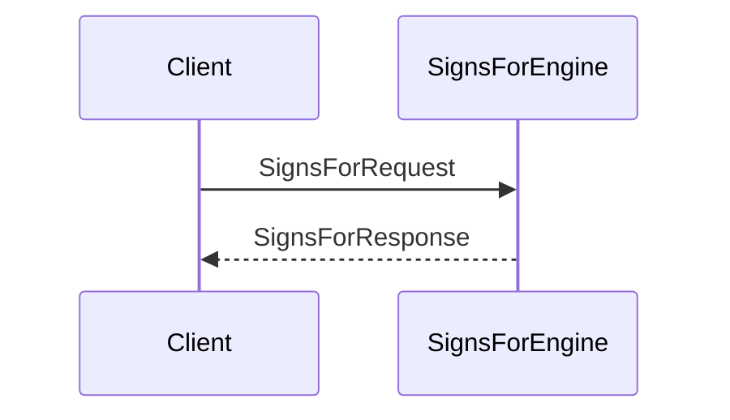
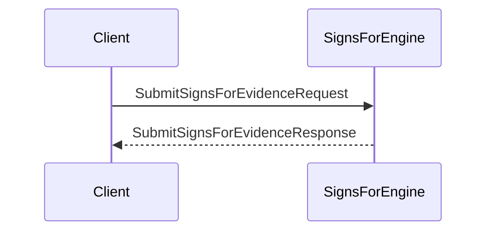

??? quote "Juvix imports"

    ```juvix
    module node_architecture.engines.signs_for_overview;
    import prelude open;
    import node_architecture.types.identity_types open;
    ```
    
# Signs For Engine Family Overview

## Purpose

The **Signs For Engine** manages `signs_for` relationships between identities. A `signs_for` relationship indicates that one identity can produce signatures (commitments) on behalf of another identity. This is useful in scenarios where signature delegation or proxy signing is required.

## Message Interface

The Signs For Engine communicates using the following messages:

- `SignsForRequest` and `SignsForResponse`
- `SubmitSignsForEvidenceRequest` and `SubmitSignsForEvidenceResponse`
- `QuerySignsForEvidenceRequest` and `QuerySignsForEvidenceResponse`

### `SignsForRequest` and `SignsForResponse`

#### `SignsForRequest`

```juvix
type SignsForRequest := mkSignsForRequest {
  externalIdentityA : ExternalIdentity;
  externalIdentityB : ExternalIdentity;
};
```

A `SignsForRequest` queries whether externalIdentityA can sign on behalf of externalIdentityB.

- `externalIdentityA`: The identity attempting to sign.
- `externalIdentityB`: The identity on whose behalf the signature is made.

#### `SignsForResponse`

```juvix
type SignsForResponse := mkSignsForResponse {
  signsFor : Bool;
  error : Maybe String;
};
```

A `SignsForResponse` indicates whether the signs_for relationship exists.

- `signsFor`: True if externalIdentityA can sign for externalIdentityB, False otherwise.
- `error`: An error message if the query failed.

### `SubmitSignsForEvidenceRequest` and `SubmitSignsForEvidenceResponse`

#### `SubmitSignsForEvidenceRequest`

```juvix
type SubmitSignsForEvidenceRequest := mkSubmitSignsForEvidenceRequest {
  evidence : SignsForEvidence;
};
```

A `SubmitSignsForEvidenceRequest` submits evidence of a `signs_for` relationship.

- `evidence`: The evidence supporting the `signs_for` relationship.

#### `SubmitSignsForEvidenceResponse`

```juvix
type SubmitSignsForEvidenceResponse := mkSubmitSignsForEvidenceResponse {
  error : Maybe String;
};
```

A `SubmitSignsForEvidenceResponse` acknowledges the submission of evidence.

- `error`: An error message if the submission failed.

### `QuerySignsForEvidenceRequest` and `QuerySignsForEvidenceResponse`

#### `QuerySignsForEvidenceRequest`

```juvix
type QuerySignsForEvidenceRequest := mkQuerySignsForEvidenceRequest {
  externalIdentity : ExternalIdentity;
};
```

A `QuerySignsForEvidenceRequest` queries all `signs_for` evidence related to an identity.

- `externalIdentity`: The identity for which to retrieve evidence.

#### `QuerySignsForEvidenceResponse`

```juvix
type QuerySignsForEvidenceResponse := mkQuerySignsForEvidenceResponse {
  evidence : Set SignsForEvidence;
  error : Maybe String;
};
```

A `QuerySignsForEvidenceResponse` provides the requested evidence.

- `evidence`: A set of SignsForEvidence related to the identity.
- `error`: An error message if the query failed.

## Signs For Messages

We define the messages that the Signs For Engine handles:

```juvix
type SignsForMsg :=
  | MsgSignsForRequest SignsForRequest
  | MsgSignsForResponse SignsForResponse
  | MsgSubmitSignsForEvidenceRequest SubmitSignsForEvidenceRequest
  | MsgSubmitSignsForEvidenceResponse SubmitSignsForEvidenceResponse
  | MsgQuerySignsForEvidenceRequest QuerySignsForEvidenceRequest
  | MsgQuerySignsForEvidenceResponse QuerySignsForEvidenceResponse;
```

## Engine Components

- [[signs_for_management_environment|Signs For Engine Environment]]
- [[signs_for_management_dynamics|Signs For Engine Dynamics]]

## Message Sequence Diagrams

### Signs For Query Sequence

<figure markdown="span">

<figcaption markdown="span">
Sequence diagram for `signs_for` query.
</figcaption> </figure>

### Submit Signs For Evidence Sequence
<figure markdown="span">


<figcaption markdown="span">
Sequence diagram for submitting `signs_for` evidence.
</figcaption> </figure>
