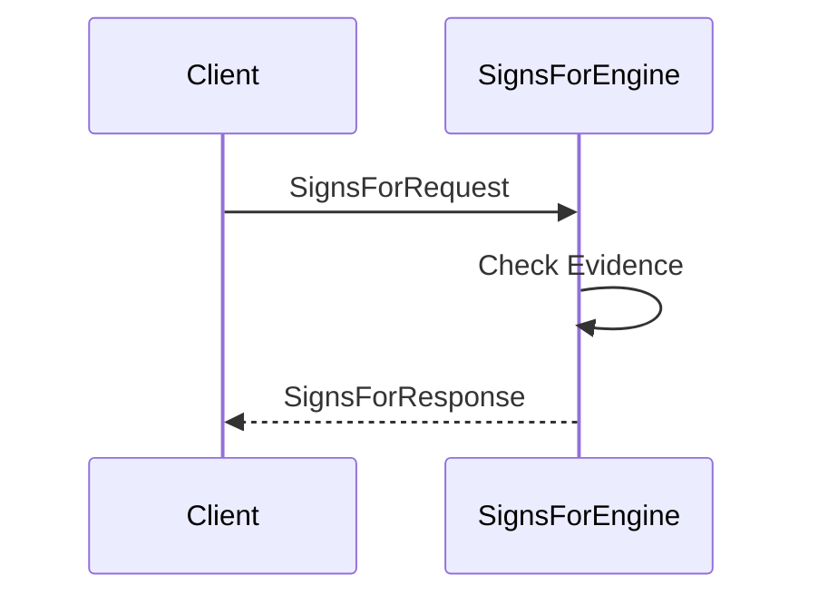
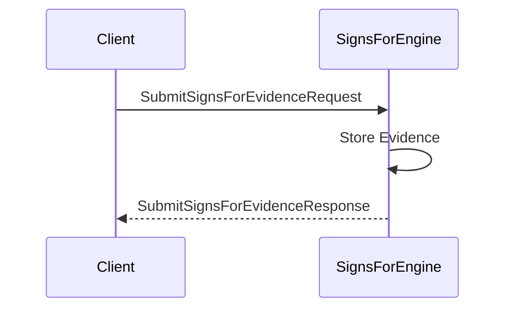

??? quote "Juvix imports"

    ```juvix
    module node_architecture.engines.signs_for_overview;
    import prelude open;
    import node_architecture.identity_types open;
    ```

# `Signs For` Engine Family Overview

--8<-- "./docs/node_architecture/engines/signs_for.juvix.md:signs-for-engine-family"

The Signs For Engine manages `signs_for` relationships between identities. A `signs_for` relationship indicates that one identity can produce signatures (commitments) on behalf of another identity.

## Purpose

The Signs For Engine maintains and manages the state of `signs_for` relationships between identities. It handles queries about these relationships, allows submission of new evidence, and provides information about existing relationships. This is useful in scenarios where signature delegation or proxy signing is required.

## Message interface

<!-- --8<-- [start:SignsForMsg] -->
```juvix
type SignsForMsg :=
  | -- --8<-- [start:SignsForRequest]
    SignsForRequest {
      externalIdentityA : ExternalIdentity;
      externalIdentityB : ExternalIdentity
    }
    -- --8<-- [end:SignsForRequest]
  | -- --8<-- [start:SignsForResponse]
    SignsForResponse {
      signsFor : Bool;
      error : Maybe String
    }
    -- --8<-- [end:SignsForResponse]
  | -- --8<-- [start:SubmitSignsForEvidenceRequest]
    SubmitSignsForEvidenceRequest {
      evidence : SignsForEvidence
    }
    -- --8<-- [end:SubmitSignsForEvidenceRequest]
  | -- --8<-- [start:SubmitSignsForEvidenceResponse]
    SubmitSignsForEvidenceResponse {
      error : Maybe String
    }
    -- --8<-- [end:SubmitSignsForEvidenceResponse]
  | -- --8<-- [start:QuerySignsForEvidenceRequest]
    QuerySignsForEvidenceRequest {
      externalIdentity : ExternalIdentity
    }
    -- --8<-- [end:QuerySignsForEvidenceRequest]
  | -- --8<-- [start:QuerySignsForEvidenceResponse]
    QuerySignsForEvidenceResponse {
      evidence : Set SignsForEvidence;
      error : Maybe String
    }
    -- --8<-- [end:QuerySignsForEvidenceResponse]
  ;
```
<!-- --8<-- [end:SignsForMsg] -->

### `SignsForRequest` message

!!! quote "SignsForRequest"

    ```
    --8<-- "./signs_for_overview.juvix.md:SignsForRequest"
    ```

A `SignsForRequest` queries whether `externalIdentityA` can sign on behalf of `externalIdentityB`.

- `externalIdentityA`: The identity attempting to sign.
- `externalIdentityB`: The identity on whose behalf the signature is made.

### `SignsForResponse` message

!!! quote "SignsForResponse"

    ```
    --8<-- "./signs_for_overview.juvix.md:SignsForResponse"
    ```

A `SignsForResponse` indicates whether the `signs_for` relationship exists.

- `signsFor`: True if externalIdentityA can sign for externalIdentityB, False otherwise.
- `error`: An error message if the query failed.

### `SubmitSignsForEvidenceRequest` message

!!! quote "SubmitSignsForEvidenceRequest"

    ```
    --8<-- "./signs_for_overview.juvix.md:SubmitSignsForEvidenceRequest"
    ```

A `SubmitSignsForEvidenceRequest` submits evidence of a `signs_for` relationship.

- `evidence`: The evidence supporting the `signs_for` relationship.

### `SubmitSignsForEvidenceResponse` message

!!! quote "SubmitSignsForEvidenceResponse"

    ```
    --8<-- "./signs_for_overview.juvix.md:SubmitSignsForEvidenceResponse"
    ```

A `SubmitSignsForEvidenceResponse` acknowledges the submission of evidence.

- `error`: An error message if the submission failed.

### `QuerySignsForEvidenceRequest` message

!!! quote "QuerySignsForEvidenceRequest"

    ```
    --8<-- "./signs_for_overview.juvix.md:QuerySignsForEvidenceRequest"
    ```

A `QuerySignsForEvidenceRequest` queries all `signs_for` evidence related to an identity.

- `externalIdentity`: The identity for which to retrieve evidence.

### `QuerySignsForEvidenceResponse` message

!!! quote "QuerySignsForEvidenceResponse"

    ```
    --8<-- "./signs_for_overview.juvix.md:QuerySignsForEvidenceResponse"
    ```

A `QuerySignsForEvidenceResponse` provides the requested evidence.

- `evidence`: A set of SignsForEvidence related to the identity.
- `error`: An error message if the query failed.

## Message sequence diagrams

### Signs For Query Sequence

<!-- --8<-- [start:message-sequence-diagram-query] -->
<figure markdown="span">



<figcaption markdown="span">
Sequence diagram for `signs_for` query.
</figcaption>
</figure>
<!-- --8<-- [end:message-sequence-diagram-query] -->

### Submit Signs For Evidence Sequence

<!-- --8<-- [start:message-sequence-diagram-submit] -->
<figure markdown="span">



<figcaption markdown="span">
Sequence diagram for submitting `signs_for` evidence.
</figcaption>
</figure>
<!-- --8<-- [end:message-sequence-diagram-submit] -->

## Engine Components

- [[signs_for_environment|`Signs For` Engine Environment]]
- [[signs_for_dynamics|`Signs For` Engine Dynamics]]

## Useful links
